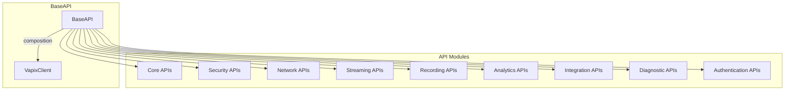
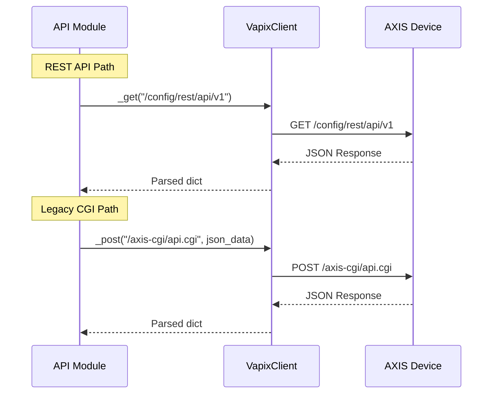
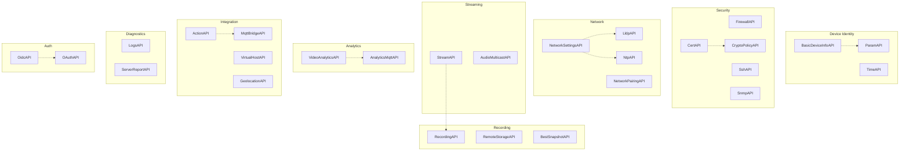

# API Modules Reference

This document provides detailed documentation for all VAPIX API modules in the `axis_cam.api` package.

## Table of Contents

- [Overview](#overview)
- [API Module Architecture](#api-module-architecture)
- [Core APIs](#core-apis)
- [Security APIs](#security-apis)
- [Network APIs](#network-apis)
- [Streaming APIs](#streaming-apis)
- [Recording APIs](#recording-apis)
- [Analytics APIs](#analytics-apis)
- [Integration APIs](#integration-apis)
- [Diagnostic APIs](#diagnostic-apis)
- [Authentication APIs](#authentication-apis)

---

## Overview

The `axis_cam.api` package contains 29 API modules, each encapsulating a specific domain of the AXIS VAPIX API. All modules inherit from `BaseAPI` and use composition with `VapixClient` for HTTP communication.



## API Module Architecture

### BaseAPI Class

All API modules inherit from `BaseAPI`, which provides:

```python
class BaseAPI(ABC):
    """Abstract base class for VAPIX API modules."""

    def __init__(self, client: VapixClient) -> None:
        self._client = client

    async def _get(self, path: str, params: dict | None = None) -> Any:
        """Perform a GET request via the client."""
        return await self._client.get_json(path, params)

    async def _post(self, path: str, data: dict | None = None,
                    json_data: dict | None = None) -> Any:
        """Perform a POST request via the client."""
        return await self._client.post_json(path, data=data, json_data=json_data)

    async def _get_raw(self, path: str, params: dict | None = None) -> bytes:
        """Perform a GET request and return raw bytes."""
        return await self._client.get_raw(path, params)
```

### Common Patterns



---

## Core APIs

### BasicDeviceInfoAPI

**Module:** `api/device_info.py`

Retrieves basic device identification information.

| Endpoint | Type | Description |
|----------|------|-------------|
| `/config/rest/basic-device-info/v2beta` | REST | Modern REST API |
| `/axis-cgi/basicdeviceinfo.cgi` | CGI | Legacy fallback |

**Methods:**

| Method | Returns | Description |
|--------|---------|-------------|
| `get_info()` | `BasicDeviceInfo` | Device brand, model, serial, firmware |
| `get_property(name)` | `str \| None` | Specific property value |
| `get_properties()` | `DeviceProperties` | Extended properties |
| `is_axis_device()` | `bool` | Verify AXIS branding |
| `get_firmware_version()` | `str` | Firmware version string |
| `get_serial_number()` | `str` | Device serial number |
| `get_model()` | `str` | Product model (e.g., "M3216-LVE") |

**Example:**
```python
info = await device.device_info.get_info()
print(f"Model: {info.product_number}")
print(f"Serial: {info.serial_number}")
print(f"Firmware: {info.firmware_version}")
```

---

### ParamAPI

**Module:** `api/param.py`

Access and modify device parameters via the param.cgi endpoint.

| Endpoint | Type | Description |
|----------|------|-------------|
| `/axis-cgi/param.cgi` | CGI | Parameter management |

**Methods:**

| Method | Returns | Description |
|--------|---------|-------------|
| `get_params(group)` | `dict` | Get parameter group |
| `get_all_params()` | `dict` | Get all parameters |
| `set_param(name, value)` | `bool` | Set parameter value |
| `get_friendly_name()` | `str` | Device friendly name |
| `get_location()` | `str` | Device location |
| `export_params()` | `dict` | Export all as dict |

**Example:**
```python
params = await device.params.get_params("Network")
name = await device.params.get_friendly_name()
```

---

### TimeAPI

**Module:** `api/time.py`

Manage device time settings and timezone configuration.

| Endpoint | Type | Description |
|----------|------|-------------|
| `/axis-cgi/date.cgi` | CGI | Date/time settings |
| `/config/rest/system/v1/time` | REST | Modern time API |

**Methods:**

| Method | Returns | Description |
|--------|---------|-------------|
| `get_info()` | `TimeInfo` | Current time and timezone |
| `set_timezone(tz)` | `bool` | Set timezone |
| `sync_with_ntp()` | `bool` | Force NTP sync |

**Example:**
```python
time_info = await device.time.get_info()
print(f"UTC: {time_info.utc_time}")
print(f"Timezone: {time_info.timezone}")
```

---

## Security APIs

### FirewallAPI

**Module:** `api/firewall.py`

Manage device firewall rules.

| Endpoint | Type | Description |
|----------|------|-------------|
| `/config/rest/firewall/v1` | REST | Firewall configuration |
| `/axis-cgi/firewall.cgi` | CGI | Legacy fallback |

**Methods:**

| Method | Returns | Description |
|--------|---------|-------------|
| `get_config()` | `FirewallConfig` | Current firewall state |
| `enable()` | `bool` | Enable firewall |
| `disable()` | `bool` | Disable firewall |
| `add_rule(rule)` | `bool` | Add firewall rule |
| `remove_rule(id)` | `bool` | Remove rule by ID |
| `list_rules()` | `list[FirewallRule]` | List all rules |

---

### SshAPI

**Module:** `api/ssh.py`

Configure SSH access.

| Endpoint | Type | Description |
|----------|------|-------------|
| `/config/rest/ssh/v1` | REST | SSH configuration |

**Methods:**

| Method | Returns | Description |
|--------|---------|-------------|
| `get_config()` | `SshConfig` | SSH settings |
| `enable()` | `bool` | Enable SSH |
| `disable()` | `bool` | Disable SSH |
| `set_port(port)` | `bool` | Change SSH port |

---

### SnmpAPI

**Module:** `api/snmp.py`

Configure SNMP settings.

| Endpoint | Type | Description |
|----------|------|-------------|
| `/config/rest/snmp/v1` | REST | SNMP configuration |
| `/axis-cgi/param.cgi` | CGI | Legacy SNMP params |

**Methods:**

| Method | Returns | Description |
|--------|---------|-------------|
| `get_config()` | `SnmpConfig` | SNMP settings |
| `enable()` | `bool` | Enable SNMP |
| `disable()` | `bool` | Disable SNMP |
| `set_community(read, write)` | `bool` | Set community strings |

---

### CertAPI

**Module:** `api/cert.py`

Manage SSL/TLS certificates.

| Endpoint | Type | Description |
|----------|------|-------------|
| `/config/rest/cert/v1` | REST | Certificate management |

**Methods:**

| Method | Returns | Description |
|--------|---------|-------------|
| `get_config()` | `CertConfig` | Certificate info |
| `list_certificates()` | `list[Certificate]` | All certificates |
| `get_certificate(id)` | `Certificate` | Specific certificate |
| `install_certificate(cert, key)` | `str` | Install new cert |
| `delete_certificate(id)` | `bool` | Remove certificate |

---

### CryptoPolicyAPI

**Module:** `api/crypto_policy.py`

Configure TLS/cipher settings.

| Endpoint | Type | Description |
|----------|------|-------------|
| `/config/rest/cryptopolicy/v1` | REST | Crypto configuration |

**Methods:**

| Method | Returns | Description |
|--------|---------|-------------|
| `get_config()` | `CryptoPolicyConfig` | TLS settings |
| `set_min_tls_version(version)` | `bool` | Set minimum TLS |
| `set_max_tls_version(version)` | `bool` | Set maximum TLS |
| `get_cipher_suites()` | `list[str]` | Available ciphers |

---

## Network APIs

### NetworkSettingsAPI

**Module:** `api/network.py`

Extended network configuration.

| Endpoint | Type | Description |
|----------|------|-------------|
| `/config/rest/network-settings/v1` | REST | Network settings |
| `/axis-cgi/param.cgi` | CGI | Legacy network params |

**Methods:**

| Method | Returns | Description |
|--------|---------|-------------|
| `get_config()` | `NetworkConfig` | Network settings |
| `get_interfaces()` | `list[NetworkInterface]` | Network interfaces |
| `get_dns_config()` | `DnsConfig` | DNS settings |
| `set_dns_servers(primary, secondary)` | `bool` | Configure DNS |
| `set_hostname(hostname)` | `bool` | Set hostname |

---

### LldpAPI

**Module:** `api/lldp.py`

LLDP neighbor discovery for switch port mapping.

| Endpoint | Type | Description |
|----------|------|-------------|
| `/config/rest/lldp/v1` | REST | LLDP configuration |

**Methods:**

| Method | Returns | Description |
|--------|---------|-------------|
| `get_info()` | `LldpInfo` | LLDP status and neighbors |
| `get_neighbors()` | `list[LldpNeighbor]` | Discovered neighbors |
| `enable()` | `bool` | Enable LLDP |
| `disable()` | `bool` | Disable LLDP |

**Example:**
```python
lldp = await device.lldp.get_info()
for neighbor in lldp.neighbors:
    print(f"Switch: {neighbor.system_name}, Port: {neighbor.port_id}")
```

---

### NtpAPI

**Module:** `api/ntp.py`

NTP time synchronization.

| Endpoint | Type | Description |
|----------|------|-------------|
| `/config/rest/ntp/v1` | REST | NTP configuration |
| `/axis-cgi/param.cgi` | CGI | Legacy NTP params |

**Methods:**

| Method | Returns | Description |
|--------|---------|-------------|
| `get_config()` | `NtpConfig` | NTP settings |
| `enable()` | `bool` | Enable NTP |
| `disable()` | `bool` | Disable NTP |
| `add_server(server)` | `bool` | Add NTP server |
| `remove_server(server)` | `bool` | Remove NTP server |
| `force_sync()` | `bool` | Force immediate sync |

---

### NetworkPairingAPI

**Module:** `api/networkpairing.py`

Device pairing configuration.

| Endpoint | Type | Description |
|----------|------|-------------|
| `/config/rest/network-pairing/v1` | REST | Pairing settings |

**Methods:**

| Method | Returns | Description |
|--------|---------|-------------|
| `get_config()` | `NetworkPairingConfig` | Pairing status |
| `get_paired_devices()` | `list[PairedDevice]` | Paired devices |
| `pair_device(host, credentials)` | `bool` | Pair new device |
| `unpair_device(id)` | `bool` | Remove pairing |

---

## Streaming APIs

### StreamAPI

**Module:** `api/stream.py`

Stream diagnostics including RTSP, RTP, and profile configuration.

| Endpoint | Type | Description |
|----------|------|-------------|
| `/axis-cgi/param.cgi` | CGI | Stream parameters |
| `/axis-cgi/streamprofile.cgi` | CGI | Stream profiles |

**Methods:**

| Method | Returns | Description |
|--------|---------|-------------|
| `get_rtsp_config()` | `RtspConfig` | RTSP settings |
| `get_rtp_config()` | `RtpConfig` | RTP settings |
| `get_stream_profiles()` | `list[StreamProfile]` | Video profiles |
| `get_diagnostics(name)` | `StreamDiagnostics` | Full diagnostics |

**Example:**
```python
diagnostics = await device.stream.get_diagnostics("front_camera")
print(f"RTSP Port: {diagnostics.rtsp.port}")
print(f"RTP Range: {diagnostics.rtp.port_range}")
for profile in diagnostics.profiles:
    print(f"Profile: {profile.name} - {profile.codec}")
```

---

### AudioMulticastAPI

**Module:** `api/audio_multicast.py`

Audio multicast streaming control.

| Endpoint | Type | Description |
|----------|------|-------------|
| `/config/rest/audio-multicast/v1` | REST | Multicast settings |

**Methods:**

| Method | Returns | Description |
|--------|---------|-------------|
| `get_config()` | `AudioMulticastConfig` | Multicast settings |
| `get_groups()` | `list[MulticastGroup]` | Multicast groups |
| `create_group(config)` | `str` | Create new group |
| `delete_group(id)` | `bool` | Delete group |

---

## Recording APIs

### RecordingAPI

**Module:** `api/recording.py`

Recording group and profile configuration.

| Endpoint | Type | Description |
|----------|------|-------------|
| `/config/rest/recording/v1` | REST | Recording config |

**Methods:**

| Method | Returns | Description |
|--------|---------|-------------|
| `get_config()` | `RecordingConfig` | Recording settings |
| `get_groups()` | `list[RecordingGroup]` | Recording groups |
| `create_group(config)` | `str` | Create group |
| `delete_group(id)` | `bool` | Delete group |
| `start_recording(group_id)` | `bool` | Start recording |
| `stop_recording(group_id)` | `bool` | Stop recording |

---

### RemoteStorageAPI

**Module:** `api/storage.py`

Remote object storage destinations.

| Endpoint | Type | Description |
|----------|------|-------------|
| `/config/rest/storage/v1` | REST | Storage config |

**Methods:**

| Method | Returns | Description |
|--------|---------|-------------|
| `get_config()` | `RemoteStorageConfig` | Storage settings |
| `get_destinations()` | `list[StorageDestination]` | Storage targets |
| `add_destination(config)` | `str` | Add storage target |
| `remove_destination(id)` | `bool` | Remove target |
| `test_connection(id)` | `bool` | Test connectivity |

---

### BestSnapshotAPI

**Module:** `api/snapshot.py`

Best snapshot capture and configuration.

| Endpoint | Type | Description |
|----------|------|-------------|
| `/config/rest/bestsnapshot/v1` | REST | Snapshot config |
| `/axis-cgi/jpg/image.cgi` | CGI | Capture endpoint |

**Methods:**

| Method | Returns | Description |
|--------|---------|-------------|
| `get_config()` | `BestSnapshotConfig` | Snapshot settings |
| `capture(resolution, compression)` | `bytes` | Capture snapshot |
| `get_profiles()` | `list[SnapshotProfile]` | Capture profiles |

---

## Analytics APIs

### VideoAnalyticsAPI

**Module:** `api/analytics.py`

Video analytics configuration.

| Endpoint | Type | Description |
|----------|------|-------------|
| `/config/rest/analytics/v1` | REST | Analytics config |

**Methods:**

| Method | Returns | Description |
|--------|---------|-------------|
| `get_config()` | `AnalyticsConfig` | Analytics settings |
| `get_profiles()` | `list[AnalyticsProfile]` | Analytics profiles |
| `create_profile(config)` | `str` | Create profile |
| `delete_profile(id)` | `bool` | Delete profile |
| `get_scenarios()` | `list[Scenario]` | Detection scenarios |

---

### AnalyticsMqttAPI

**Module:** `api/analytics_mqtt.py`

Analytics MQTT event publishing.

| Endpoint | Type | Description |
|----------|------|-------------|
| `/config/rest/analytics-mqtt/v1` | REST | MQTT publishing |

**Methods:**

| Method | Returns | Description |
|--------|---------|-------------|
| `get_config()` | `AnalyticsMqttConfig` | Publishing settings |
| `enable()` | `bool` | Enable publishing |
| `disable()` | `bool` | Disable publishing |
| `set_broker(host, port)` | `bool` | Configure broker |

---

## Integration APIs

### ActionAPI

**Module:** `api/action.py`

Action rules configuration.

| Endpoint | Type | Description |
|----------|------|-------------|
| `/config/rest/action/v1` | REST | Action rules |
| `/axis-cgi/eventactionrules.cgi` | CGI | Legacy actions |

**Methods:**

| Method | Returns | Description |
|--------|---------|-------------|
| `get_config()` | `ActionConfig` | Action rules |
| `get_rules()` | `list[ActionRule]` | All rules |
| `create_rule(config)` | `str` | Create rule |
| `delete_rule(id)` | `bool` | Delete rule |
| `get_templates()` | `list[ActionTemplate]` | Rule templates |

---

### MqttBridgeAPI

**Module:** `api/mqtt.py`

MQTT event bridge configuration.

| Endpoint | Type | Description |
|----------|------|-------------|
| `/config/rest/mqtt/v1` | REST | MQTT bridge |

**Methods:**

| Method | Returns | Description |
|--------|---------|-------------|
| `get_config()` | `MqttBridgeConfig` | MQTT settings |
| `get_clients()` | `list[MqttClient]` | MQTT clients |
| `create_client(config)` | `str` | Create client |
| `delete_client(id)` | `bool` | Delete client |
| `test_connection(id)` | `bool` | Test connectivity |

---

### VirtualHostAPI

**Module:** `api/virtualhost.py`

Virtual host configuration.

| Endpoint | Type | Description |
|----------|------|-------------|
| `/config/rest/virtualhost/v1` | REST | Virtual hosts |

**Methods:**

| Method | Returns | Description |
|--------|---------|-------------|
| `get_config()` | `VirtualHostConfig` | Virtual host settings |
| `get_hosts()` | `list[VirtualHost]` | Configured hosts |
| `create_host(config)` | `str` | Create host |
| `delete_host(id)` | `bool` | Delete host |

---

### GeolocationAPI

**Module:** `api/geolocation.py`

Device geolocation settings.

| Endpoint | Type | Description |
|----------|------|-------------|
| `/config/rest/geolocation/v1` | REST | Location config |

**Methods:**

| Method | Returns | Description |
|--------|---------|-------------|
| `get_config()` | `GeolocationConfig` | Location settings |
| `set_coordinates(lat, lon, alt)` | `bool` | Set GPS coords |
| `set_direction(heading)` | `bool` | Set compass heading |
| `clear()` | `bool` | Clear location |

---

## Diagnostic APIs

### LogsAPI

**Module:** `api/logs.py`

System, access, and audit log retrieval.

| Endpoint | Type | Description |
|----------|------|-------------|
| `/axis-cgi/systemlog.cgi` | CGI | System logs |
| `/axis-cgi/accesslog.cgi` | CGI | Access logs |
| `/axis-cgi/auditlog.cgi` | CGI | Audit logs |

**Methods:**

| Method | Returns | Description |
|--------|---------|-------------|
| `get_logs(log_type, max_entries)` | `LogReport` | Retrieve logs |
| `get_system_logs(max_entries)` | `LogReport` | System logs |
| `get_access_logs(max_entries)` | `LogReport` | HTTP access logs |
| `get_audit_logs(max_entries)` | `LogReport` | Config change logs |
| `get_all_logs(max_entries)` | `list[LogReport]` | All log types |

**Example:**
```python
logs = await device.logs.get_system_logs(max_entries=50)
for entry in logs.entries:
    print(f"[{entry.timestamp}] {entry.severity}: {entry.message}")
```

---

### ServerReportAPI

**Module:** `api/serverreport.py`

Server report and debug archive downloads.

| Endpoint | Type | Description |
|----------|------|-------------|
| `/axis-cgi/serverreport.cgi` | CGI | Server reports |
| `/axis-cgi/debug/debug.tgz` | CGI | Debug archive |

**Methods:**

| Method | Returns | Description |
|--------|---------|-------------|
| `download_report(format, timeout)` | `ServerReport` | Download report |
| `get_debug_archive(timeout)` | `ServerReport` | Download debug.tgz |

**Formats:**
- `zip_with_image` - ZIP with snapshot (default)
- `zip` - ZIP without image
- `text` - Plain text

**Example:**
```python
# Download server report
report = await device.serverreport.download_report(
    format=ServerReportFormat.ZIP_WITH_IMAGE,
    timeout=60.0
)
with open("report.zip", "wb") as f:
    f.write(report.content)

# Download debug archive
debug = await device.serverreport.get_debug_archive(timeout=120.0)
with open("debug.tgz", "wb") as f:
    f.write(debug.content)
```

---

## Authentication APIs

### OidcAPI

**Module:** `api/oidc.py`

OpenID Connect configuration.

| Endpoint | Type | Description |
|----------|------|-------------|
| `/config/rest/oidc/v1` | REST | OIDC settings |

**Methods:**

| Method | Returns | Description |
|--------|---------|-------------|
| `get_config()` | `OidcConfig` | OIDC settings |
| `enable()` | `bool` | Enable OIDC |
| `disable()` | `bool` | Disable OIDC |
| `set_provider(issuer, client_id)` | `bool` | Configure provider |

---

### OAuthAPI

**Module:** `api/oauth.py`

OAuth 2.0 Client Credentials Grant.

| Endpoint | Type | Description |
|----------|------|-------------|
| `/config/rest/oauth/v1` | REST | OAuth settings |

**Methods:**

| Method | Returns | Description |
|--------|---------|-------------|
| `get_config()` | `OAuthConfig` | OAuth settings |
| `enable()` | `bool` | Enable OAuth |
| `disable()` | `bool` | Disable OAuth |
| `create_client(config)` | `str` | Create client |
| `delete_client(id)` | `bool` | Delete client |

---

## API Module Relationship Diagram



---

## See Also

- [Architecture Overview](./architecture.md) - System architecture
- [Device Classes](./device-classes.md) - Device implementations
- [CLI Reference](./cli-reference.md) - Command-line usage
