# AXIS Camera Manager Architecture

This document provides a comprehensive overview of the `axis_cam` package architecture, including module relationships, data flows, and design patterns.

## Table of Contents

- [High-Level Overview](#high-level-overview)
- [Package Structure](#package-structure)
- [Core Components](#core-components)
- [Design Patterns](#design-patterns)
- [Data Flow](#data-flow)
- [Module Relationships](#module-relationships)

---

## High-Level Overview

The AXIS Camera Manager (`axis_cam`) is a Python library and CLI tool for managing AXIS network devices via the VAPIX REST API. The architecture follows a layered design with clear separation of concerns.

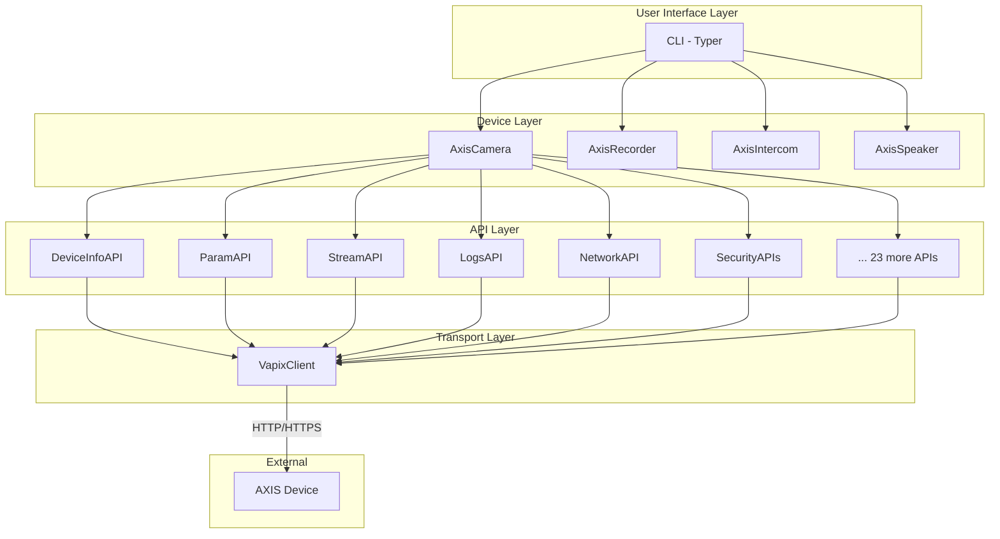

## Package Structure

```
axis_cam/
├── __init__.py          # Package exports
├── cli.py               # Typer CLI (~2600 lines)
├── client.py            # VapixClient HTTP client
├── config.py            # Configuration management
├── models.py            # Pydantic models (~2000 lines)
├── exceptions.py        # Exception hierarchy
├── api/                 # VAPIX API modules (29 modules)
│   ├── __init__.py
│   ├── base.py          # BaseAPI abstract class
│   ├── device_info.py   # Basic device information
│   ├── param.py         # Device parameters
│   ├── stream.py        # Stream diagnostics
│   ├── logs.py          # Log retrieval
│   ├── network.py       # Network settings
│   ├── firewall.py      # Firewall rules
│   ├── ssh.py           # SSH configuration
│   ├── snmp.py          # SNMP configuration
│   ├── cert.py          # Certificate management
│   ├── ntp.py           # NTP synchronization
│   ├── action.py        # Action rules
│   ├── mqtt.py          # MQTT event bridge
│   ├── recording.py     # Recording profiles
│   ├── storage.py       # Remote storage
│   ├── geolocation.py   # GPS/location
│   ├── analytics.py     # Video analytics
│   ├── snapshot.py      # Best snapshot
│   ├── serverreport.py  # Server reports & debug
│   ├── oidc.py          # OpenID Connect
│   ├── oauth.py         # OAuth 2.0
│   ├── virtualhost.py   # Virtual hosts
│   ├── crypto_policy.py # TLS/cipher settings
│   └── networkpairing.py # Device pairing
└── devices/             # Device type implementations
    ├── __init__.py
    ├── base.py          # AxisDevice abstract base
    ├── camera.py        # AxisCamera
    ├── recorder.py      # AxisRecorder
    ├── intercom.py      # AxisIntercom
    └── speaker.py       # AxisSpeaker
```

## Core Components

### 1. VapixClient (`client.py`)

The `VapixClient` is the foundation of all device communication. It handles:

- HTTP/HTTPS connections using `httpx`
- Basic and Digest authentication
- Request formatting and response parsing
- Connection management via async context managers

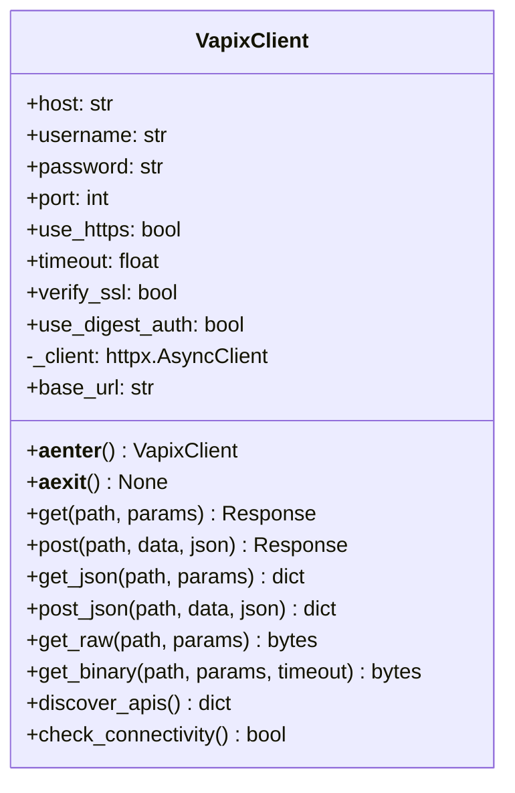

**Key Features:**
- Async context manager for proper resource cleanup
- Automatic HTTP to HTTPS based on port (443 = HTTPS)
- Support for both JSON and binary responses
- Custom timeout support for long-running operations

### 2. BaseAPI (`api/base.py`)

Abstract base class providing common functionality for all API modules.

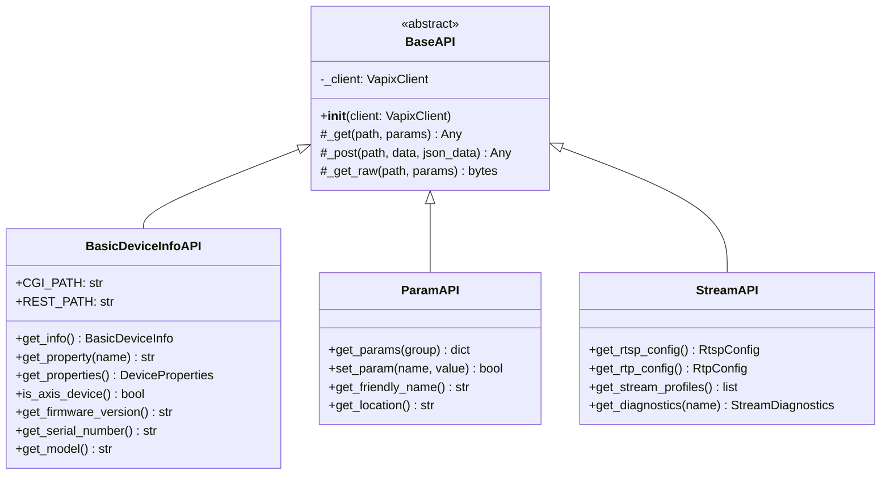

### 3. AxisDevice (`devices/base.py`)

Abstract base class that composes API modules to provide a unified device interface.

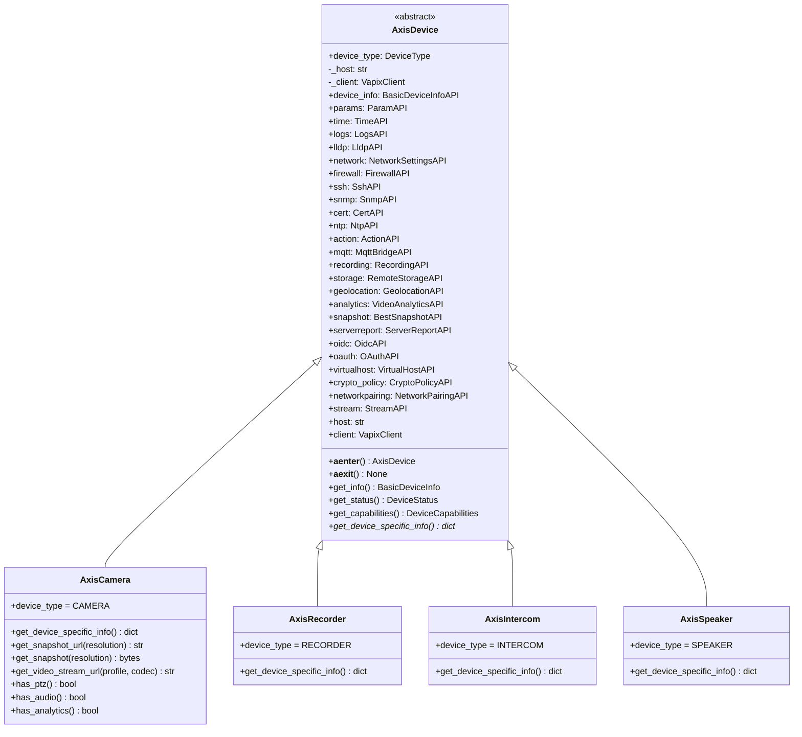

### 4. Configuration (`config.py`)

Configuration management with support for:

- YAML configuration files
- Environment variable interpolation (`${VAR_NAME}` syntax)
- XDG Base Directory specification
- Legacy path migration
- Multiple device definitions

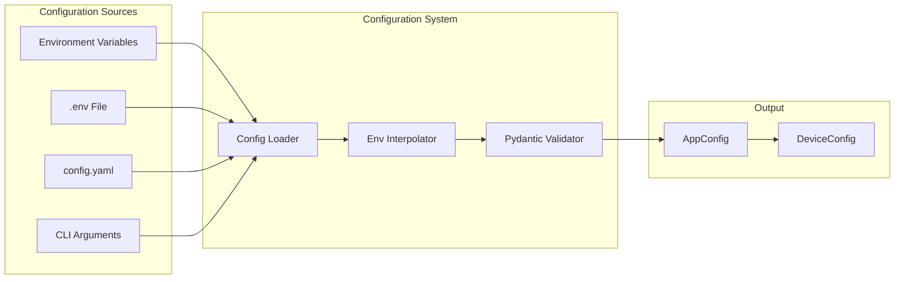

### 5. Exception Hierarchy (`exceptions.py`)

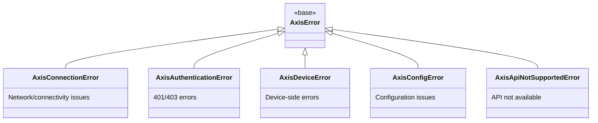

## Design Patterns

### 1. Composition over Inheritance

API modules are composed into device classes rather than inherited:

```python
class AxisDevice:
    def __init__(self, ...):
        self._client = VapixClient(...)
        # Compose API modules
        self.device_info = BasicDeviceInfoAPI(self._client)
        self.params = ParamAPI(self._client)
        self.stream = StreamAPI(self._client)
        # ... 25+ more API modules
```

**Benefits:**
- Easy to add/remove API modules
- Clear dependency relationships
- Testable in isolation

### 2. Async Context Manager

All device and client classes support async context management:

```python
async with AxisCamera("192.168.1.10", "admin", "pass") as camera:
    info = await camera.get_info()
    # Connection automatically closed on exit
```

**Benefits:**
- Proper resource cleanup
- Exception-safe connection handling
- Pythonic API

### 3. Factory Pattern

The CLI uses a factory pattern for device creation:

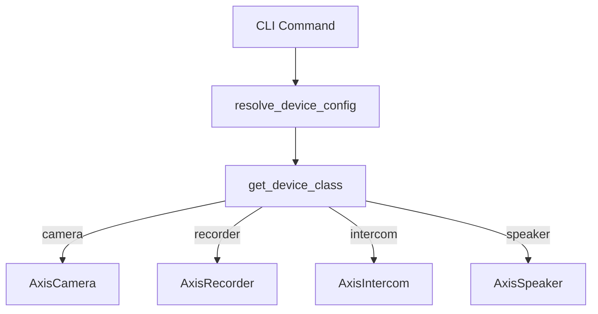

### 4. Strategy Pattern

Authentication method selection:

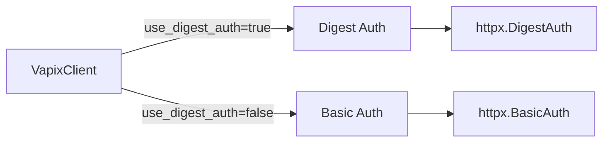

### 5. Template Method Pattern

API modules define template methods for common operations:

```python
class BaseAPI:
    async def _get(self, path, params):
        return await self._client.get_json(path, params)

    async def _post(self, path, data, json_data):
        return await self._client.post_json(path, data, json_data)
```

Subclasses implement specific API logic using these template methods.

## Data Flow

### Request Flow

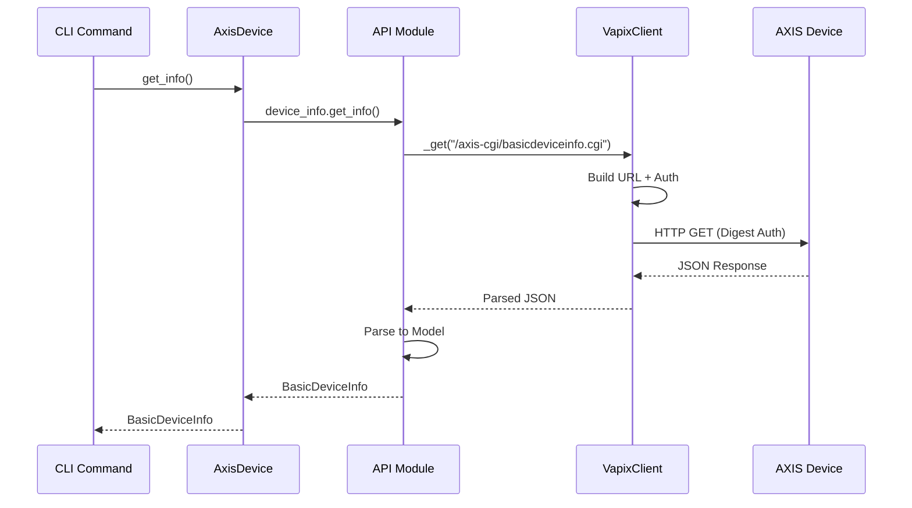

### Configuration Flow

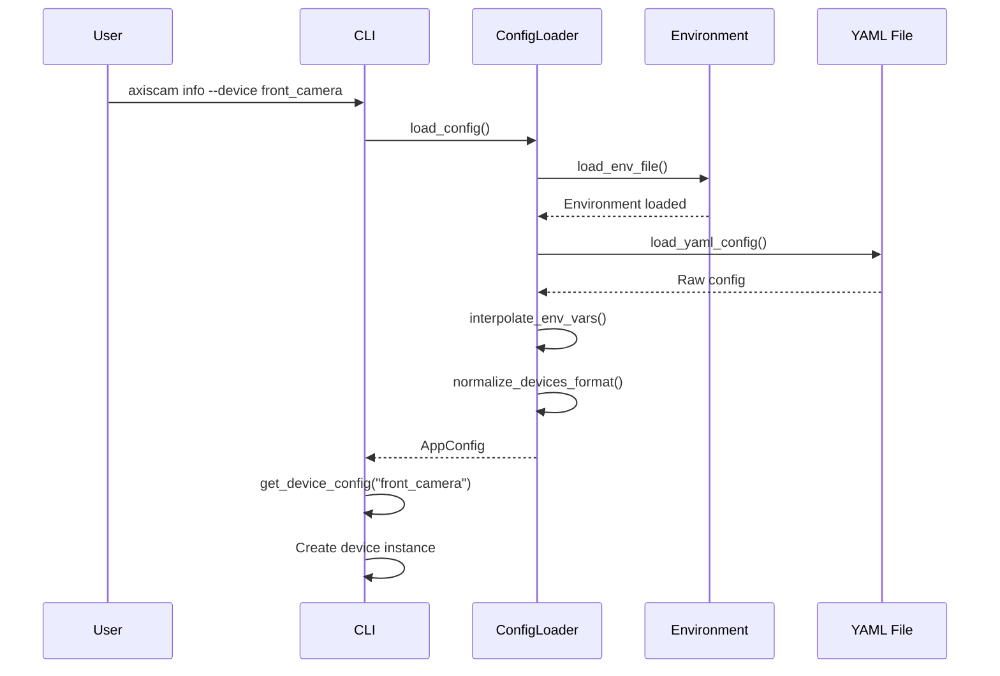

### Report Generation Flow

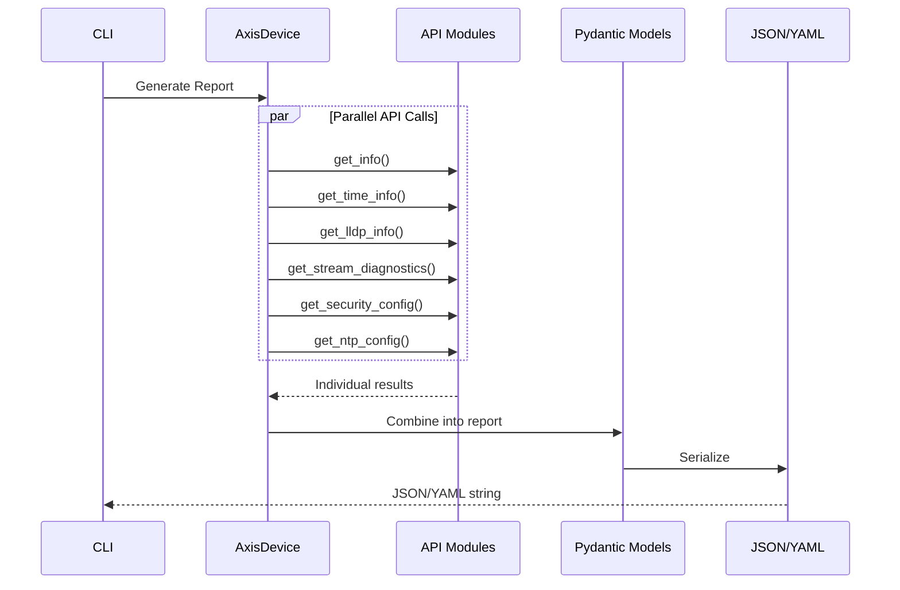

## Module Relationships

### API Module Categories

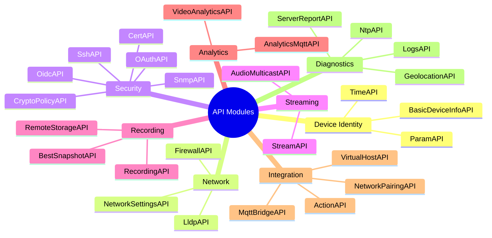

### Import Dependencies

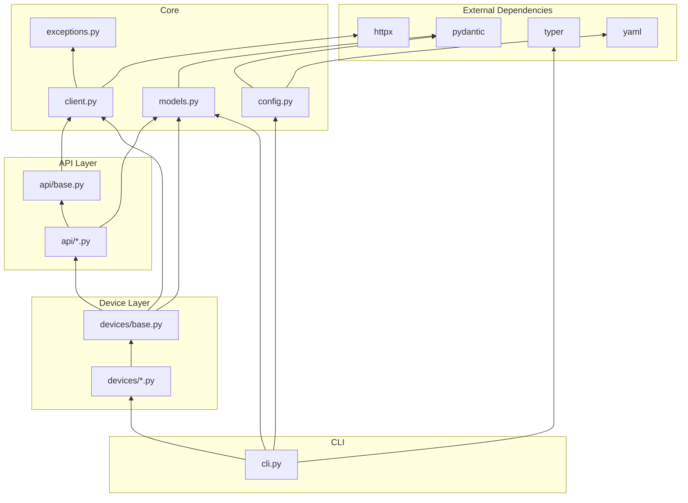

---

## See Also

- [API Modules Reference](./api-modules.md) - Detailed API module documentation
- [Device Classes](./device-classes.md) - Device type implementations
- [CLI Reference](./cli-reference.md) - Command-line interface documentation
- [Configuration Guide](./configuration.md) - Configuration system details
