# AXIS Camera Manager Architecture

This document provides a comprehensive overview of the `axis_cam` package architecture, including module relationships, data flows, and design patterns.

## Table of Contents

- [High-Level Overview](#high-level-overview)
- [Package Structure](#package-structure)
- [Core Components](#core-components)
- [Design Patterns](#design-patterns)
- [Data Flow](#data-flow)
- [Module Relationships](#module-relationships)

---

## High-Level Overview

The AXIS Camera Manager (`axis_cam`) is a Python library and CLI tool for managing AXIS network devices via the VAPIX REST API. The architecture follows a layered design with clear separation of concerns.

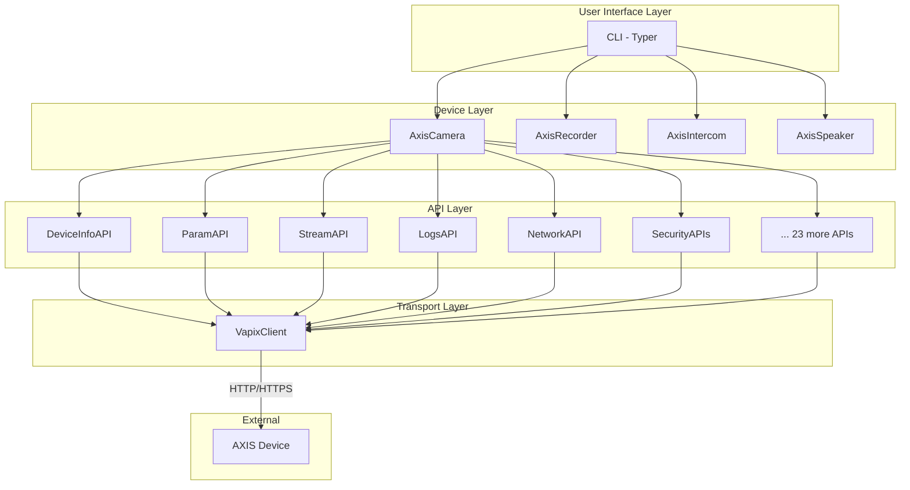
```mermaid
flowchart TB
    subgraph "User Interface Layer"
        CLI[CLI - Typer]
    end

    subgraph "Device Layer"
        Camera[AxisCamera]
        Recorder[AxisRecorder]
        Intercom[AxisIntercom]
        Speaker[AxisSpeaker]
    end

    subgraph "API Layer"
        DeviceInfo[DeviceInfoAPI]
        Param[ParamAPI]
        Stream[StreamAPI]
        Logs[LogsAPI]
        Network[NetworkAPI]
        Security[SecurityAPIs]
        More[... 23 more APIs]
    end

    subgraph "Transport Layer"
        Client[VapixClient]
    end

    subgraph "External"
        Device[AXIS Device]
    end

    CLI --> Camera
    CLI --> Recorder
    CLI --> Intercom
    CLI --> Speaker

    Camera --> DeviceInfo
    Camera --> Param
    Camera --> Stream
    Camera --> Logs
    Camera --> Network
    Camera --> Security
    Camera --> More

    DeviceInfo --> Client
    Param --> Client
    Stream --> Client
    Logs --> Client
    Network --> Client
    Security --> Client
    More --> Client

    Client -->|HTTP/HTTPS| Device
```

## Package Structure

```
axis_cam/
├── __init__.py          # Package exports
├── cli.py               # Typer CLI (~2600 lines)
├── client.py            # VapixClient HTTP client
├── config.py            # Configuration management
├── models.py            # Pydantic models (~2000 lines)
├── exceptions.py        # Exception hierarchy
├── api/                 # VAPIX API modules (29 modules)
│   ├── __init__.py
│   ├── base.py          # BaseAPI abstract class
│   ├── device_info.py   # Basic device information
│   ├── param.py         # Device parameters
│   ├── stream.py        # Stream diagnostics
│   ├── logs.py          # Log retrieval
│   ├── network.py       # Network settings
│   ├── firewall.py      # Firewall rules
│   ├── ssh.py           # SSH configuration
│   ├── snmp.py          # SNMP configuration
│   ├── cert.py          # Certificate management
│   ├── ntp.py           # NTP synchronization
│   ├── action.py        # Action rules
│   ├── mqtt.py          # MQTT event bridge
│   ├── recording.py     # Recording profiles
│   ├── storage.py       # Remote storage
│   ├── geolocation.py   # GPS/location
│   ├── analytics.py     # Video analytics
│   ├── snapshot.py      # Best snapshot
│   ├── serverreport.py  # Server reports & debug
│   ├── oidc.py          # OpenID Connect
│   ├── oauth.py         # OAuth 2.0
│   ├── virtualhost.py   # Virtual hosts
│   ├── crypto_policy.py # TLS/cipher settings
│   └── networkpairing.py # Device pairing
└── devices/             # Device type implementations
    ├── __init__.py
    ├── base.py          # AxisDevice abstract base
    ├── camera.py        # AxisCamera
    ├── recorder.py      # AxisRecorder
    ├── intercom.py      # AxisIntercom
    └── speaker.py       # AxisSpeaker
```

## Core Components

### 1. VapixClient (`client.py`)

The `VapixClient` is the foundation of all device communication. It handles:

- HTTP/HTTPS connections using `httpx`
- Basic and Digest authentication
- Request formatting and response parsing
- Connection management via async context managers

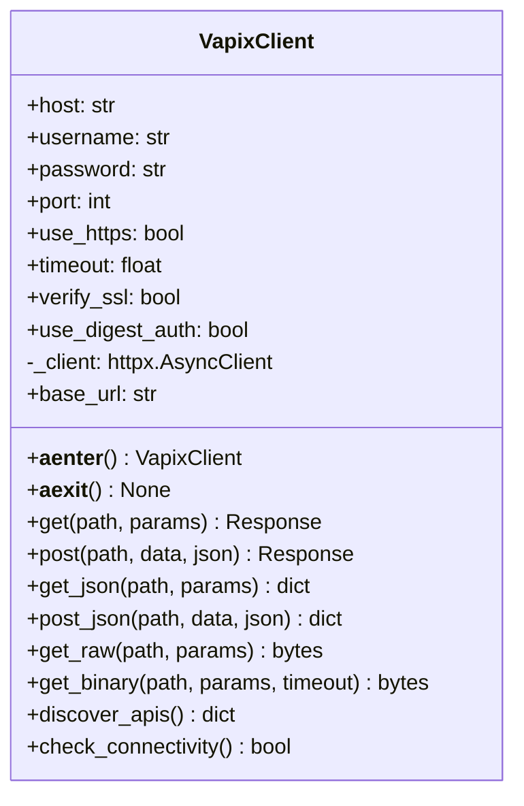
```mermaid
classDiagram
    class VapixClient {
        +host: str
        +username: str
        +password: str
        +port: int
        +use_https: bool
        +timeout: float
        +verify_ssl: bool
        +use_digest_auth: bool
        -_client: httpx.AsyncClient
        +base_url: str
        +__aenter__() VapixClient
        +__aexit__() None
        +get(path, params) Response
        +post(path, data, json) Response
        +get_json(path, params) dict
        +post_json(path, data, json) dict
        +get_raw(path, params) bytes
        +get_binary(path, params, timeout) bytes
        +discover_apis() dict
        +check_connectivity() bool
    }
```

**Key Features:**
- Async context manager for proper resource cleanup
- Automatic HTTP to HTTPS based on port (443 = HTTPS)
- Support for both JSON and binary responses
- Custom timeout support for long-running operations

### 2. BaseAPI (`api/base.py`)

Abstract base class providing common functionality for all API modules.

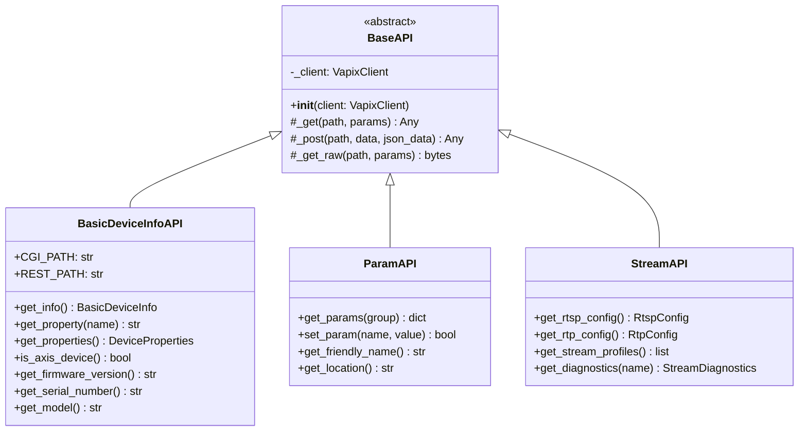
```mermaid
classDiagram
    class BaseAPI {
        <<abstract>>
        -_client: VapixClient
        +__init__(client: VapixClient)
        #_get(path, params) Any
        #_post(path, data, json_data) Any
        #_get_raw(path, params) bytes
    }

    class BasicDeviceInfoAPI {
        +CGI_PATH: str
        +REST_PATH: str
        +get_info() BasicDeviceInfo
        +get_property(name) str
        +get_properties() DeviceProperties
        +is_axis_device() bool
        +get_firmware_version() str
        +get_serial_number() str
        +get_model() str
    }

    class ParamAPI {
        +get_params(group) dict
        +set_param(name, value) bool
        +get_friendly_name() str
        +get_location() str
    }

    class StreamAPI {
        +get_rtsp_config() RtspConfig
        +get_rtp_config() RtpConfig
        +get_stream_profiles() list
        +get_diagnostics(name) StreamDiagnostics
    }

    BaseAPI <|-- BasicDeviceInfoAPI
    BaseAPI <|-- ParamAPI
    BaseAPI <|-- StreamAPI
```

### 3. AxisDevice (`devices/base.py`)

Abstract base class that composes API modules to provide a unified device interface.

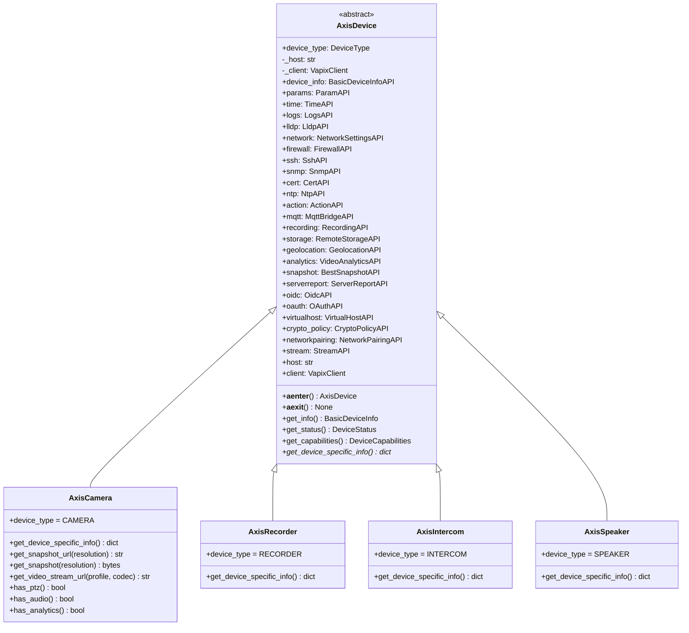
```mermaid
classDiagram
    class AxisDevice {
        <<abstract>>
        +device_type: DeviceType
        -_host: str
        -_client: VapixClient
        +device_info: BasicDeviceInfoAPI
        +params: ParamAPI
        +time: TimeAPI
        +logs: LogsAPI
        +lldp: LldpAPI
        +network: NetworkSettingsAPI
        +firewall: FirewallAPI
        +ssh: SshAPI
        +snmp: SnmpAPI
        +cert: CertAPI
        +ntp: NtpAPI
        +action: ActionAPI
        +mqtt: MqttBridgeAPI
        +recording: RecordingAPI
        +storage: RemoteStorageAPI
        +geolocation: GeolocationAPI
        +analytics: VideoAnalyticsAPI
        +snapshot: BestSnapshotAPI
        +serverreport: ServerReportAPI
        +oidc: OidcAPI
        +oauth: OAuthAPI
        +virtualhost: VirtualHostAPI
        +crypto_policy: CryptoPolicyAPI
        +networkpairing: NetworkPairingAPI
        +stream: StreamAPI
        +host: str
        +client: VapixClient
        +__aenter__() AxisDevice
        +__aexit__() None
        +get_info() BasicDeviceInfo
        +get_status() DeviceStatus
        +get_capabilities() DeviceCapabilities
        +get_device_specific_info()* dict
    }

    class AxisCamera {
        +device_type = CAMERA
        +get_device_specific_info() dict
        +get_snapshot_url(resolution) str
        +get_snapshot(resolution) bytes
        +get_video_stream_url(profile, codec) str
        +has_ptz() bool
        +has_audio() bool
        +has_analytics() bool
    }

    class AxisRecorder {
        +device_type = RECORDER
        +get_device_specific_info() dict
    }

    class AxisIntercom {
        +device_type = INTERCOM
        +get_device_specific_info() dict
    }

    class AxisSpeaker {
        +device_type = SPEAKER
        +get_device_specific_info() dict
    }

    AxisDevice <|-- AxisCamera
    AxisDevice <|-- AxisRecorder
    AxisDevice <|-- AxisIntercom
    AxisDevice <|-- AxisSpeaker
```

### 4. Configuration (`config.py`)

Configuration management with support for:

- YAML configuration files
- Environment variable interpolation (`${VAR_NAME}` syntax)
- XDG Base Directory specification
- Legacy path migration
- Multiple device definitions

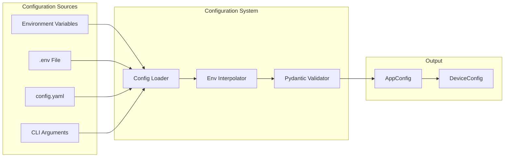
```mermaid
flowchart LR
    subgraph "Configuration Sources"
        ENV[Environment Variables]
        DOTENV[.env File]
        YAML[config.yaml]
        CLI_ARGS[CLI Arguments]
    end

    subgraph "Configuration System"
        LOADER[Config Loader]
        INTERPOLATOR[Env Interpolator]
        VALIDATOR[Pydantic Validator]
    end

    subgraph "Output"
        APP_CONFIG[AppConfig]
        DEVICE_CONFIG[DeviceConfig]
    end

    ENV --> LOADER
    DOTENV --> LOADER
    YAML --> LOADER
    CLI_ARGS --> LOADER

    LOADER --> INTERPOLATOR
    INTERPOLATOR --> VALIDATOR
    VALIDATOR --> APP_CONFIG
    APP_CONFIG --> DEVICE_CONFIG
```

### 5. Exception Hierarchy (`exceptions.py`)

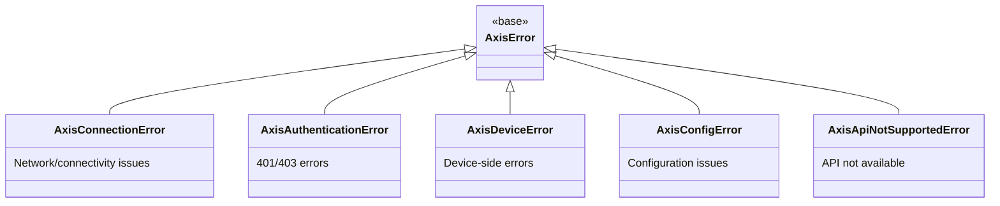
```mermaid
classDiagram
    class AxisError {
        <<base>>
    }

    class AxisConnectionError {
        Network/connectivity issues
    }

    class AxisAuthenticationError {
        401/403 errors
    }

    class AxisDeviceError {
        Device-side errors
    }

    class AxisConfigError {
        Configuration issues
    }

    class AxisApiNotSupportedError {
        API not available
    }

    AxisError <|-- AxisConnectionError
    AxisError <|-- AxisAuthenticationError
    AxisError <|-- AxisDeviceError
    AxisError <|-- AxisConfigError
    AxisError <|-- AxisApiNotSupportedError
```

## Design Patterns

### 1. Composition over Inheritance

API modules are composed into device classes rather than inherited:

```python
class AxisDevice:
    def __init__(self, ...):
        self._client = VapixClient(...)
        # Compose API modules
        self.device_info = BasicDeviceInfoAPI(self._client)
        self.params = ParamAPI(self._client)
        self.stream = StreamAPI(self._client)
        # ... 25+ more API modules
```

**Benefits:**
- Easy to add/remove API modules
- Clear dependency relationships
- Testable in isolation

### 2. Async Context Manager

All device and client classes support async context management:

```python
async with AxisCamera("192.168.1.10", "admin", "pass") as camera:
    info = await camera.get_info()
    # Connection automatically closed on exit
```

**Benefits:**
- Proper resource cleanup
- Exception-safe connection handling
- Pythonic API

### 3. Factory Pattern

The CLI uses a factory pattern for device creation:

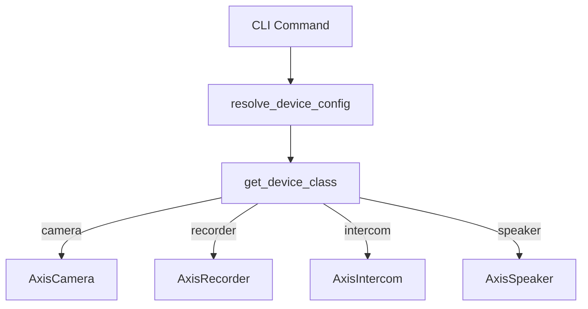
```mermaid
flowchart TD
    CLI[CLI Command] --> RESOLVE[resolve_device_config]
    RESOLVE --> GET_CLASS[get_device_class]
    GET_CLASS --> |camera| CAMERA[AxisCamera]
    GET_CLASS --> |recorder| RECORDER[AxisRecorder]
    GET_CLASS --> |intercom| INTERCOM[AxisIntercom]
    GET_CLASS --> |speaker| SPEAKER[AxisSpeaker]
```

### 4. Strategy Pattern

Authentication method selection:

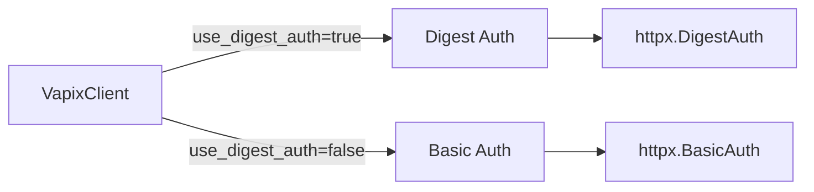
```mermaid
flowchart LR
    CLIENT[VapixClient] --> |use_digest_auth=true| DIGEST[Digest Auth]
    CLIENT --> |use_digest_auth=false| BASIC[Basic Auth]
    DIGEST --> HTTPX[httpx.DigestAuth]
    BASIC --> HTTPX2[httpx.BasicAuth]
```

### 5. Template Method Pattern

API modules define template methods for common operations:

```python
class BaseAPI:
    async def _get(self, path, params):
        return await self._client.get_json(path, params)

    async def _post(self, path, data, json_data):
        return await self._client.post_json(path, data, json_data)
```

Subclasses implement specific API logic using these template methods.

## Data Flow

### Request Flow

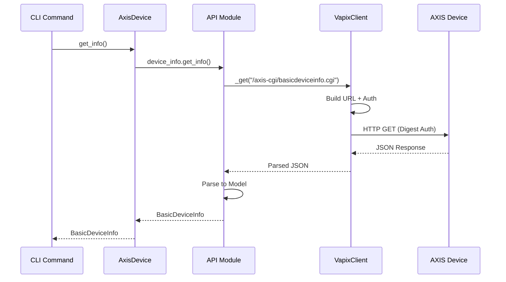
```mermaid
sequenceDiagram
    participant CLI as CLI Command
    participant Device as AxisDevice
    participant API as API Module
    participant Client as VapixClient
    participant AXIS as AXIS Device

    CLI->>Device: get_info()
    Device->>API: device_info.get_info()
    API->>Client: _get("/axis-cgi/basicdeviceinfo.cgi")
    Client->>Client: Build URL + Auth
    Client->>AXIS: HTTP GET (Digest Auth)
    AXIS-->>Client: JSON Response
    Client-->>API: Parsed JSON
    API->>API: Parse to Model
    API-->>Device: BasicDeviceInfo
    Device-->>CLI: BasicDeviceInfo
```

### Configuration Flow

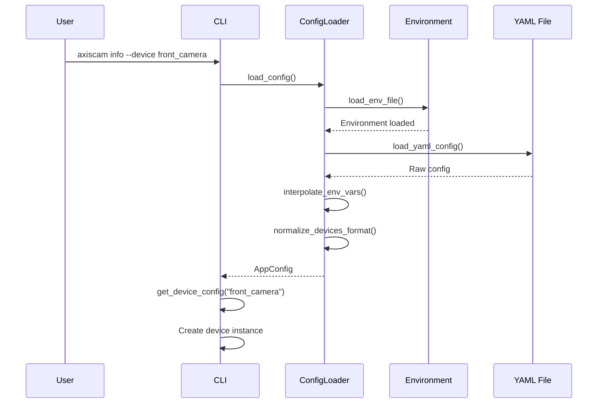
```mermaid
sequenceDiagram
    participant User as User
    participant CLI as CLI
    participant Config as ConfigLoader
    participant ENV as Environment
    participant YAML as YAML File

    User->>CLI: axiscam info --device front_camera
    CLI->>Config: load_config()
    Config->>ENV: load_env_file()
    ENV-->>Config: Environment loaded
    Config->>YAML: load_yaml_config()
    YAML-->>Config: Raw config
    Config->>Config: interpolate_env_vars()
    Config->>Config: normalize_devices_format()
    Config-->>CLI: AppConfig
    CLI->>CLI: get_device_config("front_camera")
    CLI->>CLI: Create device instance
```

### Report Generation Flow

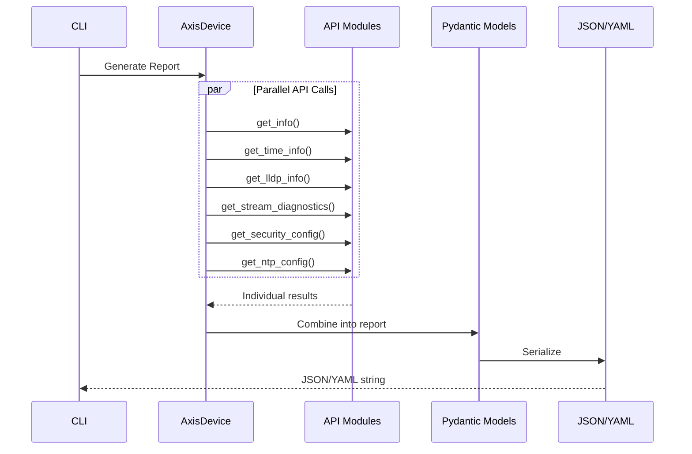
```mermaid
sequenceDiagram
    participant CLI as CLI
    participant Device as AxisDevice
    participant APIs as API Modules
    participant Model as Pydantic Models
    participant Output as JSON/YAML

    CLI->>Device: Generate Report

    par Parallel API Calls
        Device->>APIs: get_info()
        Device->>APIs: get_time_info()
        Device->>APIs: get_lldp_info()
        Device->>APIs: get_stream_diagnostics()
        Device->>APIs: get_security_config()
        Device->>APIs: get_ntp_config()
    end

    APIs-->>Device: Individual results
    Device->>Model: Combine into report
    Model->>Output: Serialize
    Output-->>CLI: JSON/YAML string
```

## Module Relationships

### API Module Categories

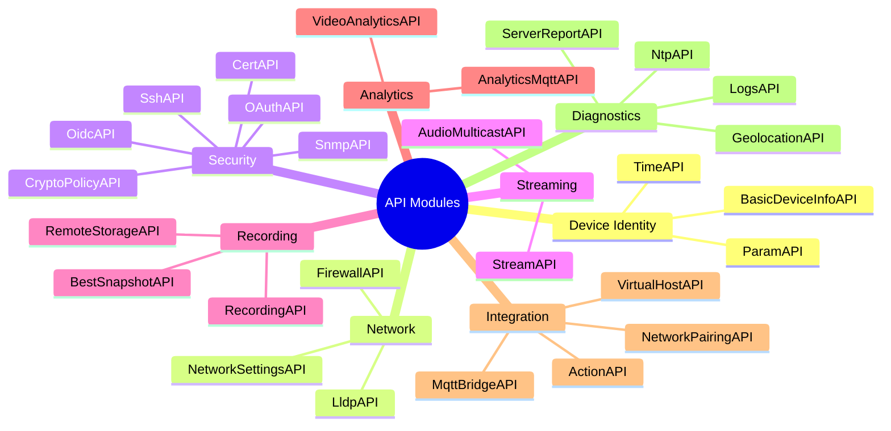
```mermaid
mindmap
    root((API Modules))
        Device Identity
            BasicDeviceInfoAPI
            ParamAPI
            TimeAPI
        Network
            NetworkSettingsAPI
            LldpAPI
            FirewallAPI
        Security
            SshAPI
            SnmpAPI
            CertAPI
            OidcAPI
            OAuthAPI
            CryptoPolicyAPI
        Streaming
            StreamAPI
            AudioMulticastAPI
        Recording
            RecordingAPI
            RemoteStorageAPI
            BestSnapshotAPI
        Analytics
            VideoAnalyticsAPI
            AnalyticsMqttAPI
        Integration
            ActionAPI
            MqttBridgeAPI
            NetworkPairingAPI
            VirtualHostAPI
        Diagnostics
            LogsAPI
            ServerReportAPI
            NtpAPI
            GeolocationAPI
```

### Import Dependencies

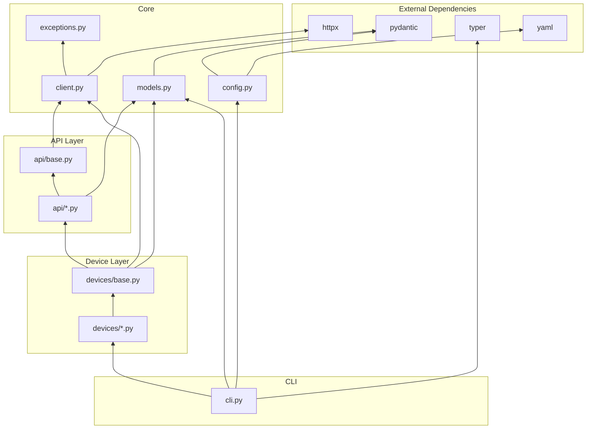
```mermaid
flowchart BT
    subgraph "External Dependencies"
        httpx
        pydantic
        typer
        yaml
    end

    subgraph "Core"
        exceptions[exceptions.py]
        client[client.py]
        models[models.py]
        config[config.py]
    end

    subgraph "API Layer"
        base[api/base.py]
        api_modules[api/*.py]
    end

    subgraph "Device Layer"
        device_base[devices/base.py]
        devices[devices/*.py]
    end

    subgraph "CLI"
        cli[cli.py]
    end

    client --> httpx
    client --> exceptions

    models --> pydantic

    config --> yaml
    config --> pydantic

    base --> client
    api_modules --> base
    api_modules --> models

    device_base --> client
    device_base --> api_modules
    device_base --> models

    devices --> device_base

    cli --> typer
    cli --> devices
    cli --> config
    cli --> models
```

---

## Deep Dive Sections

### Transport Layer Deep Dive

#### HTTP Connection Pooling

`VapixClient` delegates connection management entirely to `httpx.AsyncClient`. When `__aenter__` is called, a single `AsyncClient` instance is created and held for the lifetime of the context manager. `httpx` internally manages a connection pool keyed by `(host, port, scheme)`. All requests to the same device reuse the underlying TCP connection via HTTP/1.1 keep-alive, avoiding per-request TCP handshake and TLS negotiation overhead.

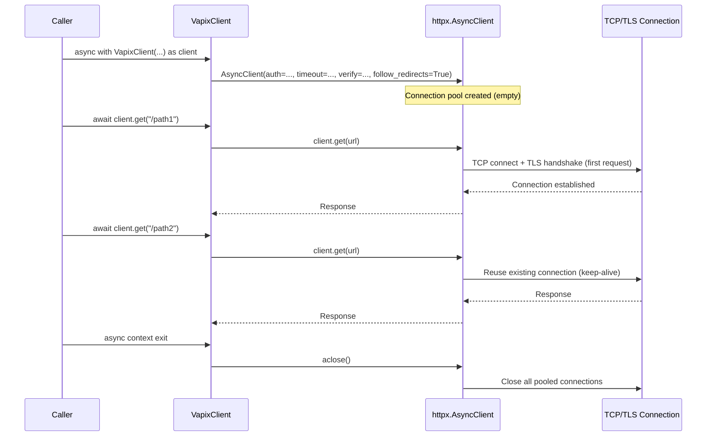
```mermaid
sequenceDiagram
    participant Caller
    participant VapixClient
    participant httpx.AsyncClient
    participant TCPConn as TCP/TLS Connection

    Caller->>VapixClient: async with VapixClient(...) as client
    VapixClient->>httpx.AsyncClient: AsyncClient(auth=..., timeout=..., verify=..., follow_redirects=True)
    Note over httpx.AsyncClient: Connection pool created (empty)

    Caller->>VapixClient: await client.get("/path1")
    VapixClient->>httpx.AsyncClient: client.get(url)
    httpx.AsyncClient->>TCPConn: TCP connect + TLS handshake (first request)
    TCPConn-->>httpx.AsyncClient: Connection established
    httpx.AsyncClient-->>VapixClient: Response

    Caller->>VapixClient: await client.get("/path2")
    VapixClient->>httpx.AsyncClient: client.get(url)
    httpx.AsyncClient->>TCPConn: Reuse existing connection (keep-alive)
    TCPConn-->>httpx.AsyncClient: Response
    httpx.AsyncClient-->>VapixClient: Response

    Caller->>VapixClient: async context exit
    VapixClient->>httpx.AsyncClient: aclose()
    httpx.AsyncClient->>TCPConn: Close all pooled connections
```

#### Authentication Flow Detail

Auth strategy is chosen at `__aenter__` time and baked into the `httpx.AsyncClient` instance. `httpx.BasicAuth` encodes `username:password` as Base64 and adds it on every request. `httpx.DigestAuth` performs a challenge-response dance: the first request goes out with no `Authorization` header, the `401` response carries the server's challenge nonce, and `httpx` re-sends the request with a computed MD5/SHA digest. All of this is transparent to `VapixClient` callers.

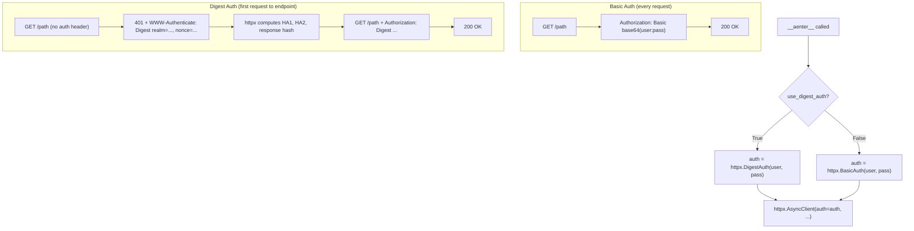
```mermaid
flowchart TD
    ENTER["__aenter__ called"] --> CHECK{use_digest_auth?}
    CHECK -->|True| DIGEST["auth = httpx.DigestAuth(user, pass)"]
    CHECK -->|False| BASIC["auth = httpx.BasicAuth(user, pass)"]
    DIGEST --> CREATE["httpx.AsyncClient(auth=auth, ...)"]
    BASIC --> CREATE

    subgraph "Basic Auth (every request)"
        BASIC_REQ["GET /path"] --> BASIC_HDR["Authorization: Basic base64(user:pass)"]
        BASIC_HDR --> BASIC_RESP["200 OK"]
    end

    subgraph "Digest Auth (first request to endpoint)"
        DIG_REQ1["GET /path (no auth header)"] --> DIG_401["401 + WWW-Authenticate: Digest realm=..., nonce=..."]
        DIG_401 --> DIG_COMPUTE["httpx computes HA1, HA2, response hash"]
        DIG_COMPUTE --> DIG_REQ2["GET /path + Authorization: Digest ..."]
        DIG_REQ2 --> DIG_RESP["200 OK"]
    end
```

#### Error Response Parsing and Exception Mapping

`_check_response()` sits between the raw `httpx.Response` and the rest of the stack. It maps HTTP status codes to the internal exception hierarchy:

| HTTP Status | Exception Raised | Meaning |
|---|---|---|
| 401 | `AxisAuthenticationError` | Bad credentials |
| 403 | `AxisAuthenticationError` | Insufficient permissions |
| 400–499 (other) | `AxisDeviceError` | Device-side request error |
| 500+ | `AxisDeviceError` | Device-side server error |
| `ConnectError` | `AxisConnectionError` | Network unreachable / refused |
| `TimeoutException` | `AxisConnectionError` | Request timed out |

JSON parse failures after a successful HTTP response raise `AxisDeviceError` with the failing path, so callers always see typed exceptions regardless of failure mode.

#### Binary Response Handling

Two methods handle binary content: `get_raw()` and `get_binary()`. Both return `response.content` (bytes), but they differ in timeout behaviour. `get_raw()` uses the client-level timeout set at construction. `get_binary()` accepts an optional `timeout` parameter that overrides the per-request timeout, enabling long-running downloads (e.g., a server report ZIP) to use 60–120 s without changing the default for all other calls.

```python
# Server report download: 120 s timeout, while normal requests stay at 30 s
report_bytes = await client.get_binary(
    "/axis-cgi/serverreport.cgi",
    params={"type": "text"},
    timeout=120.0,
)
```

---

### API Layer Deep Dive

#### The REST-First / CGI-Fallback Pattern

AXIS firmware has two API generations. AXIS OS 11.x introduced a proper REST API under `/config/rest/`. Older firmware only supports CGI endpoints (e.g., `/axis-cgi/basicdeviceinfo.cgi`). Rather than requiring callers to know which generation they are talking to, the API modules implement a try-REST-then-fall-back pattern transparently.

`BasicDeviceInfoAPI.get_info()` illustrates the pattern:

```python
async def get_info(self) -> BasicDeviceInfo:
    try:
        data = await self._get_rest_info()          # Try REST first
        if data and self._has_device_info_fields(data):
            return self._parse_rest_response(data)  # Success: return immediately
    except Exception:
        pass                                         # Any failure: fall through

    data = await self._get_cgi_info()               # Fall back to CGI
    return self._parse_cgi_response(data)
```

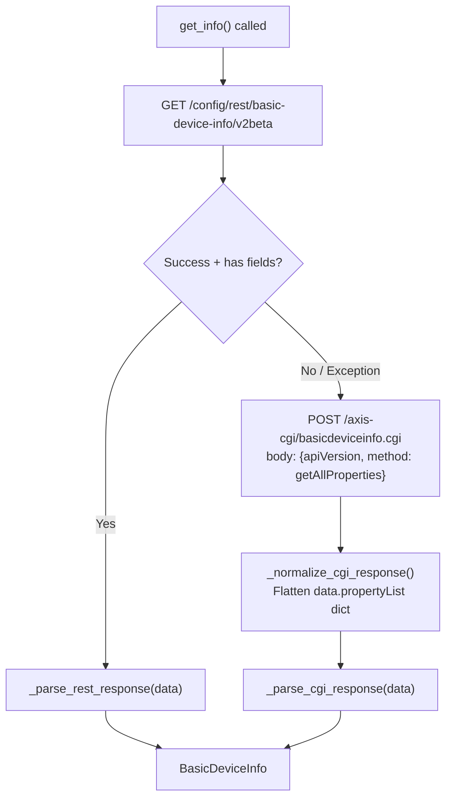
```mermaid
flowchart TD
    CALL["get_info() called"] --> TRY_REST["GET /config/rest/basic-device-info/v2beta"]
    TRY_REST --> REST_OK{Success + has fields?}
    REST_OK -->|Yes| PARSE_REST["_parse_rest_response(data)"] --> RETURN
    REST_OK -->|No / Exception| CGI["POST /axis-cgi/basicdeviceinfo.cgi\nbody: {apiVersion, method: getAllProperties}"]
    CGI --> NORMALIZE["_normalize_cgi_response()\nFlatten data.propertyList dict"]
    NORMALIZE --> PARSE_CGI["_parse_cgi_response(data)"] --> RETURN["BasicDeviceInfo"]
```

The CGI response normalization handles two sub-formats: modern CGI returns a flat dict under `data.propertyList`, while the oldest firmware wraps it as a `propertyList.properties` array of `{name, value}` objects.

#### How BaseAPI Wraps VapixClient Methods

`BaseAPI` provides three protected helpers that delegate to `VapixClient`. Subclasses call `self._get()`, `self._post()`, or `self._get_raw()` without touching the client directly.

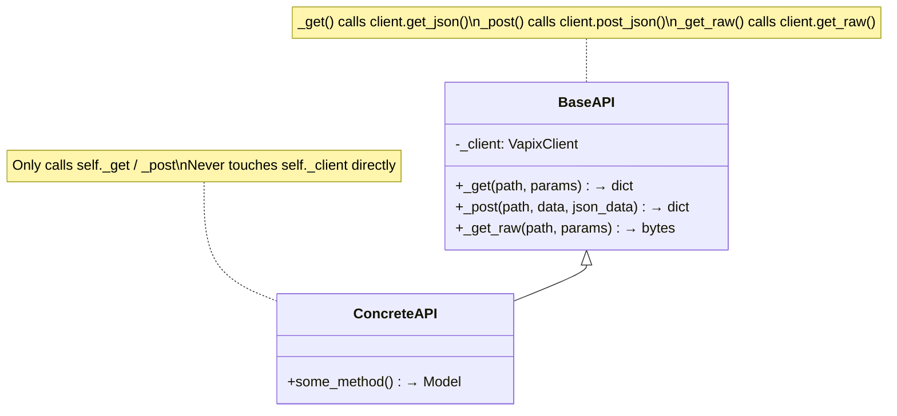
```mermaid
classDiagram
    class BaseAPI {
        -_client: VapixClient
        +_get(path, params) → dict
        +_post(path, data, json_data) → dict
        +_get_raw(path, params) → bytes
    }
    note for BaseAPI "_get() calls client.get_json()\n_post() calls client.post_json()\n_get_raw() calls client.get_raw()"

    class ConcreteAPI {
        +some_method() → Model
    }

    BaseAPI <|-- ConcreteAPI
    note for ConcreteAPI "Only calls self._get / _post\nNever touches self._client directly"
```

This indirection means all HTTP error handling is centralised in `VapixClient._check_response()`. API modules focus purely on request construction and response parsing.

#### Response Parsing and Model Validation Pipeline

Every API module follows the same pipeline: call the transport, receive a raw dict, pass it to `Model.model_validate()`. Pydantic performs type coercion, alias resolution, and field validation in one step.

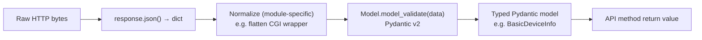
```mermaid
flowchart LR
    RAW["Raw HTTP bytes"] --> JSON["response.json() → dict"]
    JSON --> NORMALIZE["Normalize (module-specific)\ne.g. flatten CGI wrapper"]
    NORMALIZE --> VALIDATE["Model.model_validate(data)\nPydantic v2"]
    VALIDATE --> MODEL["Typed Pydantic model\ne.g. BasicDeviceInfo"]
    MODEL --> CALLER["API method return value"]
```

#### API Discovery Mechanism

`VapixClient.discover_apis()` queries `/config/discover/apis.json`. This endpoint returns a dict mapping API names to version and capability metadata. The result is consumed by `AxisDevice.get_capabilities()` to populate a `DeviceCapabilities` model. On older firmware that does not have this endpoint, the method catches the `AxisDeviceError` and returns an empty dict — making capability discovery gracefully degrading.

---

### Device Layer Deep Dive

#### Composition in Practice: 27 API Modules Injected

The `AxisDevice.__init__()` constructor creates all API module instances in a single place, passing the shared `VapixClient` to each. Modules are grouped in comments by priority, making it clear which APIs are expected to work on all devices vs. device-specific ones:

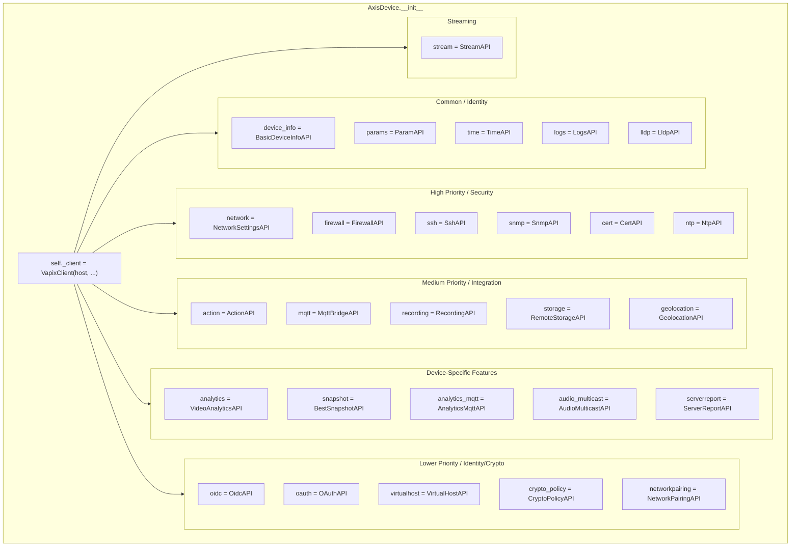
```mermaid
flowchart TB
    subgraph "AxisDevice.__init__"
        CLIENT["self._client = VapixClient(host, ...)"]

        CLIENT --> G1
        CLIENT --> G2
        CLIENT --> G3
        CLIENT --> G4
        CLIENT --> G5
        CLIENT --> G6

        subgraph G1["Common / Identity"]
            DI["device_info = BasicDeviceInfoAPI"]
            PA["params = ParamAPI"]
            TI["time = TimeAPI"]
            LG["logs = LogsAPI"]
            LL["lldp = LldpAPI"]
        end

        subgraph G2["High Priority / Security"]
            NW["network = NetworkSettingsAPI"]
            FW["firewall = FirewallAPI"]
            SS["ssh = SshAPI"]
            SN["snmp = SnmpAPI"]
            CT["cert = CertAPI"]
            NT["ntp = NtpAPI"]
        end

        subgraph G3["Medium Priority / Integration"]
            AC["action = ActionAPI"]
            MQ["mqtt = MqttBridgeAPI"]
            RC["recording = RecordingAPI"]
            ST["storage = RemoteStorageAPI"]
            GE["geolocation = GeolocationAPI"]
        end

        subgraph G4["Device-Specific Features"]
            AN["analytics = VideoAnalyticsAPI"]
            SN2["snapshot = BestSnapshotAPI"]
            AM["analytics_mqtt = AnalyticsMqttAPI"]
            AU["audio_multicast = AudioMulticastAPI"]
            SR["serverreport = ServerReportAPI"]
        end

        subgraph G5["Lower Priority / Identity/Crypto"]
            OI["oidc = OidcAPI"]
            OA["oauth = OAuthAPI"]
            VH["virtualhost = VirtualHostAPI"]
            CP["crypto_policy = CryptoPolicyAPI"]
            NP["networkpairing = NetworkPairingAPI"]
        end

        subgraph G6["Streaming"]
            SM["stream = StreamAPI"]
        end
    end
```

All modules share one `VapixClient` instance — there is only one connection pool for the device lifetime.

#### The Factory Pattern in CLI (`get_device_class`)

The CLI resolves a device type string (from config or default `"camera"`) to a concrete device class via a simple dict-based factory:

```python
def get_device_class(device_type: str) -> type[AxisDevice]:
    type_map = {
        "camera": AxisCamera,
        "recorder": AxisRecorder,
        "intercom": AxisIntercom,
        "speaker": AxisSpeaker,
    }
    return type_map.get(device_type.lower(), AxisCamera)  # default: AxisCamera
```

This decouples CLI commands from concrete device classes. Commands only import `AxisDevice` (the abstract base); the factory injects the correct subclass at runtime.

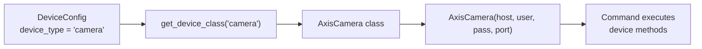
```mermaid
flowchart LR
    CONFIG["DeviceConfig\ndevice_type = 'camera'"] --> FACTORY["get_device_class('camera')"]
    FACTORY --> CLASS["AxisCamera class"]
    CLASS --> INSTANCE["AxisCamera(host, user, pass, port)"]
    INSTANCE --> CMD["Command executes\ndevice methods"]
```

#### Device-Specific Method Implementations

`AxisCamera` extends `AxisDevice` with camera-only methods. `get_snapshot()` calls `client.get_raw()` directly (bypassing the `BaseAPI` layer) because snapshots are binary, not JSON. `get_video_stream_url()` constructs an RTSP URL from the device host without making a network call — it is a pure string builder.

The `get_device_specific_info()` abstract method is the device fingerprint. It gates the capability API call and returns a flat dict that the CLI and report commands consume. Each subclass must implement it; the base class enforces this via `@abstractmethod`.

---

### Configuration System Deep Dive

#### Full Config Loading Pipeline

`load_config()` is decorated with `@lru_cache(maxsize=1)`, meaning it runs once per process lifetime. The pipeline is:

```mermaid
flowchart TD
    CALL["load_config(config_path=None)"] --> LRU{Already cached?}
    LRU -->|Yes| RETURN_CACHED["Return cached AppConfig"]
    LRU -->|No| LOAD_ENV["load_env_file()\nRead ~/.config/axiscam/.env\nSet missing OS env vars"]
    LOAD_ENV --> START["config_data = {'devices': {}}"]
    START --> DEFAULT_FILE{Default config\nexists?}
    DEFAULT_FILE -->|Yes| LOAD_DEFAULT["load_yaml_config(~/.config/axiscam/config.yaml)\n→ interpolate_env_vars()\n→ normalize_devices_format()"]
    DEFAULT_FILE -->|No| SKIP1["Skip"]
    LOAD_DEFAULT --> MERGE1["config_data.update(file_config)"]
    SKIP1 --> MERGE1
    MERGE1 --> EXTRA_FILE{config_path\nprovided?}
    EXTRA_FILE -->|Yes| LOAD_EXTRA["load_yaml_config(config_path)"]
    EXTRA_FILE -->|No| SKIP2["Skip"]
    LOAD_EXTRA --> MERGE2["config_data.update(extra_config)"]
    SKIP2 --> MERGE2
    MERGE2 --> ENV_DEV["load_env_config()\nAXIS_HOST, AXIS_USERNAME, AXIS_PASSWORD, etc."]
    ENV_DEV --> HAS_HOST{AXIS_HOST\npresent?}
    HAS_HOST -->|Yes| INJECT_DEV["Inject 'default' device\nSet default_device = 'default'"]
    HAS_HOST -->|No| SKIP3["Skip"]
    INJECT_DEV --> VALIDATE["AppConfig.model_validate(config_data)"]
    SKIP3 --> VALIDATE
    VALIDATE --> RETURN["Return AppConfig (now cached)"]
```

#### Environment Variable Interpolation

`interpolate_env_vars()` uses a single compiled regex to find and replace `${VAR_NAME}` tokens. It recursively handles nested dicts and lists, so the entire YAML config tree is processed in one pass:

```python
pattern = re.compile(r"\$\{([^}]+)\}")
```

For each match, `os.environ.get(var_name, "")` is called. Missing variables silently resolve to empty string — a deliberate choice to avoid failing on partial environments (e.g., a device whose password is not yet set).

#### Legacy Format Detection and Conversion

`normalize_devices_format()` detects whether `devices` is a YAML list (legacy) or dict (current). The trigger is a simple `isinstance(devices, list)` check. List items carry a `name` field; the normalizer slugifies it (lowercase, spaces/hyphens → underscores) for use as the dict key while preserving the original `name` in the value:

```python
key = name.lower().replace(" ", "_").replace("-", "_")
```

#### Pydantic Validation with Custom Validators

`DeviceConfig` has two custom `@field_validator` methods:

**`validate_host`**: Strips whitespace and rejects empty strings. Handles pasted IPs with trailing spaces.

**`validate_device_type`**: Normalises the type field in three steps:
1. Strips ASCII and Unicode quote characters (handles YAML formatting artifacts)
2. Lowercases the value
3. Checks `valid_types` set first, then falls through to `DEVICE_TYPE_MAPPINGS` for descriptive names ("Dome Camera" → "camera"), defaulting to "camera" if unknown

```mermaid
flowchart LR
    INPUT["device_type raw value\ne.g. 'Dome Camera'"] --> STRIP["Strip quotes + lowercase\n→ 'dome camera'"]
    STRIP --> CHECK_EXACT{In valid_types?}
    CHECK_EXACT -->|Yes| RETURN_EXACT["Return as-is"]
    CHECK_EXACT -->|No| CHECK_MAP{In DEVICE_TYPE_MAPPINGS?}
    CHECK_MAP -->|Yes| RETURN_MAPPED["Return mapped value\n'dome camera' → 'camera'"]
    CHECK_MAP -->|No| DEFAULT["Return 'camera' (default)"]
```

`AppConfig` and `DeviceConfig` both set `model_config = {"frozen": True}` — models are immutable after construction, preventing accidental mutation in long-lived cache.

---

### CLI Architecture Deep Dive

#### Typer App Structure with Sub-Apps

The CLI defines one root `typer.Typer` app (`app`) and five sub-apps, each registered with `app.add_typer()`. This produces a two-level command hierarchy:

```mermaid
graph TD
    APP["app\naxiscam"] --> INFO["@app.command('info')\naxiscam info"]
    APP --> STATUS["@app.command('status')\naxiscam status"]
    APP --> REPORT["@app.command('report')\naxiscam report"]
    APP --> CONFIG_CMD["@app.command('config')\naxiscam config"]
    APP --> LOGS_APP["logs_app\naxiscam logs"]
    APP --> NET_APP["network_app\naxiscam network"]
    APP --> SEC_APP["security_app\naxiscam security"]
    APP --> SVC_APP["services_app\naxiscam services"]
    APP --> DL_APP["download_app\naxiscam download"]

    LOGS_APP --> LOG_SYS["axiscam logs system"]
    LOGS_APP --> LOG_APP_CMD["axiscam logs application"]
    NET_APP --> NET_INFO["axiscam network info"]
    SEC_APP --> SEC_FW["axiscam security firewall"]
    SEC_APP --> SEC_SSH["axiscam security ssh"]
    SEC_APP --> SEC_CERT["axiscam security cert"]
    SVC_APP --> SVC_SNMP["axiscam services snmp"]
    SVC_APP --> SVC_NTP["axiscam services ntp"]
    DL_APP --> DL_REPORT["axiscam download report"]
    DL_APP --> DL_DEBUG["axiscam download debug"]
```

Sub-apps group related commands without forcing a deep class hierarchy. Each sub-app is a plain `Typer()` instance; commands are registered with `@sub_app.command("name")`.

#### How Commands Resolve Device Configs and Create Device Instances

Every command follows the same two-step resolution pattern:

```mermaid
sequenceDiagram
    participant CMD as CLI Command
    participant RESOLVE as resolve_device_config()
    participant FACTORY as get_device_class()
    participant CONFIG as load_config()
    participant DEVICE as AxisDevice subclass

    CMD->>RESOLVE: (device=None, host="192.168.1.10", user, pass, port)
    RESOLVE->>CONFIG: get_device_config(device)
    CONFIG-->>RESOLVE: None (not in config)
    RESOLVE->>RESOLVE: host looks like IP → use directly
    RESOLVE-->>CMD: (host, user, pass, port, "camera")

    CMD->>FACTORY: get_device_class("camera")
    FACTORY-->>CMD: AxisCamera class

    CMD->>DEVICE: async with AxisCamera(host, user, pass, port) as dev
    CMD->>DEVICE: await dev.get_info()
    DEVICE-->>CMD: BasicDeviceInfo
```

`resolve_device_config()` handles three resolution paths: (1) explicit `--host` with credentials, (2) named device from config file, (3) IP-that-looks-like-a-host searched against config devices, then falling through to direct credential requirement.

#### Output Formatting: Rich Tables, Panels, and JSON Mode

Commands accept a `--json` / `-j` flag. When False (default), Rich components are used. When True, Pydantic models are serialised via `.model_dump()` and printed as JSON. The `console` object is a module-level `rich.Console` singleton — all output goes through it, making redirection and testing consistent.

Rich component usage by command type:

| Output Need | Rich Component |
|---|---|
| Key-value device info | `rich.table.Table` (two-column, no header) |
| Section grouping | `rich.panel.Panel` with title |
| Hierarchical data (capabilities, APIs) | `rich.tree.Tree` |
| Log entries | `rich.table.Table` with timestamp/level/message columns |

---

## State Diagrams

### Device Connection Lifecycle

```mermaid
stateDiagram-v2
    [*] --> Instantiated : AxisDevice.__init__()
    note right of Instantiated
        VapixClient created (not connected)
        All 27 API modules instantiated
        _client._client = None
    end note

    Instantiated --> Connected : async with device as dev\n(calls __aenter__ → client.__aenter__)
    note right of Connected
        httpx.AsyncClient created
        Auth strategy selected
        Connection pool ready
    end note

    Connected --> Executing : await dev.some_method()
    note right of Executing
        HTTP request in flight
        Connection pool manages socket
    end note

    Executing --> Connected : Response received
    Executing --> ErrorState : AxisConnectionError\nAxisAuthenticationError\nAxisDeviceError

    ErrorState --> Connected : Exception propagated\n(connection still open unless ConnectError)
    ErrorState --> Closed : ConnectError / caller exits context

    Connected --> Closed : Context exit __aexit__\n(calls client.aclose())
    note right of Closed
        httpx.AsyncClient closed
        All pooled connections released
        _client._client = None
    end note

    Closed --> [*]
```

---

## ER Diagram: Configuration Entities

```mermaid
erDiagram
    AppConfig {
        string default_device
        float timeout
    }

    DeviceConfig {
        string host
        string username
        SecretStr password
        int port
        bool ssl_verify
        string device_type
        string name
        string vendor
        string model
    }

    AxisDevice {
        string host
        DeviceType device_type
    }

    VapixClient {
        string host
        int port
        bool use_https
        float timeout
        bool use_digest_auth
    }

    AppConfig ||--o{ DeviceConfig : "devices dict"
    DeviceConfig ||--|| AxisDevice : "instantiates via factory"
    AxisDevice ||--|| VapixClient : "owns _client"
```

---

## Full Lifecycle Sequence: `axiscam report --full --device front_camera`

```mermaid
sequenceDiagram
    participant User
    participant CLI as CLI (report command)
    participant Config as load_config()
    participant Factory as get_device_class()
    participant Device as AxisCamera
    participant Client as VapixClient
    participant AXIS as AXIS Device

    User->>CLI: axiscam report --full --device front_camera
    CLI->>Config: get_device_config("front_camera")
    Config-->>CLI: DeviceConfig(host=192.168.1.10, type="camera")
    CLI->>Factory: get_device_class("camera")
    Factory-->>CLI: AxisCamera
    CLI->>Device: async with AxisCamera(host, user, pass, 443)
    Device->>Client: VapixClient.__aenter__() → httpx.AsyncClient created

    par Parallel API calls
        CLI->>Device: get_info()
        Device->>Client: GET /config/rest/basic-device-info/v2beta
        Client->>AXIS: HTTPS GET (Basic auth)
        AXIS-->>Client: JSON
        Client-->>Device: BasicDeviceInfo

        CLI->>Device: get_time_info()
        Device->>Client: GET /axis-cgi/time.cgi
        Client->>AXIS: HTTPS GET
        AXIS-->>Client: JSON
        Client-->>Device: TimeInfo

        CLI->>Device: get_lldp_info()
        Device->>Client: GET /config/rest/lldp/v1beta
        Client->>AXIS: HTTPS GET
        AXIS-->>Client: JSON
        Client-->>Device: LldpInfo

        CLI->>Device: get_network_config()
        Device->>Client: GET /config/rest/network-settings/v1beta
        Client->>AXIS: HTTPS GET
        AXIS-->>Client: JSON
        Client-->>Device: NetworkConfig

        CLI->>Device: get_stream_diagnostics()
        Device->>Client: GET /axis-cgi/param.cgi (rtsp/rtp params)
        Client->>AXIS: HTTPS GET
        AXIS-->>Client: Config data
        Client-->>Device: StreamDiagnostics

        CLI->>Device: get_security_config() [ssh, snmp, cert, firewall]
        Device->>Client: Multiple GETs to security endpoints
        Client->>AXIS: HTTPS GETs
        AXIS-->>Client: JSON responses
        Client-->>Device: SshConfig, SnmpConfig, CertConfig, FirewallConfig
    end

    CLI->>Device: get_capabilities()
    Device->>Client: GET /config/discover/apis.json
    Client->>AXIS: HTTPS GET
    AXIS-->>Client: API discovery JSON
    Client-->>Device: DeviceCapabilities

    CLI->>CLI: Combine into report dict
    CLI->>User: Rich table output (or JSON if --json)

    CLI->>Device: async context exit
    Device->>Client: VapixClient.__aexit__() → aclose()
    Client->>AXIS: Close TCP/TLS connection
```

---

## CLI Sub-Apps to Device Methods and API Modules

```mermaid
flowchart LR
    subgraph "CLI Sub-Apps"
        INFO["axiscam info"]
        REPORT["axiscam report"]
        LOGS_CMD["axiscam logs system/application"]
        NET_CMD["axiscam network info"]
        SEC_FW["axiscam security firewall"]
        SEC_SSH["axiscam security ssh"]
        SEC_CERT["axiscam security cert"]
        SVC_SNMP["axiscam services snmp"]
        SVC_NTP["axiscam services ntp"]
        DL_RPT["axiscam download report"]
        DL_DBG["axiscam download debug"]
    end

    subgraph "Device Methods"
        GET_INFO["get_info()"]
        GET_STATUS["get_status()"]
        GET_CAPS["get_capabilities()"]
        GET_LOGS["get_logs()"]
        GET_NET["get_network_config()"]
        GET_FW["get_firewall_config()"]
        GET_SSH["get_ssh_config()"]
        GET_CERT["get_cert_config()"]
        GET_SNMP["get_snmp_config()"]
        GET_NTP["get_ntp_config()"]
        DL_REPORT_M["download_server_report()"]
        DL_DEBUG_M["download_debug_archive()"]
    end

    subgraph "API Modules"
        DINFO["BasicDeviceInfoAPI"]
        PAPI["ParamAPI"]
        LAPI["LogsAPI"]
        NAPI["NetworkSettingsAPI"]
        FAPI["FirewallAPI"]
        SAPI["SshAPI"]
        CAPI["CertAPI"]
        SNAPI["SnmpAPI"]
        NTAPI["NtpAPI"]
        SRAPI["ServerReportAPI"]
        DISAPI["API Discovery"]
    end

    INFO --> GET_INFO & GET_CAPS
    REPORT --> GET_INFO & GET_STATUS & GET_NET & GET_SSH & GET_SNMP & GET_CERT & GET_NTP
    LOGS_CMD --> GET_LOGS
    NET_CMD --> GET_NET
    SEC_FW --> GET_FW
    SEC_SSH --> GET_SSH
    SEC_CERT --> GET_CERT
    SVC_SNMP --> GET_SNMP
    SVC_NTP --> GET_NTP
    DL_RPT --> DL_REPORT_M
    DL_DBG --> DL_DEBUG_M

    GET_INFO --> DINFO
    GET_CAPS --> DISAPI
    GET_LOGS --> LAPI
    GET_NET --> NAPI
    GET_FW --> FAPI
    GET_SSH --> SAPI
    GET_CERT --> CAPI
    GET_SNMP --> SNAPI
    GET_NTP --> NTAPI
    DL_REPORT_M --> SRAPI
    DL_DEBUG_M --> SRAPI
```

---

## Design Decisions (ADR-Style)

### ADR-001: Composition over Inheritance for API Modules

**Status**: Accepted

**Context**: The codebase needs to expose ~27 VAPIX API domains across 4 device types. Inheritance would require either a deep chain (fragile, forces capability onto every subclass) or multiple inheritance (Python MRO complexity, diamond problem).

**Decision**: Each API domain is a standalone class inheriting only from `BaseAPI`. `AxisDevice` holds them as named attributes. Device subclasses inherit the complete set.

**Rationale**:
- Adding a new API module requires creating one file and one attribute assignment in `AxisDevice.__init__()`. No existing code changes.
- API modules are testable in isolation by injecting a mock `VapixClient`.
- Attribute access (`device.mqtt.get_config()`) is readable and self-documenting.
- Not all device types expose all APIs; subclasses can override individual attributes to `None` or a device-specific variant without touching the inheritance chain.

**Consequences**: All 27 modules are instantiated even if unused in a given CLI call. The cost is negligible (they're just object construction), and eager instantiation avoids lazy-init complexity.

---

### ADR-002: Async Throughout (sync CLI wrapper at the boundary)

**Status**: Accepted

**Context**: AXIS devices support VAPIX calls in parallel (e.g., fetching network config and security config simultaneously). The report command benefits significantly from concurrent API calls.

**Decision**: All device and API methods are `async def`. The CLI uses `asyncio.run()` via the `run_async()` helper as the single sync-to-async boundary.

**Rationale**:
- `httpx.AsyncClient` enables true concurrent I/O within a single event loop turn.
- The `par` blocks in report generation (multiple API calls in flight simultaneously) are possible only with async.
- Sync wrappers (`asyncio.run()`) at the CLI entry point are the standard Python pattern for async libraries consumed by sync code.
- Keeping async all the way down avoids the "coloring problem" of mixing sync and async in library code.

**Consequences**: Tests require `pytest-asyncio` or similar. One-liner scripts need `asyncio.run()`. These are well-understood, standard Python practices.

---

### ADR-003: Pydantic v2 for Models

**Status**: Accepted

**Context**: API responses are raw dicts. The codebase needs validation, type coercion, and serialisation.

**Decision**: All response models and config models use Pydantic v2 `BaseModel`.

**Rationale**:
- `model_validate()` handles alias resolution (e.g., `address` → `host` in `DeviceConfig`), type coercion, and custom validators in one call.
- `model_dump()` / `model_dump_json()` provide free serialisation to JSON for CLI `--json` output.
- `frozen=True` on config models prevents mutation bugs in cached config.
- `SecretStr` for passwords prevents accidental logging of credentials.
- Field validators (`@field_validator`) centralise normalisation logic (device type, host validation) close to the model definition.

**Consequences**: Pydantic v2 is a required dependency. Models must be kept in sync with API response shapes. Validation errors surface as `ValidationError` exceptions that need to be caught or mapped to `AxisDeviceError`.

---

### ADR-004: httpx over aiohttp / requests

**Status**: Accepted

**Context**: The transport layer needs async HTTP with Basic and Digest auth, connection pooling, configurable timeouts, and binary response support.

**Decision**: `httpx.AsyncClient` is the sole HTTP dependency.

**Rationale**:
- `httpx` provides `BasicAuth` and `DigestAuth` as first-class citizens. `aiohttp` requires third-party libraries for Digest auth. `requests` is sync-only.
- `httpx` follows the `requests`-compatible API surface, reducing learning curve.
- `follow_redirects=True` handles AXIS firmware redirects (e.g., HTTP → HTTPS upgrade redirects) automatically.
- Per-request timeout override (`timeout=` param on `.get()`) is native in `httpx`; `aiohttp` requires wrapping in `asyncio.wait_for()`.
- `httpx` is a single dependency that covers sync and async; `requests` + `aiohttp` would be two.

**Consequences**: `httpx` is a production-grade but less ubiquitous library than `requests`. Team familiarity is a mild onboarding cost.

---

### ADR-005: Typer over Click / argparse

**Status**: Accepted

**Context**: The CLI needs subcommands, typed options, auto-generated `--help`, and clean integration with Rich for formatted output.

**Decision**: Typer with Rich as the output layer.

**Rationale**:
- Typer derives CLI options from Python type annotations and docstrings, eliminating decorator boilerplate.
- Sub-apps (`typer.Typer()` + `app.add_typer()`) produce a two-level command hierarchy without the Click group ceremony.
- Typer's `Annotated[type, typer.Option(...)]` pattern co-locates option metadata with the type hint.
- Rich integrates naturally — `Console()`, `Table()`, `Panel()`, `Tree()` are drop-in replacements for `print()`.
- argparse produces plain text help; Typer + Rich produces coloured, formatted help pages at zero additional cost.

**Consequences**: Typer is a higher-level abstraction than Click. Edge cases (e.g., custom completion) require dropping to Click internals, but these are rare.

---

## Cross-References

The following companion documents provide complementary views of the system:

| Document | Purpose |
|---|---|
| [c4-architecture.md](./c4-architecture.md) | C4 model: Context, Container, Component, and Code diagrams |
| [codemap.md](./codemap.md) | Detailed per-file code breakdown with function signatures |
| [use-cases.md](./use-cases.md) | Use cases and how-to examples for common workflows |
| [troubleshooting-runbook.md](./troubleshooting-runbook.md) | Troubleshooting guide and operational runbook |

---

## See Also

- [API Modules Reference](./api-modules.md) - Detailed API module documentation
- [Device Classes](./device-classes.md) - Device type implementations
- [CLI Reference](./cli-reference.md) - Command-line interface documentation
- [Configuration Guide](./configuration.md) - Configuration system details
