# C4 Architecture: axis-cam

> **C4 Model** — Context, Containers, Components, Code  
> A hierarchical set of diagrams that describe software architecture at different levels of abstraction.

---

## Contents

1. [Level 1 — System Context](#level-1--system-context)
2. [Level 2 — Container Diagram](#level-2--container-diagram)
3. [Level 3 — Component Diagrams](#level-3--component-diagrams)
   - [CLI Application](#31-cli-application)
   - [Device Layer](#32-device-layer)
   - [API Layer](#33-api-layer)
   - [Transport Layer](#34-transport-layer)
   - [Configuration Manager](#35-configuration-manager)
4. [Level 4 — Code Level](#level-4--code-level)
   - [VapixClient class](#41-vapixclient)
   - [BaseAPI class](#42-baseapi)
   - [AxisDevice hierarchy](#43-axisdevice-hierarchy)
   - [Exception hierarchy](#44-exception-hierarchy)
   - [Configuration models](#45-configuration-models)
5. [Deployment View](#deployment-view)
6. [Request Lifecycle — Data Flow](#request-lifecycle--data-flow)
7. [Technology Choices](#technology-choices)

---

## Level 1 — System Context

The outermost view. Shows who uses `axis-cam` and what external systems it depends on.

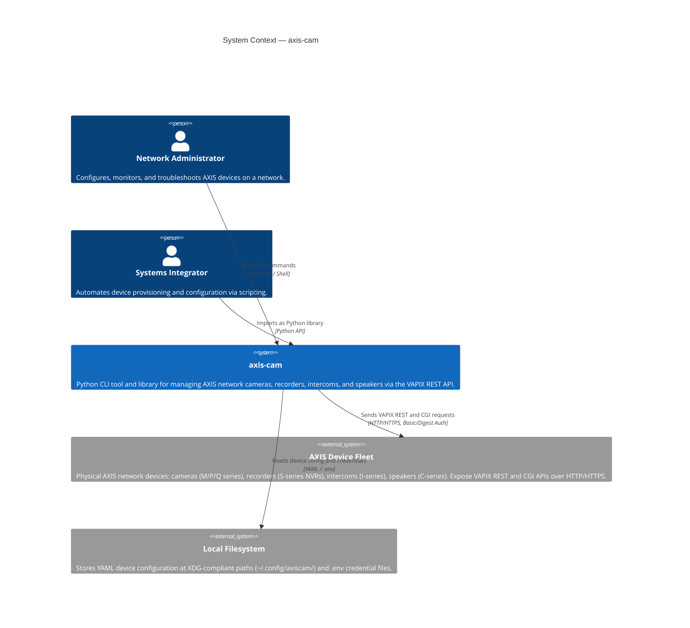

**Key relationships:**

| Actor / System | Interaction | Protocol |
|---|---|---|
| Network Administrator | Runs CLI commands (e.g., `axiscam info`, `axiscam logs system`) | Terminal |
| Systems Integrator | Imports `axis_cam` package directly in Python scripts | Python import |
| AXIS Device Fleet | Bidirectional: axiscam sends requests, devices return data | HTTP/HTTPS + VAPIX |
| Local Filesystem | Read-only: config loading at startup | File I/O |

---

## Level 2 — Container Diagram

Zooms into the `axis-cam` system, showing its internal containers (deployable / runnable units).

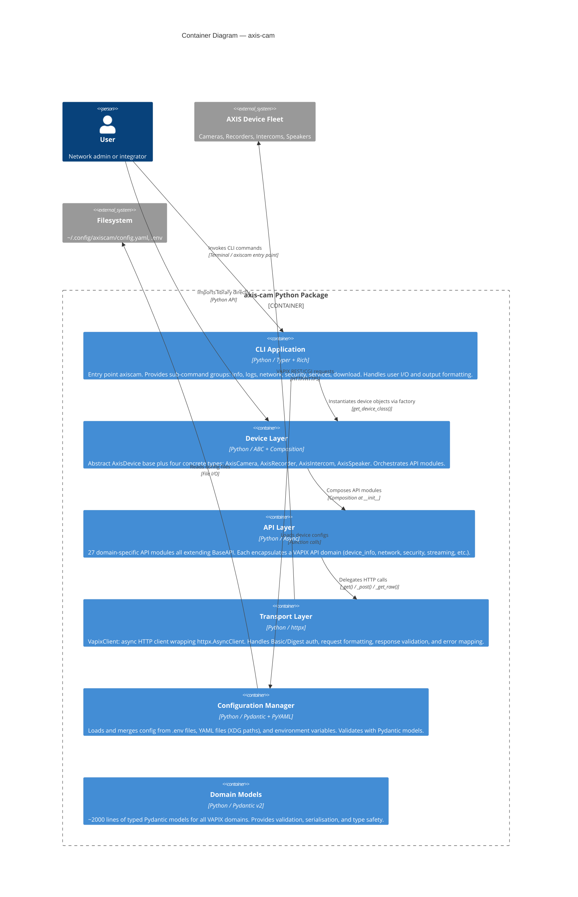

---

## Level 3 — Component Diagrams

### 3.1 CLI Application

The `cli.py` module is a single-file Typer application with named sub-apps for each command group.

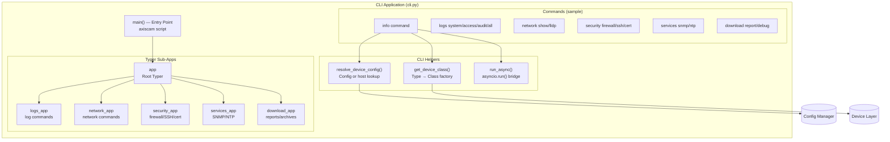

**CLI option type aliases used across all commands:**

| Alias | Flag | Purpose |
|---|---|---|
| `DeviceOption` | `--device / -d` | Named device from config |
| `HostOption` | `--host / -H` | Direct IP/hostname override |
| `UsernameOption` | `--username / -u` | Credential override |
| `PasswordOption` | `--password / -p` | Credential override |
| `PortOption` | `--port / -P` | HTTPS port (default 443) |
| `DigestOption` | `--digest / --no-digest` | Auth method (default Digest) |
| `JsonOption` | `--json / -j` | Machine-readable output |

---

### 3.2 Device Layer

The device hierarchy uses the Template Method pattern: `AxisDevice` provides all common operations; subclasses implement `get_device_specific_info()` and add device-type-specific methods.

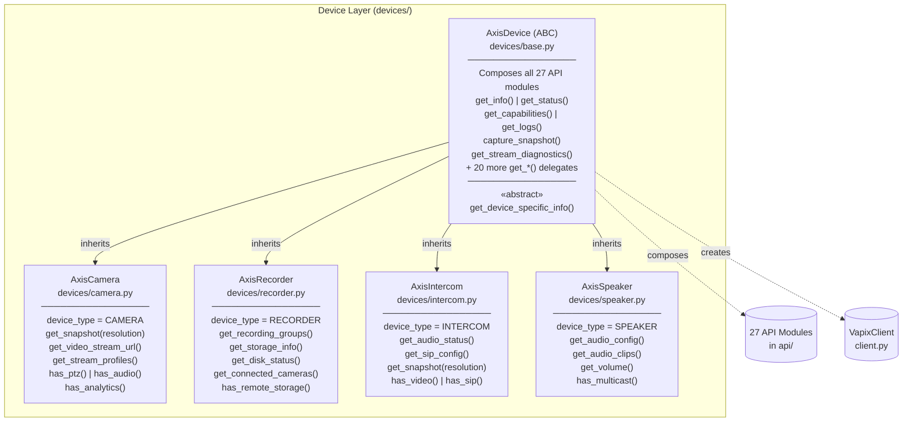

**Device type auto-detection from port:**

```
port == 443  →  use_https = True
port != 443  →  use_https = False
```

---

### 3.3 API Layer

All 27 API modules extend `BaseAPI`. Grouped by functional domain:

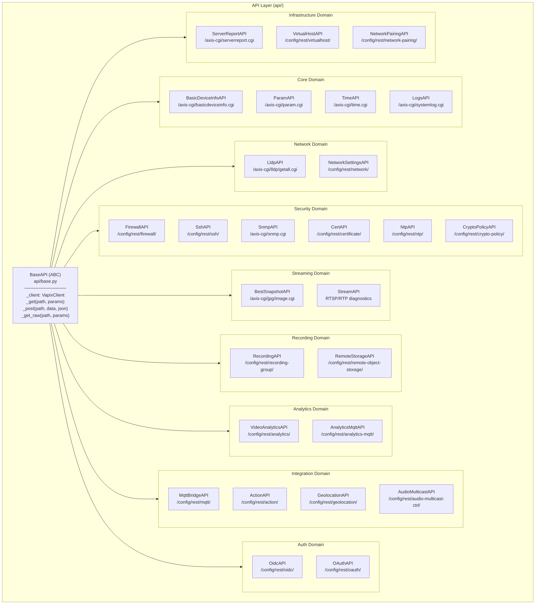

**Complete API module inventory:**

| Module | Class | VAPIX Endpoint | Domain |
|---|---|---|---|
| `device_info` | `BasicDeviceInfoAPI` | `/axis-cgi/basicdeviceinfo.cgi` | Core |
| `param` | `ParamAPI` | `/axis-cgi/param.cgi` | Core |
| `time` | `TimeAPI` | `/axis-cgi/time.cgi` | Core |
| `logs` | `LogsAPI` | `/axis-cgi/systemlog.cgi` | Core |
| `lldp` | `LldpAPI` | `/axis-cgi/lldp/getall.cgi` | Network |
| `network` | `NetworkSettingsAPI` | `/config/rest/network/v1` | Network |
| `firewall` | `FirewallAPI` | `/config/rest/firewall/v1` | Security |
| `ssh` | `SshAPI` | `/config/rest/ssh/v1` | Security |
| `snmp` | `SnmpAPI` | `/axis-cgi/snmp.cgi` | Security |
| `cert` | `CertAPI` | `/config/rest/certificate/v1` | Security |
| `ntp` | `NtpAPI` | `/config/rest/ntp/v1` | Security |
| `crypto_policy` | `CryptoPolicyAPI` | `/config/rest/crypto-policy/v1` | Security |
| `snapshot` | `BestSnapshotAPI` | `/axis-cgi/jpg/image.cgi` | Streaming |
| `stream` | `StreamAPI` + `StreamDiagnostics` | RTSP/RTP params | Streaming |
| `recording` | `RecordingAPI` | `/config/rest/recording-group/v2` | Recording |
| `storage` | `RemoteStorageAPI` | `/config/rest/remote-object-storage/v1` | Recording |
| `analytics` | `VideoAnalyticsAPI` | `/config/rest/analytics/v1` | Analytics |
| `analytics_mqtt` | `AnalyticsMqttAPI` | `/config/rest/analytics-mqtt/v1` | Analytics |
| `mqtt` | `MqttBridgeAPI` | `/config/rest/mqtt/v1` | Integration |
| `action` | `ActionAPI` | `/config/rest/action/v1` | Integration |
| `geolocation` | `GeolocationAPI` | `/config/rest/geolocation/v1` | Integration |
| `audio_multicast` | `AudioMulticastAPI` | `/config/rest/audio-multicast-ctrl/v1beta` | Integration |
| `oidc` | `OidcAPI` | `/config/rest/oidc/v1` | Auth |
| `oauth` | `OAuthAPI` | `/config/rest/oauth/v1` | Auth |
| `serverreport` | `ServerReportAPI` | `/axis-cgi/serverreport.cgi` | Diagnostics |
| `virtualhost` | `VirtualHostAPI` | `/config/rest/virtualhost/v1` | Infrastructure |
| `networkpairing` | `NetworkPairingAPI` | `/config/rest/network-pairing/v1` | Infrastructure |

---

### 3.4 Transport Layer

`VapixClient` is the sole HTTP transport, wrapping `httpx.AsyncClient`. Designed exclusively as an async context manager.

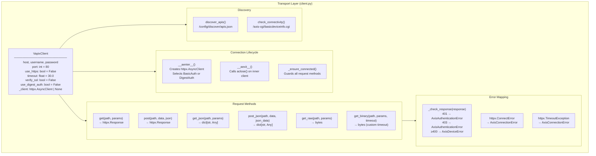

**Authentication strategy selection:**

```
use_digest_auth = True   →   httpx.DigestAuth(username, password)
use_digest_auth = False  →   httpx.BasicAuth(username, password)
```

---

### 3.5 Configuration Manager

`config.py` implements a layered config loading pipeline with Pydantic validation at the boundary.

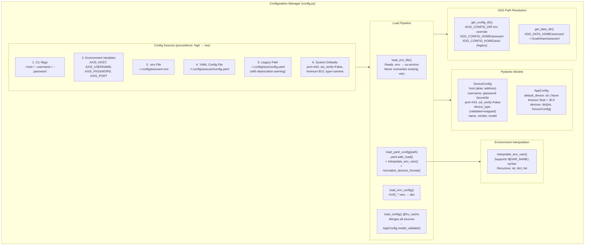

**Device type mapping (normalisation):**

Accepts human-readable descriptions and maps them to canonical types:

| Input (case-insensitive) | Canonical type |
|---|---|
| `camera`, `dome camera`, `ptz camera`, `thermal camera` | `camera` |
| `recorder`, `nvr`, `network video recorder`, `s3008`, `s3016` | `recorder` |
| `intercom`, `network video intercom`, `door station` | `intercom` |
| `speaker`, `network speaker`, `horn speaker`, `network audio` | `speaker` |

---

## Level 4 — Code Level

Class diagrams showing the key interfaces, method signatures, and relationships.

### 4.1 VapixClient

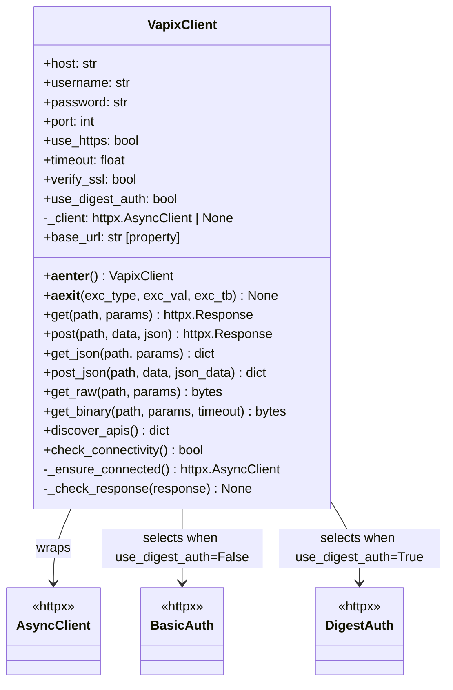

### 4.2 BaseAPI

```mermaid
classDiagram
    class BaseAPI {
        <<abstract>>
        -_client: VapixClient

        +__init__(client: VapixClient)
        #_get(path, params) Any
        #_post(path, data, json_data) Any
        #_get_raw(path, params) bytes
    }

    class BasicDeviceInfoAPI {
        +get_info() BasicDeviceInfo
    }
    class ParamAPI {
        +get_friendly_name() str
        +get_location() str
    }
    class LogsAPI {
        -device_name: str
        +get_logs(log_type, max_entries) LogReport
        +get_system_logs(max_entries) LogReport
    }
    class NetworkSettingsAPI {
        +get_config() NetworkConfig
    }
    class FirewallAPI {
        +get_config() FirewallConfig
    }
    class BestSnapshotAPI {
        +capture(resolution, compression, camera) bytes
        +get_config() BestSnapshotConfig
    }
    class StreamAPI {
        +get_diagnostics(device_name) StreamDiagnostics
    }
    class ServerReportAPI {
        +download_report(format, timeout) ServerReport
        +get_debug_archive(timeout) ServerReport
    }

    BaseAPI <|-- BasicDeviceInfoAPI
    BaseAPI <|-- ParamAPI
    BaseAPI <|-- LogsAPI
    BaseAPI <|-- NetworkSettingsAPI
    BaseAPI <|-- FirewallAPI
    BaseAPI <|-- BestSnapshotAPI
    BaseAPI <|-- StreamAPI
    BaseAPI <|-- ServerReportAPI
    BaseAPI <|-- "... 19 more API classes"
```

### 4.3 AxisDevice Hierarchy

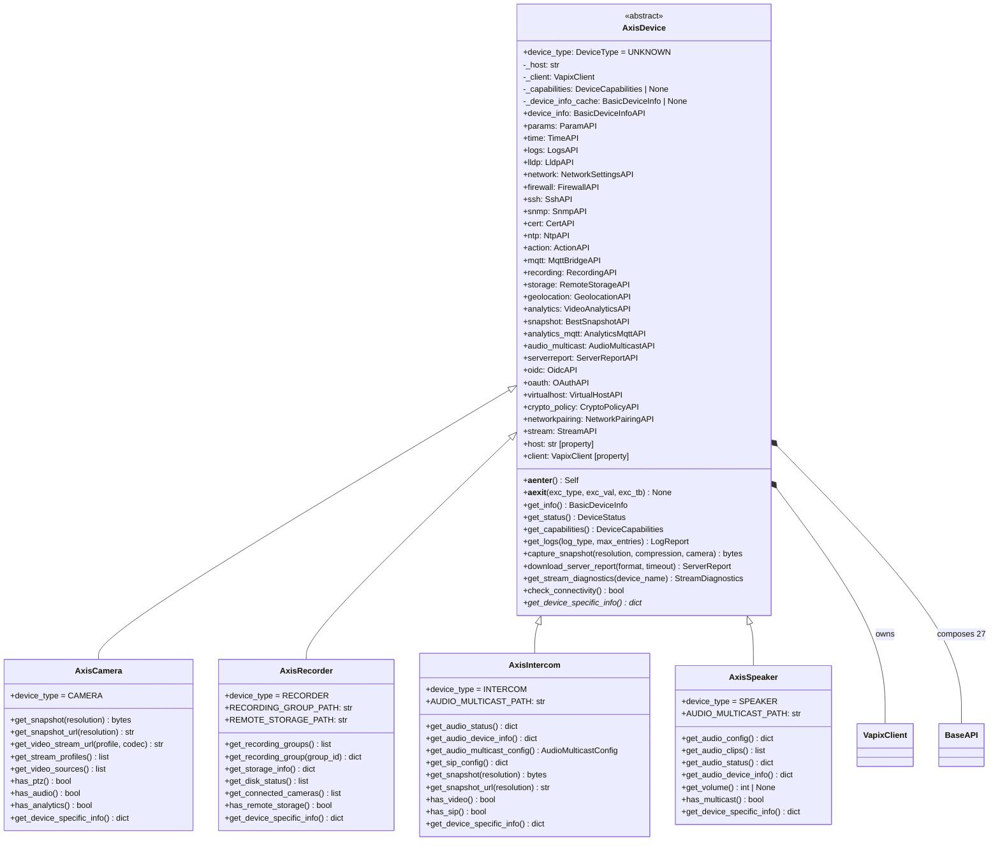

### 4.4 Exception Hierarchy

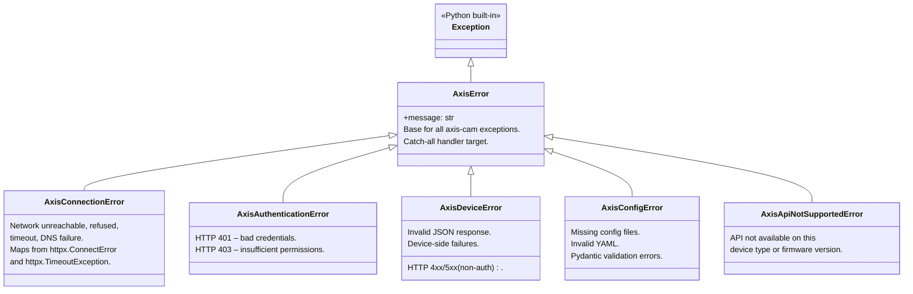

### 4.5 Configuration Models

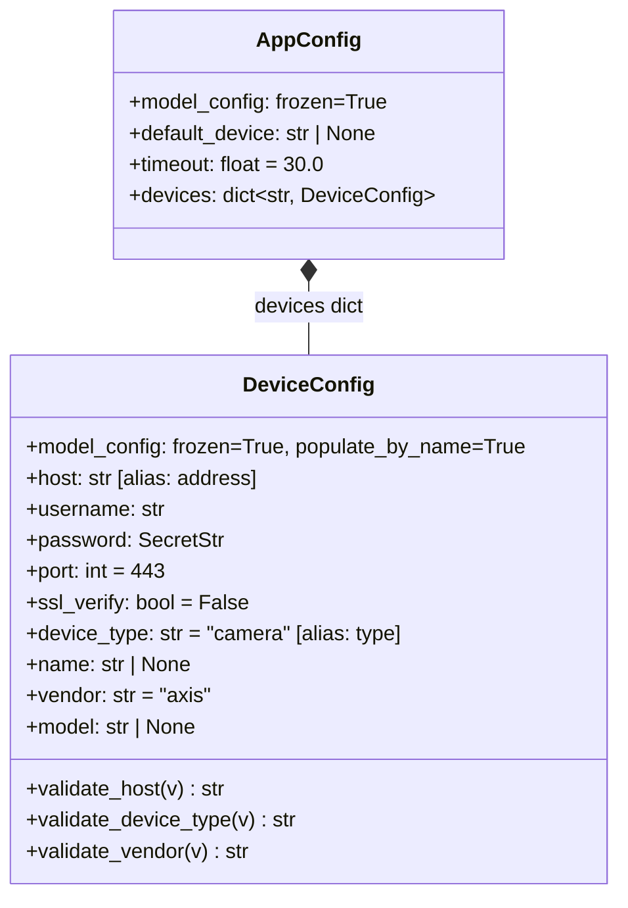

---

## Deployment View

How `axis-cam` is installed and invoked in practice:

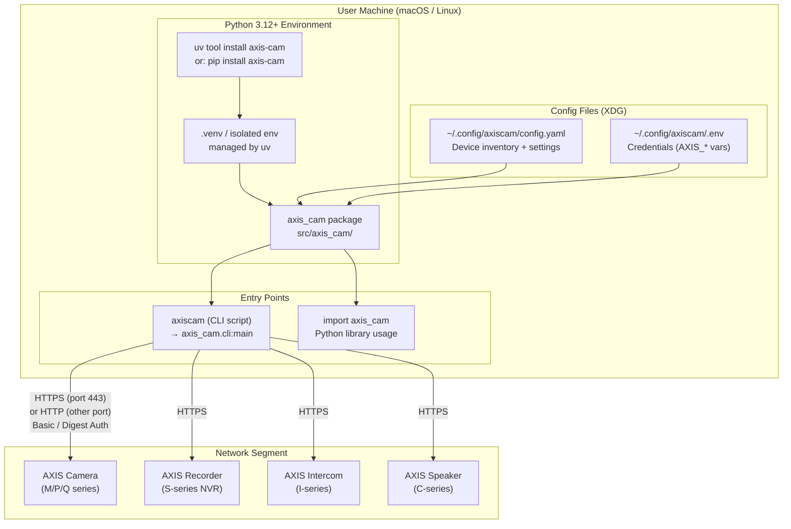

**Installation methods:**

| Method | Command | Use case |
|---|---|---|
| uv tool (recommended) | `uv tool install axis-cam` | Isolated global CLI install |
| uv in project | `uv add axis-cam` | Library dependency |
| Development | `uv sync --all-extras` | Local dev with test deps |
| pip | `pip install axis-cam` | Standard install |

**Runtime dependencies installed:**

| Package | Version | Role |
|---|---|---|
| `httpx` | ≥0.27.0 | Async HTTP client with auth |
| `pydantic` | ≥2.0.0 | Data validation and models |
| `pydantic-settings` | ≥2.0.0 | Settings management |
| `typer` | ≥0.12.0 | CLI framework |
| `rich` | ≥13.0.0 | Terminal output formatting |
| `pyyaml` | ≥6.0.0 | YAML config parsing |
| `platformdirs` | ≥4.0.0 | XDG path resolution |
| `shellingham` | ≥1.5.0 | Shell detection for Typer |

---

## Request Lifecycle — Data Flow

How a single CLI command flows through all layers end-to-end.

### Happy Path: `axiscam info --device front_door`

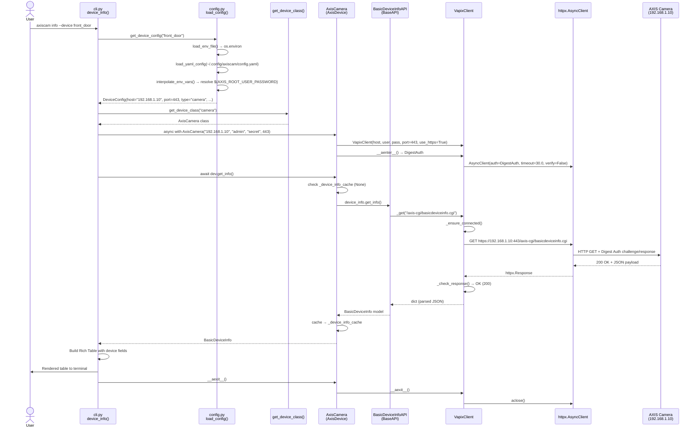

### Error Path: Authentication Failure

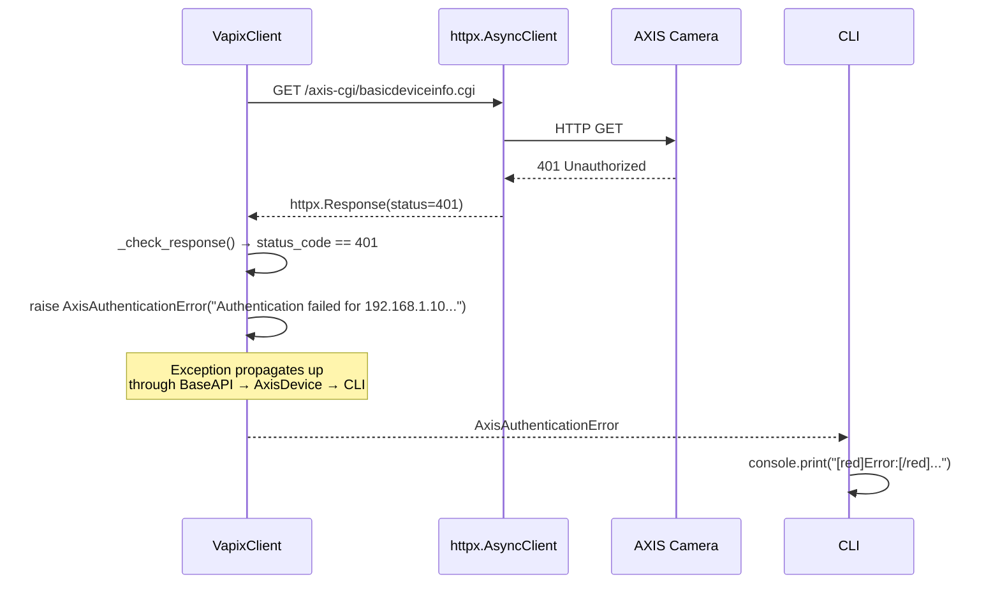

---

## Technology Choices

| Decision | Choice | Rationale |
|---|---|---|
| HTTP client | `httpx` (async) | Native async support; built-in Basic and Digest auth; cleaner API than `aiohttp`; `respx` for test mocking |
| Data validation | `pydantic` v2 | Type-safe models, automatic validation, `SecretStr` for password masking, frozen configs |
| CLI framework | `typer` | Declarative, type-hint driven; generates `--help` automatically; integrates with Rich |
| Terminal output | `rich` | Tables, panels, trees, colour — zero boilerplate for professional terminal UX |
| Config format | YAML | Human-editable device inventories; supports `${VAR}` interpolation for secrets |
| Config paths | XDG Base Directory | Platform-correct paths on Linux and macOS; respects `XDG_CONFIG_HOME` |
| Auth strategy | Basic / Digest (configurable) | VAPIX supports both; Digest default avoids plaintext credential exposure |
| Async pattern | `async with` context manager | Guarantees connection teardown even on exception; pairs naturally with httpx |
| Composition over inheritance | API modules composed into Device | Each API module is independently testable; devices gain capabilities by composition not deep inheritance |
| Abstract base for devices | `abc.ABC` + `@abstractmethod` | Enforces `get_device_specific_info()` contract on all device subclasses |
| Package manager | `uv` + `hatchling` | Fast dependency resolution; `pyproject.toml`-native; `uv tool install` for isolated CLI |
| Python version | 3.12+ | `X | Y` union syntax, `Self` type, latest `asyncio`; no legacy compatibility burden |
| Build backend | `hatchling` | Simple, PEP 517/660 compliant; works seamlessly with `uv` |
| Secrets handling | `SecretStr` + `.env` file | Prevents accidental password logging; `.env` in config dir keeps credentials out of YAML |
