# axis-cam: Class Diagrams and Application Flow

This document contains Mermaid `classDiagram` diagrams and sequence diagrams capturing
the full class hierarchy, API module structure, configuration models, exception hierarchy,
key data models, and runtime interaction flows.

---

## Section 1: Class Hierarchy Diagrams

### 1a. Device Hierarchy

All four concrete device types inherit from the abstract `AxisDevice` base class.
`AxisDevice` holds 27 API module compositions as instance attributes and exposes
high-level async façade methods that delegate to those modules.

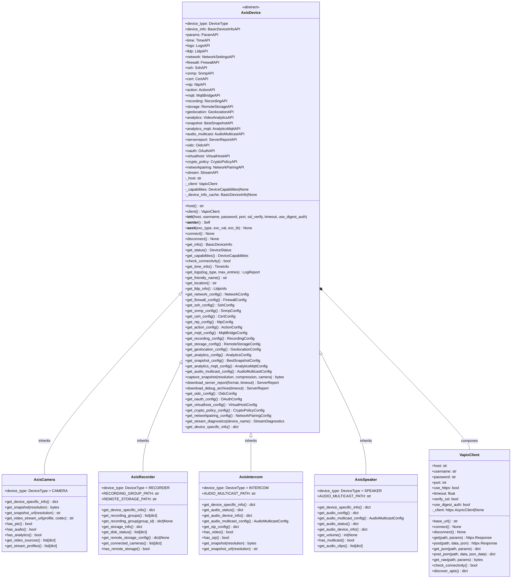

---

### 1b. API Module Hierarchy

All 27 API modules inherit from `BaseAPI`, which owns the `VapixClient` reference and
exposes protected `_get()`, `_post()`, and `_get_raw()` helpers.

```mermaid
classDiagram
    class BaseAPI {
        <<abstract>>
        -_client: VapixClient
        +__init__(client)
        +_get(path, params) Any
        +_post(path, data, json_data) Any
        +_get_raw(path, params) bytes
    }

    %% ── Device Information ──────────────────────────────────────
    class BasicDeviceInfoAPI {
        +CGI_PATH: str
        +REST_PATH: str
        +get_info() BasicDeviceInfo
        +get_property(property_name) str|None
        +get_properties() DeviceProperties
        +is_axis_device() bool
        +get_firmware_version() str
        +get_serial_number() str
        +get_model() str
    }

    class ParamAPI {
        +get(param_name) str|None
        +get_group(group_name) ParameterGroup
        +get_all() list[ParameterGroup]
        +get_many(param_names) dict[str, str|None]
        +search(pattern) list[DeviceParameter]
        +export() dict
        +get_friendly_name() str
        +get_location() str
        +get_ip_address() str
        +get_mac_address() str
    }

    class TimeAPI {
        +get_info() TimeInfo
        +get_utc_time() datetime
        +get_local_time() datetime|None
        +get_timezone() str
        +get_ntp_status() NtpStatus
        +get_available_timezones() list[str]
    }

    %% ── Logging & Reports ───────────────────────────────────────
    class LogsAPI {
        +CGI_PATH: str
        +REST_PATH: str
        -_device_name: str
        +get_server_report(mode) bytes
        +get_log_files() dict[str, str]
        +get_logs(log_type, max_entries) LogReport
        +get_system_logs(max_entries) LogReport
        +get_access_logs(max_entries) LogReport
        +get_audit_logs(max_entries) LogReport
        +get_all_logs(max_entries) LogReport
        +stream_logs(log_type) AsyncIterator[LogEntry]
        +get_persistent_logging_enabled() bool
        +search_logs(pattern, log_type, max_entries) LogReport
        +get_log_summary(log_type) dict[str, int]
    }

    class ServerReportAPI {
        +download_report(format, timeout) ServerReport
        +save_report(path, format, timeout) ServerReport
        +get_debug_archive(timeout) ServerReport
        +save_debug_archive(path, timeout) ServerReport
    }

    %% ── Network ─────────────────────────────────────────────────
    class LldpAPI {
        +get_info() LldpInfo
        +get_neighbors() list[LldpNeighbor]
        +is_enabled() bool
    }

    class NetworkSettingsAPI {
        +get_config() NetworkConfig
        +get_interfaces() list[NetworkInterface]
        +get_dns() DnsSettings
        +get_hostname() str
        +get_global_proxy() ProxySettings|None
    }

    class NtpAPI {
        +get_config() NtpConfig
        +is_enabled() bool
        +get_servers() list[NtpServer]
        +get_sync_status() NtpSyncStatus
        +is_synchronized() bool
    }

    class NetworkPairingAPI {
        +get_config() NetworkPairingConfig
        +is_enabled() bool
        +get_mode() PairingMode
        +get_paired_devices() list[PairedDevice]
        +get_online_devices() list[PairedDevice]
        +get_pending_requests() list[PairingRequest]
        +discovery_enabled() bool
        +get_pairing_token() str
    }

    %% ── Security ────────────────────────────────────────────────
    class FirewallAPI {
        +get_config() FirewallConfig
        +is_enabled() bool
        +get_ipv4_rules() list[FirewallRule]
        +get_ipv6_rules() list[FirewallRule]
        +get_default_policy() FirewallAction
    }

    class SshAPI {
        +get_config() SshConfig
        +is_enabled() bool
        +get_port() int
        +get_authorized_keys() list[SshKey]
        +root_login_allowed() bool
    }

    class SnmpAPI {
        +get_config() SnmpConfig
        +is_enabled() bool
        +get_version() SnmpVersion
        +get_trap_receivers() list[SnmpTrapReceiver]
    }

    class CertAPI {
        +get_config() CertConfig
        +get_certificates() list[Certificate]
        +get_ca_certificates() list[Certificate]
        +get_active_certificate() Certificate|None
    }

    class CryptoPolicyAPI {
        +get_config() CryptoPolicyConfig
        +get_tls_version_range() tuple[TlsVersion, TlsVersion]
        +get_cipher_suites() list[CipherSuite]
        +get_enabled_ciphers() list[CipherSuite]
        +weak_ciphers_enabled() bool
        +hsts_enabled() bool
    }

    %% ── Identity & Access ───────────────────────────────────────
    class OidcAPI {
        +get_config() OidcConfig
        +is_enabled() bool
        +get_provider() OidcProviderConfig|None
        +get_claim_mappings() list[OidcClaimMapping]
        +local_auth_allowed() bool
    }

    class OAuthAPI {
        +get_config() OAuthConfig
        +is_enabled() bool
        +get_credentials() list[OAuthCredentialConfig]
        +get_token_statuses() list[OAuthTokenStatus]
        +get_default_credential() OAuthCredentialConfig|None
    }

    %% ── Events & Automation ─────────────────────────────────────
    class ActionAPI {
        +get_config() ActionConfig
        +get_rules() list[ActionRule]
        +get_templates() list[ActionTemplate]
        +get_rule(rule_id) ActionRule|None
    }

    class MqttBridgeAPI {
        +get_config() MqttBridgeConfig
        +get_clients() list[MqttClient]
        +get_event_filters() list[MqttEventFilter]
        +is_connected() bool
    }

    class AnalyticsMqttAPI {
        +get_config() AnalyticsMqttConfig
        +get_subscriptions() list[AnalyticsMqttSubscription]
        +get_broker() AnalyticsMqttBroker|None
        +get_subscription(subscription_id) AnalyticsMqttSubscription|None
    }

    %% ── Video & Audio ────────────────────────────────────────────
    class VideoAnalyticsAPI {
        +get_config() AnalyticsConfig
        +get_profiles() list[AnalyticsProfile]
        +get_scenarios() list[AnalyticsScenario]
        +get_object_classes() list[ObjectClass]
        +get_profile(profile_id) AnalyticsProfile|None
    }

    class BestSnapshotAPI {
        +get_config() BestSnapshotConfig
        +get_profiles() list[SnapshotProfile]
        +get_triggers() list[SnapshotTrigger]
        +get_profile(profile_id) SnapshotProfile|None
        +capture(resolution, compression, camera) bytes
    }

    class AudioMulticastAPI {
        +get_config() AudioMulticastConfig
        +get_groups() list[MulticastGroup]
        +get_streams() list[AudioStream]
        +get_group(group_id) MulticastGroup|None
        +get_stream(stream_id) AudioStream|None
    }

    class StreamAPI {
        +REST_PATH: str
        +get_rtsp_config() RTSPConfig
        +get_rtp_config() RTPConfig
        +get_stream_profiles() list[StreamProfile]
        +get_network_config() NetworkDiagnostics
        +get_image_config() dict
        +get_stream_cache() dict
        +get_qos_config() dict
        +get_diagnostics(device_name) StreamDiagnostics
    }

    %% ── Storage & Recording ─────────────────────────────────────
    class RecordingAPI {
        +get_config() RecordingConfig
        +get_groups() list[RecordingGroup]
        +get_profiles() list[RecordingProfile]
        +get_group(group_id) RecordingGroup|None
    }

    class RemoteStorageAPI {
        +get_config() RemoteStorageConfig
        +get_destinations() list[StorageDestination]
        +get_destination(dest_id) StorageDestination|None
    }

    %% ── Geography & Infrastructure ───────────────────────────────
    class GeolocationAPI {
        +get_config() GeolocationConfig
        +get_coordinates() tuple[float|None, float|None]
        +get_altitude() float|None
    }

    class VirtualHostAPI {
        +get_config() VirtualHostConfig
        +is_enabled() bool
        +get_hosts() list[VirtualHost]
        +get_default_host() VirtualHost|None
        +get_host_by_name(hostname) VirtualHost|None
    }

    BaseAPI <|-- BasicDeviceInfoAPI
    BaseAPI <|-- ParamAPI
    BaseAPI <|-- TimeAPI
    BaseAPI <|-- LogsAPI
    BaseAPI <|-- ServerReportAPI
    BaseAPI <|-- LldpAPI
    BaseAPI <|-- NetworkSettingsAPI
    BaseAPI <|-- NtpAPI
    BaseAPI <|-- NetworkPairingAPI
    BaseAPI <|-- FirewallAPI
    BaseAPI <|-- SshAPI
    BaseAPI <|-- SnmpAPI
    BaseAPI <|-- CertAPI
    BaseAPI <|-- CryptoPolicyAPI
    BaseAPI <|-- OidcAPI
    BaseAPI <|-- OAuthAPI
    BaseAPI <|-- ActionAPI
    BaseAPI <|-- MqttBridgeAPI
    BaseAPI <|-- AnalyticsMqttAPI
    BaseAPI <|-- VideoAnalyticsAPI
    BaseAPI <|-- BestSnapshotAPI
    BaseAPI <|-- AudioMulticastAPI
    BaseAPI <|-- StreamAPI
    BaseAPI <|-- RecordingAPI
    BaseAPI <|-- RemoteStorageAPI
    BaseAPI <|-- GeolocationAPI
    BaseAPI <|-- VirtualHostAPI
```

---

### 1c. Configuration Classes

Both configuration models are Pydantic `BaseModel` instances. `AppConfig` is a root object
returned by `load_config()` (cached via `@lru_cache`). `DeviceConfig` uses field aliases
to accept legacy YAML keys (`address` → `host`, `type` → `device_type`).

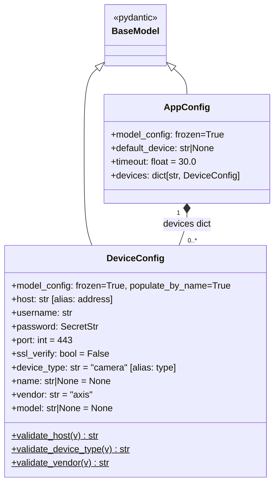

Configuration loading precedence (highest → lowest):

1. Command-line arguments (CLI layer)
2. Environment variables (`AXIS_*`)
3. `.env` file in config directory
4. `~/.config/axiscam/config.yaml`
5. `~/.config/axis/config.yaml` (legacy, with warning)
6. System defaults

---

### 1d. Exception Hierarchy

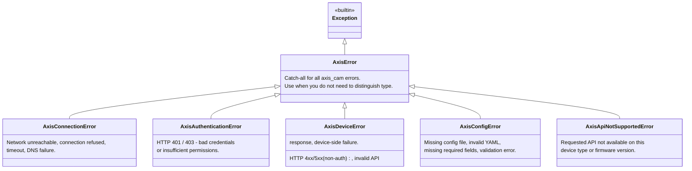

---

### 1e. Key Model Classes

#### Device Information & Status

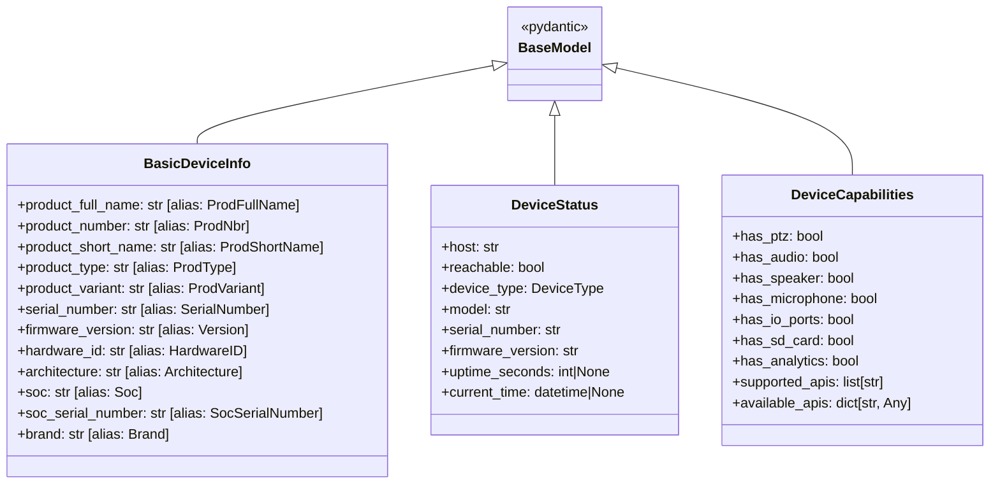

#### Stream Diagnostics Models

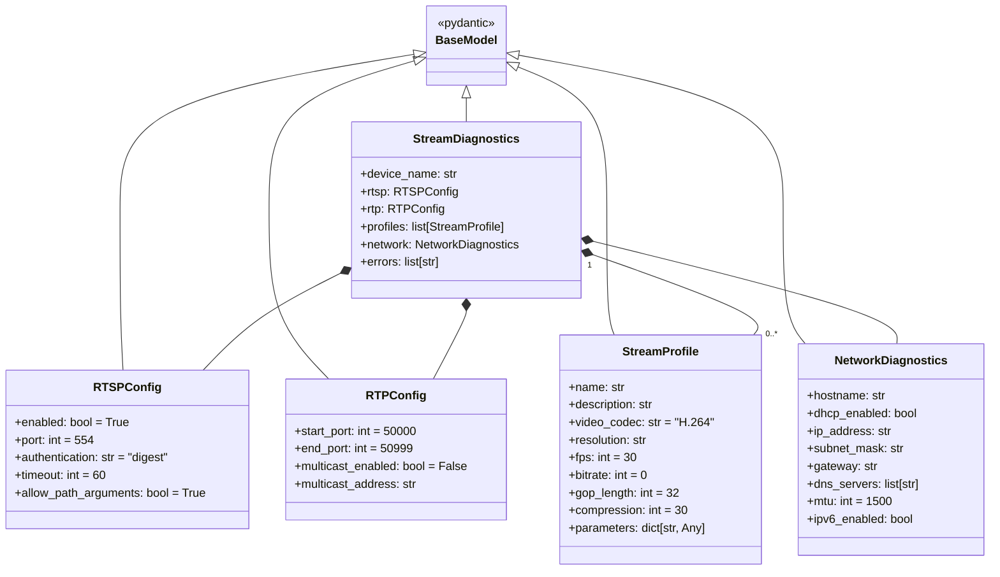

#### Log Models

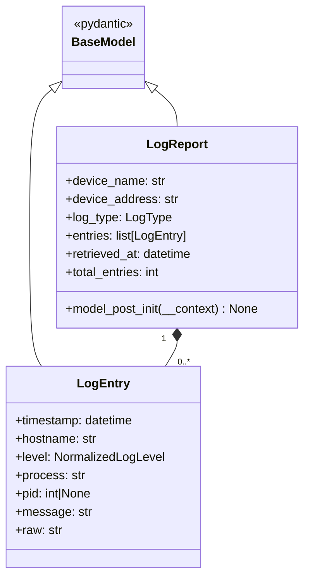

#### Firewall Models

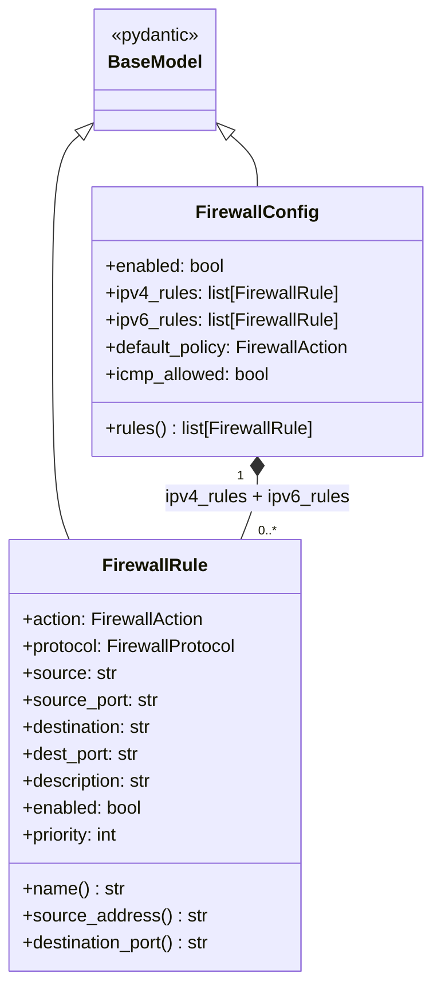

#### LLDP Models

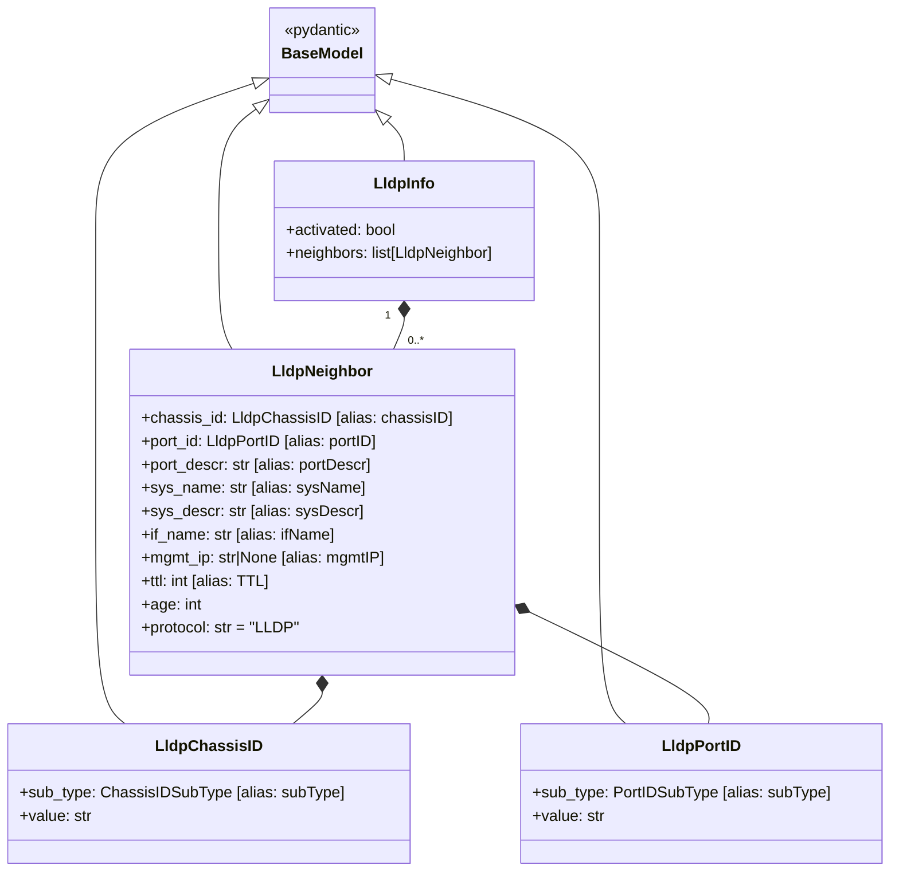

#### ServerReport Model

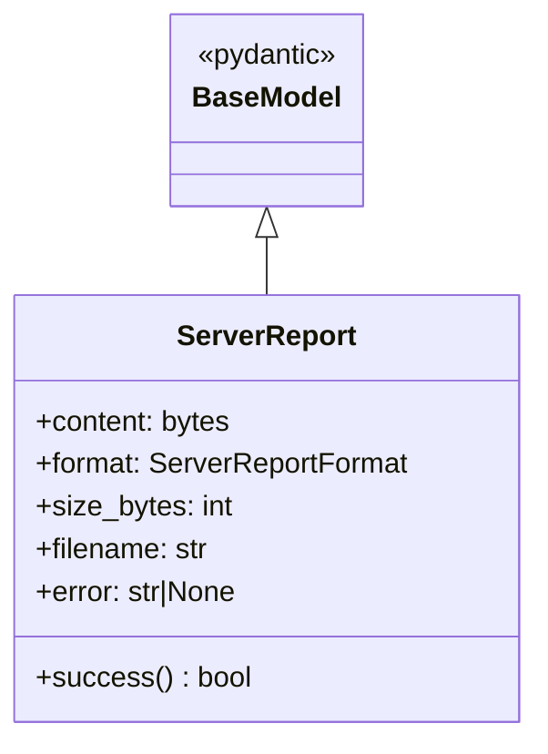

---

## Section 2: Interaction Diagrams

### 2a. `axiscam info --device front_camera`

This traces the full object lifecycle from CLI invocation through config loading,
device instantiation, API calls, and Rich console output.

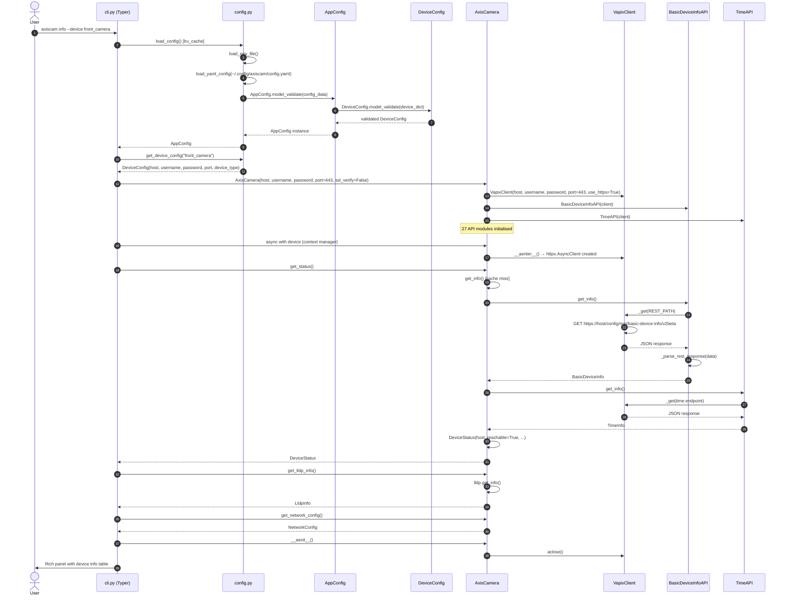

---

### 2b. Report Generation — `axiscam report --full`

During a full report, the device is opened once and multiple API modules are called
to collect configuration data. Each API call is independent and could be parallelised
(the current implementation is sequential; the diagram shows the logical flow).

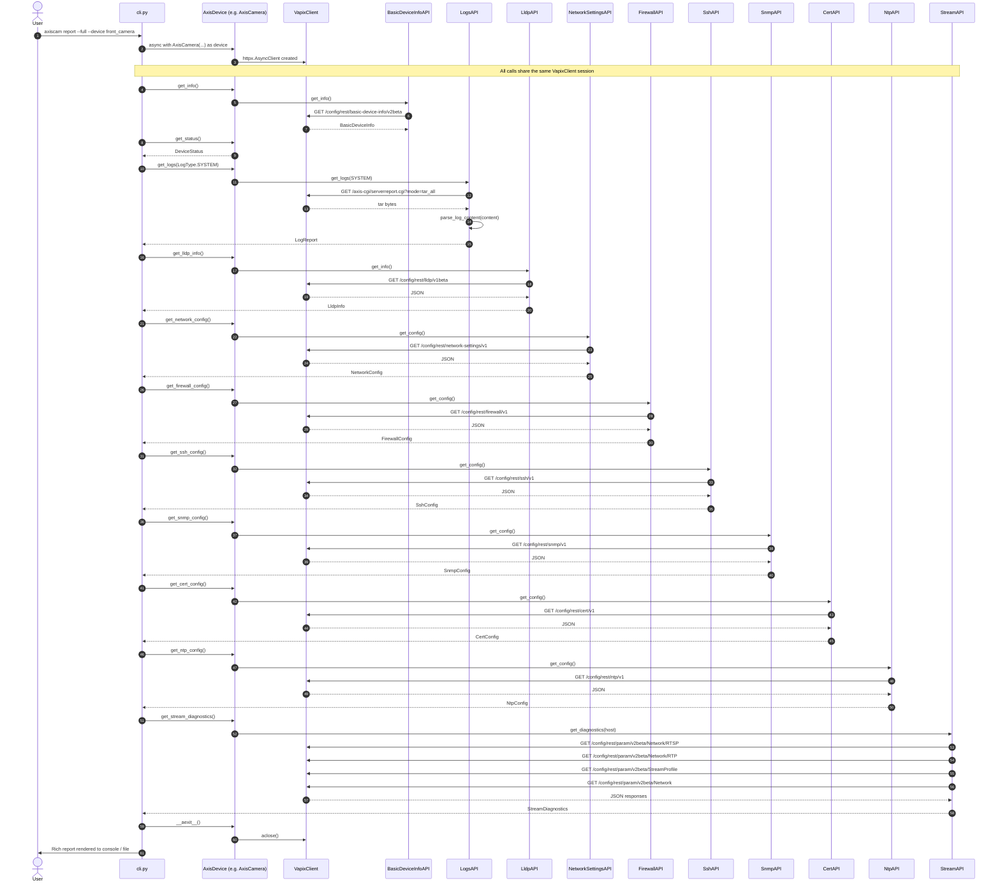

---

### 2c. Configuration Object Lifecycle

How `AppConfig` and `DeviceConfig` are created, validated, and consumed end-to-end.

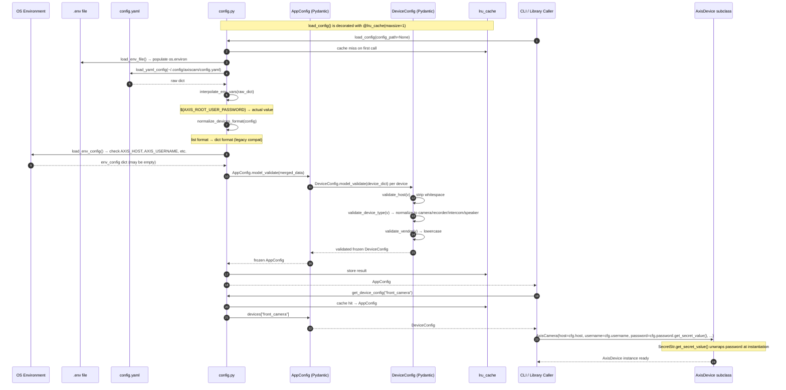

---

## Section 3: Package Diagram

Dependency relationships between `axis_cam` subpackages. Arrows indicate
`imports from` direction (dependency flows in arrow direction).

```mermaid
classDiagram
    class `axis_cam` {
        <<package root>>
        __init__.py
        exports: AxisCamera, AxisRecorder,
                 AxisIntercom, AxisSpeaker,
                 AxisError, load_config
    }

    class `axis_cam.cli` {
        <<entry point>>
        cli.py
        Typer app + subcommand groups:
        logs, network, security,
        services, download
    }

    class `axis_cam.devices` {
        <<subpackage>>
        base.py  → AxisDevice (ABC)
        camera.py → AxisCamera
        recorder.py → AxisRecorder
        intercom.py → AxisIntercom
        speaker.py → AxisSpeaker
    }

    class `axis_cam.api` {
        <<subpackage>>
        base.py → BaseAPI (ABC)
        27 domain API modules
    }

    class `axis_cam.client` {
        <<module>>
        client.py → VapixClient
        httpx async HTTP transport
    }

    class `axis_cam.models` {
        <<module>>
        models.py
        All Pydantic data models,
        enums, type aliases
    }

    class `axis_cam.config` {
        <<module>>
        config.py
        AppConfig, DeviceConfig,
        load_config(), get_device_config()
    }

    class `axis_cam.exceptions` {
        <<module>>
        exceptions.py
        AxisError hierarchy
    }

    `axis_cam.cli` --> `axis_cam.devices` : imports device classes
    `axis_cam.cli` --> `axis_cam.config` : load_config, get_device_config
    `axis_cam.cli` --> `axis_cam.models` : LogType, ServerReportFormat
    `axis_cam.cli` --> `axis_cam.exceptions` : error handling

    `axis_cam.devices` --> `axis_cam.api` : composes 27 API modules
    `axis_cam.devices` --> `axis_cam.client` : passes VapixClient to APIs
    `axis_cam.devices` --> `axis_cam.models` : return types + enums
    `axis_cam.devices` --> `axis_cam.exceptions` : raises AxisError subclasses

    `axis_cam.api` --> `axis_cam.client` : _client: VapixClient
    `axis_cam.api` --> `axis_cam.models` : return types
    `axis_cam.api` --> `axis_cam.exceptions` : raises on error

    `axis_cam.client` --> `axis_cam.exceptions` : raises on HTTP errors

    `axis_cam.config` --> `axis_cam.models` : DeviceType used in mapping
    `axis_cam.config` --> `axis_cam.exceptions` : AxisConfigError

    `axis_cam` --> `axis_cam.devices` : re-exports public API
    `axis_cam` --> `axis_cam.config` : re-exports load_config
    `axis_cam` --> `axis_cam.exceptions` : re-exports AxisError
```
