# CLI Reference

This document provides a comprehensive reference for the `axiscam` command-line interface.

## Table of Contents

- [Overview](#overview)
- [Global Options](#global-options)
- [Authentication](#authentication)
- [Core Commands](#core-commands)
- [Command Groups](#command-groups)
- [Workflows](#workflows)
- [Examples](#examples)

---

## Overview

The `axiscam` CLI provides comprehensive management of AXIS network devices via the VAPIX API.

```
axiscam [OPTIONS] COMMAND [ARGS]
```

### Command Structure

```mermaid
flowchart TB
    subgraph "Root Commands"
        INFO[info]
        STATUS[status]
        APIS[apis]
        LLDP[lldp]
        PARAMS[params]
        LOCATION[location]
        REPORT[report]
        VERSION[version]
    end

    subgraph "Configuration"
        CONFIG[config]
        INIT[init]
        MIGRATE[migrate]
        DEVICES[devices]
    end

    subgraph "Command Groups"
        LOGS[logs]
        NETWORK[network]
        SECURITY[security]
        SERVICES[services]
        DOWNLOAD[download]
        AUTOMATION[automation]
        MEDIA[media]
        STREAM[stream]
    end

    CLI[axiscam] --> INFO
    CLI --> STATUS
    CLI --> APIS
    CLI --> LLDP
    CLI --> PARAMS
    CLI --> LOCATION
    CLI --> REPORT
    CLI --> VERSION
    CLI --> CONFIG
    CLI --> INIT
    CLI --> MIGRATE
    CLI --> DEVICES
    CLI --> LOGS
    CLI --> NETWORK
    CLI --> SECURITY
    CLI --> SERVICES
    CLI --> DOWNLOAD
    CLI --> AUTOMATION
    CLI --> MEDIA
    CLI --> STREAM
```

---

## Global Options

Options available for most commands that interact with devices.

| Option | Short | Type | Default | Description |
|--------|-------|------|---------|-------------|
| `--device` | `-d` | `str` | Config default | Device name from config |
| `--host` | `-H` | `str` | - | Direct IP/hostname (overrides --device) |
| `--username` | `-u` | `str` | Config value | Authentication username |
| `--password` | `-p` | `str` | Config value | Authentication password |
| `--port` | `-P` | `int` | `443` | HTTPS port number |
| `--digest/--no-digest` | - | `bool` | `True` | Use Digest auth (default) or Basic |
| `--json` | `-j` | `bool` | `False` | Output as JSON |

### Option Precedence

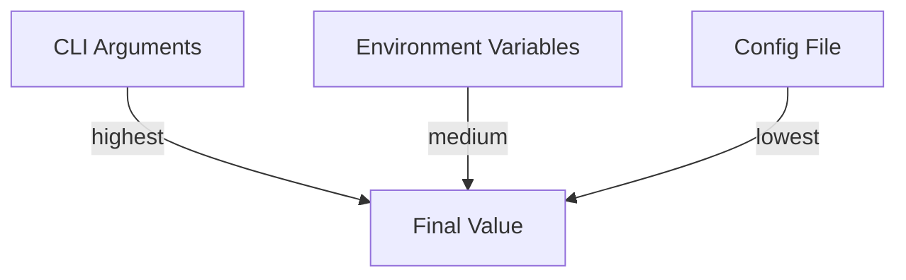

1. **CLI Arguments** (highest priority)
2. **Environment Variables** (`AXIS_*`)
3. **Config File** (`~/.config/axiscam/config.yaml`)

---

## Authentication

### Digest vs Basic Authentication

Most AXIS devices require **Digest authentication** (the default). Use `--no-digest` only for older devices that require Basic auth.

```bash
# Default: Digest authentication
axiscam info --device front_camera

# Force Basic authentication (rare)
axiscam info --device legacy_camera --no-digest
```

### Environment Variables

```bash
export AXIS_HOST=192.168.1.10
export AXIS_USERNAME=root
export AXIS_PASSWORD=secure_password
export AXIS_PORT=443
```

### Secrets in .env File

```bash
# ~/.config/axiscam/.env
AXIS_ROOT_USER_NAME=root
AXIS_ROOT_USER_PASSWORD=your_secure_password
```

---

## Core Commands

### info

Get comprehensive device information.

```bash
axiscam info [OPTIONS]
```

| Option | Description |
|--------|-------------|
| `--device, -d` | Device name |
| `--host, -H` | Direct IP address |
| `--json, -j` | Output as JSON |

**Example:**
```bash
$ axiscam info --device front_camera

Device Information:
  Brand: AXIS
  Model: M3216-LVE
  Product: AXIS M3216-LVE Dome Camera
  Serial: B8A44F9F0228
  Firmware: 12.7.61
  Hardware ID: 93A.2
  Architecture: aarch64
  SoC: Axis Artpec-8
```

---

### status

Check device connectivity and health.

```bash
axiscam status [OPTIONS]
```

**Example:**
```bash
$ axiscam status --device front_camera

✅ Device front_camera (192.168.1.10) is reachable
  Model: M3216-LVE
  Firmware: 12.7.61
  Serial: B8A44F9F0228
```

---

### apis

List available VAPIX APIs on the device.

```bash
axiscam apis [OPTIONS]
```

**Example:**
```bash
$ axiscam apis --device front_camera

Available APIs:
  basic-device-info (v2beta)
  param (v1.3)
  network-settings (v1)
  lldp (v1)
  firewall (v1)
  ...
```

---

### params

List or export device parameters.

```bash
axiscam params [OPTIONS]
```

| Option | Description |
|--------|-------------|
| `--group` | Parameter group (e.g., "Network") |
| `--export` | Export all parameters |
| `--output, -o` | Output file path |

**Example:**
```bash
# List specific group
$ axiscam params --device front_camera --group Network

# Export all parameters to file
$ axiscam params --device front_camera --export --output params.json
```

---

### lldp

Show LLDP neighbor discovery information (switch port mapping).

```bash
axiscam lldp [OPTIONS]
```

**Example:**
```bash
$ axiscam lldp --device front_camera

LLDP Status: Enabled
Neighbors:
  System: BobUSWLite8PoE
  Port: Port 2
  Port Description: b8_a4_4f_9f_02_28
```

---

### report

Generate comprehensive device configuration report.

```bash
axiscam report [OPTIONS]
```

| Option | Short | Description |
|--------|-------|-------------|
| `--output` | `-o` | Output file path |
| `--format` | `-f` | Format: `json`, `yaml`, `text` |
| `--full` | - | Include all configurations |

**Example:**
```bash
# Basic report
$ axiscam report --device front_camera --format json --output report.json

# Full report with all configurations
$ axiscam report --device front_camera --full --output full_report.json
```

**Full Report Includes:**
- Basic device info
- Time configuration
- LLDP neighbors
- Stream settings
- Firewall rules
- SSH configuration
- SNMP settings
- Certificates
- NTP configuration
- MQTT bridge
- Action rules
- Recording profiles
- Storage destinations
- Geolocation
- Analytics
- OIDC/OAuth
- Crypto policy

---

### location

Show device geolocation configuration.

```bash
axiscam location [OPTIONS]
```

**Example:**
```bash
$ axiscam location --device front_camera

Geolocation:
  Latitude: 37.7749
  Longitude: -122.4194
  Altitude: 10.5m
  Direction: 45°
```

---

## Command Groups

### logs

Retrieve device logs.

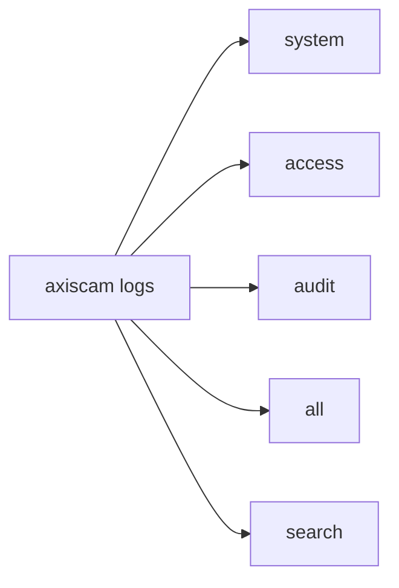

#### logs system

```bash
axiscam logs system [OPTIONS]

Options:
  --device, -d    Device name
  --lines, -n     Number of lines (default: 50)
```

#### logs access

```bash
axiscam logs access [OPTIONS]

Options:
  --device, -d    Device name
  --lines, -n     Number of lines
```

#### logs audit

```bash
axiscam logs audit [OPTIONS]

Options:
  --device, -d    Device name
  --lines, -n     Number of lines
```

#### logs all

```bash
axiscam logs all [OPTIONS]

Options:
  --device, -d    Device name
  --lines, -n     Number of lines per log type
```

#### logs search

```bash
axiscam logs search [OPTIONS] PATTERN

Options:
  --device, -d    Device name
  --type, -t      Log type (system, access, audit)
```

**Examples:**
```bash
# Get last 50 system log entries
$ axiscam logs system --device front_camera --lines 50

# Get access logs
$ axiscam logs access --device front_camera

# Search for errors
$ axiscam logs search "error" --device front_camera
```

---

### network

Network configuration commands.

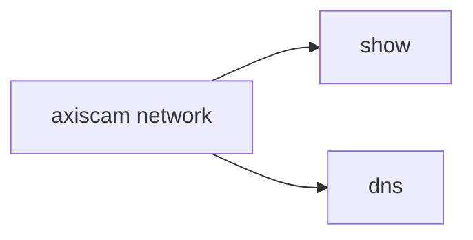

#### network show

```bash
axiscam network show [OPTIONS]

Options:
  --device, -d    Device name
  --json, -j      Output as JSON
```

#### network dns

```bash
axiscam network dns [OPTIONS]

Options:
  --device, -d    Device name
```

**Examples:**
```bash
# Show network configuration
$ axiscam network show --device front_camera

# Show DNS settings
$ axiscam network dns --device front_camera
```

---

### security

Security configuration commands.

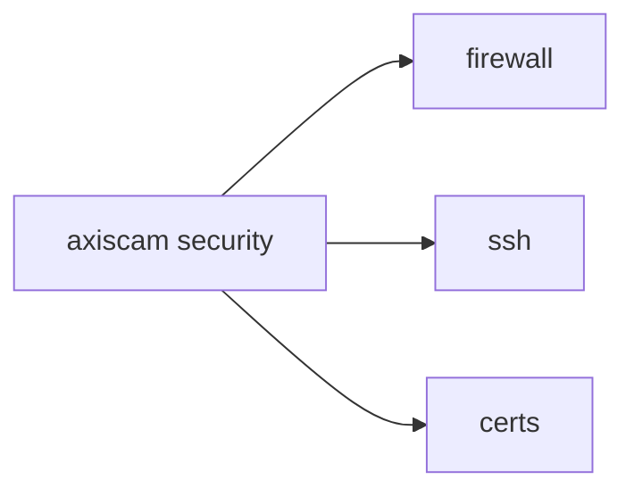

#### security firewall

```bash
axiscam security firewall [OPTIONS]

Options:
  --device, -d    Device name
  --json, -j      Output as JSON
```

#### security ssh

```bash
axiscam security ssh [OPTIONS]

Options:
  --device, -d    Device name
```

#### security certs

```bash
axiscam security certs [OPTIONS]

Options:
  --device, -d    Device name
```

**Examples:**
```bash
# Show firewall rules
$ axiscam security firewall --device front_camera

# Show SSH configuration
$ axiscam security ssh --device front_camera

# Show certificates
$ axiscam security certs --device front_camera
```

---

### services

Service configuration commands.

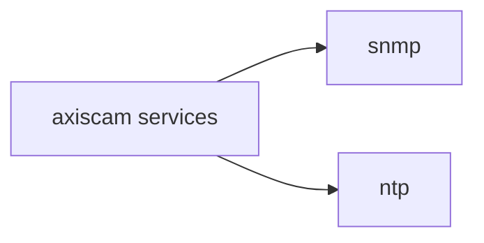

#### services snmp

```bash
axiscam services snmp [OPTIONS]

Options:
  --device, -d    Device name
```

#### services ntp

```bash
axiscam services ntp [OPTIONS]

Options:
  --device, -d    Device name
```

---

### download

Download diagnostic reports and debug archives.

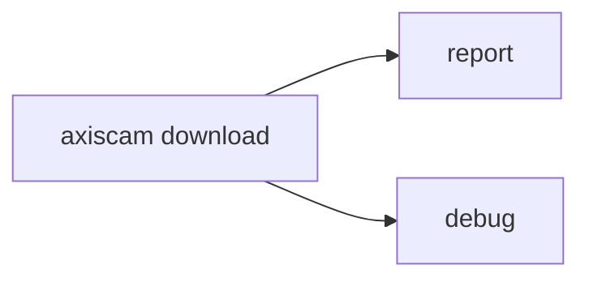

#### download report

Download server report from device.

```bash
axiscam download report [OPTIONS]

Options:
  --device, -d    Device name
  --output, -o    Output file path
  --format, -f    Report format (zip_with_image, zip, text)
  --timeout, -t   Download timeout in seconds (default: 60)
  --digest/--no-digest    Authentication mode
```

**Formats:**
| Format | Description |
|--------|-------------|
| `zip_with_image` | ZIP with diagnostic snapshot (default) |
| `zip` | ZIP without image |
| `text` | Plain text report |

#### download debug

Download debug archive (debug.tgz).

```bash
axiscam download debug [OPTIONS]

Options:
  --device, -d    Device name
  --output, -o    Output file path
  --timeout, -t   Download timeout in seconds (default: 120)
  --digest/--no-digest    Authentication mode
```

**Examples:**
```bash
# Download server report with snapshot
$ axiscam download report --device front_camera --output ~/report.zip

# Download server report as text
$ axiscam download report --device front_camera --format text --output ~/report.txt

# Download debug archive (large, takes time)
$ axiscam download debug --device front_camera --output ~/debug.tgz --timeout 180
```

---

### stream

Stream diagnostics commands.


#### stream show

Show RTSP, RTP, and stream profile configuration.

```bash
axiscam stream show [OPTIONS]

Options:
  --device, -d    Device name
  --json, -j      Output as JSON
```

**Example:**
```bash
$ axiscam stream show --device front_camera

Stream Diagnostics:
  RTSP:
    Port: 554
    Authentication: digest
  RTP:
    Port Range: 50000-50999
    Multicast: disabled
  Profiles:
    - Profile1: H.264, 1920x1080, 30fps
    - Profile2: MJPEG, 640x480, 15fps
```

---

### automation

Automation configuration commands.

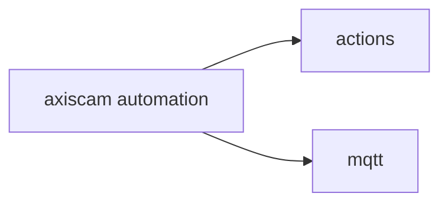

---

### media

Media configuration commands.

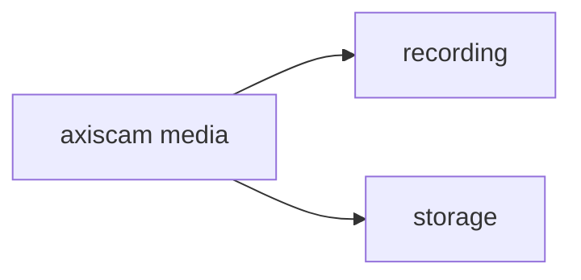

---

### Configuration Commands

#### config

Show current configuration.

```bash
$ axiscam config

Configuration:
  Path: ~/.config/axiscam/config.yaml
  Default Device: front_camera
  Devices: 4 configured
```

#### init

Initialize configuration with defaults.

```bash
axiscam init [OPTIONS]

Options:
  --force    Overwrite existing configuration
```

#### devices

List all configured devices.

```bash
$ axiscam devices

Configured Devices:
  front_camera (camera) - 192.168.1.10
  main_nvr (recorder) - 192.168.1.100
  front_intercom (intercom) - 192.168.1.12
  office_speaker (speaker) - 192.168.1.45
```

#### migrate

Migrate from legacy configuration path.

```bash
$ axiscam migrate

Migrating from ~/.config/axis/ to ~/.config/axiscam/...
✅ Configuration migrated successfully
```

---

## Workflows

### Device Discovery Workflow

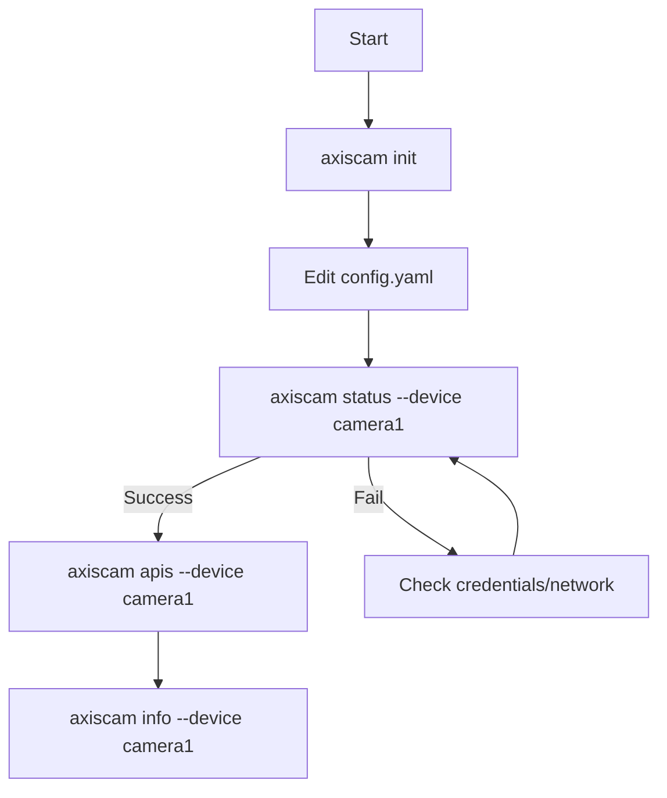

### Troubleshooting Workflow

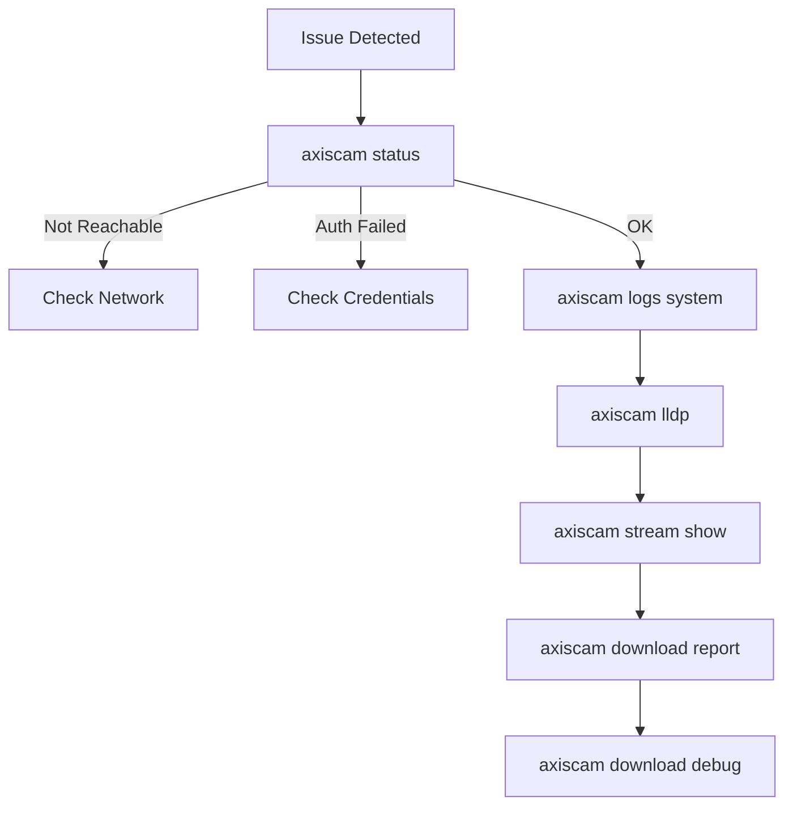

### Full Configuration Export


---

## Examples

### Quick Device Check

```bash
# Check device status
axiscam status --device front_camera

# Get device info
axiscam info --device front_camera

# List APIs
axiscam apis --device front_camera
```

### Network Diagnostics

```bash
# LLDP neighbors (switch port mapping)
axiscam lldp --device front_camera

# Network configuration
axiscam network show --device front_camera

# DNS settings
axiscam network dns --device front_camera
```

### Stream Troubleshooting

```bash
# Stream diagnostics
axiscam stream show --device front_camera --json

# Full device report
axiscam report --device front_camera --full --output config.json
```

### Log Analysis

```bash
# System logs
axiscam logs system --device front_camera --lines 100

# Search for errors
axiscam logs search "error" --device front_camera

# All logs
axiscam logs all --device front_camera
```

### Security Audit

```bash
# Firewall status
axiscam security firewall --device front_camera

# SSH configuration
axiscam security ssh --device front_camera

# Certificates
axiscam security certs --device front_camera
```

### Diagnostic Export

```bash
# Server report with snapshot
axiscam download report --device front_camera --output ~/camera_report.zip

# Debug archive for support
axiscam download debug --device front_camera --output ~/camera_debug.tgz --timeout 180
```

### Multi-Device Operations

```bash
# Loop through devices
for device in front_camera back_camera side_camera; do
    echo "=== $device ==="
    axiscam status --device $device
done

# Export all reports
for device in $(axiscam devices --json | jq -r '.[] | .name'); do
    axiscam report --device $device --full --output "${device}_report.json"
done
```

### JSON Output for Scripting

```bash
# Parse JSON output
axiscam info --device front_camera --json | jq '.serial_number'

# Get RTSP port
axiscam stream show --device front_camera --json | jq '.rtsp.port'

# Filter logs
axiscam logs system --device front_camera --json | jq '.entries[] | select(.severity == "ERROR")'
```

---

## See Also

- [Architecture Overview](./architecture.md) - System architecture
- [Configuration Guide](./configuration.md) - Configuration system
- [Device Classes](./device-classes.md) - Device implementations
- [API Modules](./api-modules.md) - API reference
