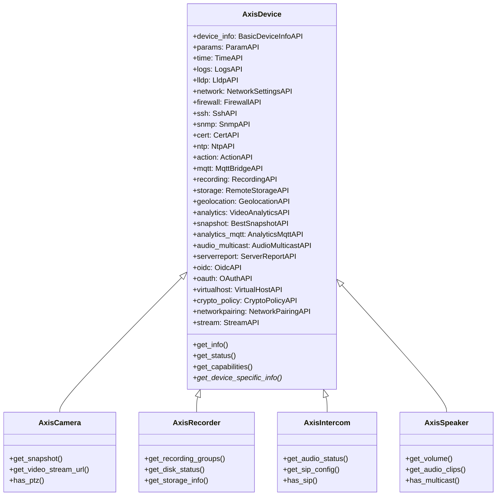
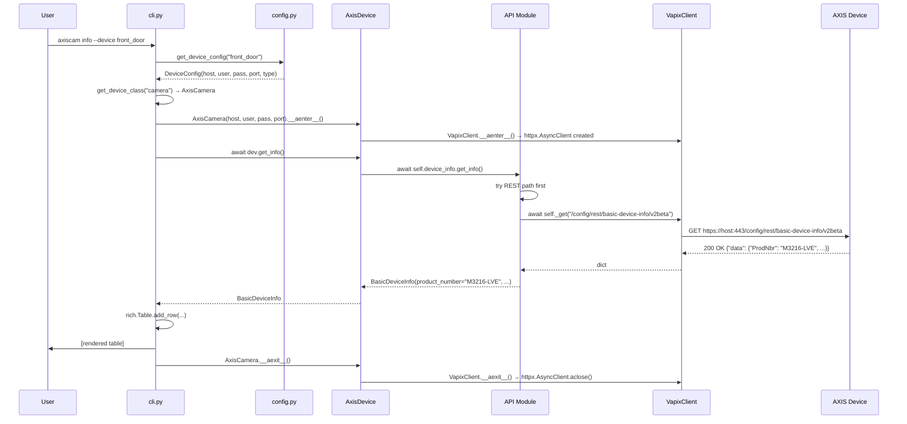
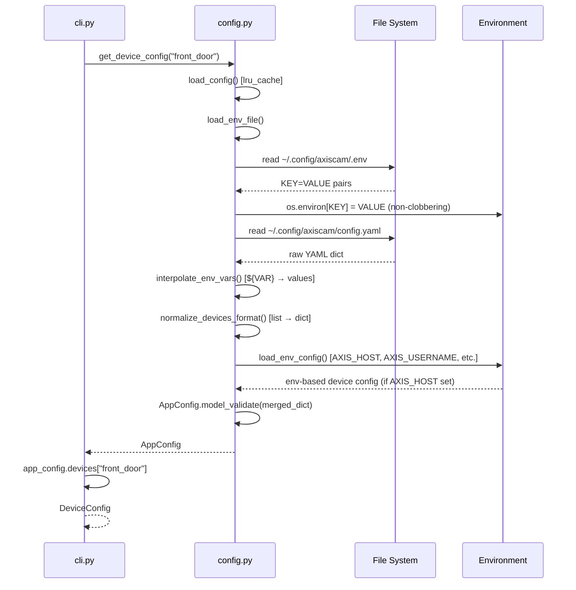
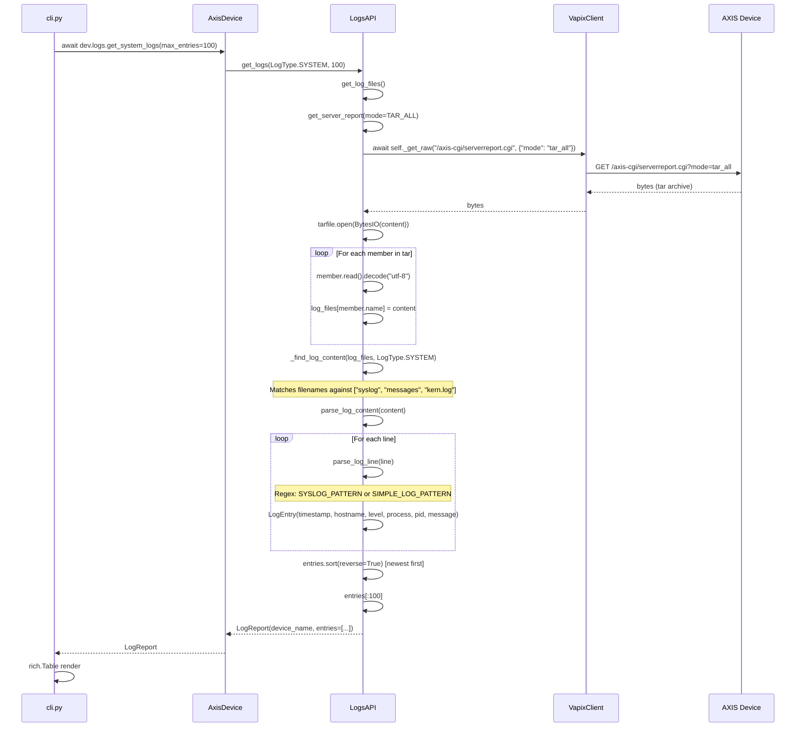
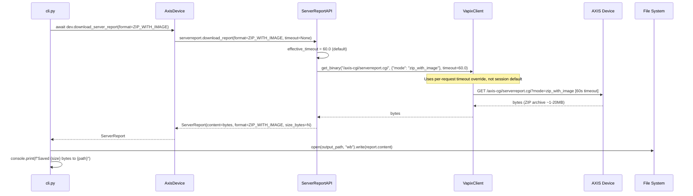
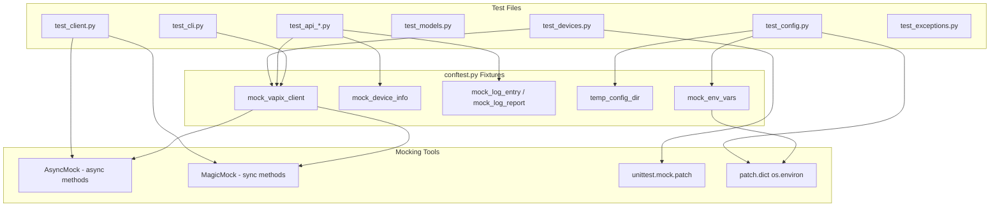

# axis-cam Codemap

> **Purpose of this document**: A complete navigational map of the `axis-cam` codebase —
> where everything lives, how the layers connect, and how data flows end-to-end.
> Treat it as the first file to read before diving into any module.

---

## Table of Contents

1. [Overview](#1-overview)
2. [Repository Layout](#2-repository-layout)
3. [Module Map](#3-module-map)
   - [Package Root](#31-package-root--initpy)
   - [CLI Layer](#32-cli-layer--clipy)
   - [Client Layer](#33-client-layer--clientpy)
   - [API Layer](#34-api-layer--api)
   - [Device Layer](#35-device-layer--devices)
   - [Config Layer](#36-config-layer--configpy)
   - [Models](#37-models--modelspy)
   - [Exceptions](#38-exceptions--exceptionspy)
4. [Interface Descriptions](#4-interface-descriptions)
5. [Data Flow Diagrams](#5-data-flow-diagrams)
6. [Dependency Graph](#6-dependency-graph)
7. [API Module Reference Table](#7-api-module-reference-table)
8. [Testing Architecture](#8-testing-architecture)

---

## 1. Overview

`axis-cam` is a Python CLI tool and importable library for managing AXIS network
cameras, NVRs, intercoms, and speakers using the **VAPIX REST API** — Axis's device
management HTTP protocol.

### Entry Points

| Entry Point | Description |
|---|---|
| `axiscam` CLI command | Installed via `[project.scripts]` in `pyproject.toml`, calls `axis_cam.cli:main` |
| `from axis_cam import AxisCamera` | Library use — instantiate a device class directly |

### Layers at a glance

```
┌─────────────────────────────────────────────────────────┐
│  CLI (cli.py)  ←  user-facing Typer commands            │
├─────────────────────────────────────────────────────────┤
│  Device classes (devices/)  ←  per-device-type facade   │
│  AxisCamera / AxisRecorder / AxisIntercom / AxisSpeaker  │
├─────────────────────────────────────────────────────────┤
│  API modules (api/)  ←  27 domain-specific VAPIX wrappers│
├─────────────────────────────────────────────────────────┤
│  VapixClient (client.py)  ←  async HTTP + auth          │
├─────────────────────────────────────────────────────────┤
│  Config (config.py)  ←  YAML / env / XDG paths          │
│  Models (models.py)  ←  Pydantic validation + types     │
│  Exceptions (exceptions.py)  ←  error hierarchy         │
└─────────────────────────────────────────────────────────┘
```

### Technology stack

| Concern | Library |
|---|---|
| HTTP | `httpx` (async) |
| CLI | `typer` |
| Terminal output | `rich` |
| Data validation | `pydantic` v2 |
| Config format | YAML (`pyyaml`) |
| Python version | ≥ 3.12 |
| Package manager | `uv` |
| Linter/formatter | `ruff` |

---

## 2. Repository Layout

```
axiscam/
├── src/
│   └── axis_cam/
│       ├── __init__.py          # Public API exports
│       ├── cli.py               # ~2566 lines - all CLI commands
│       ├── client.py            # VapixClient - async HTTP
│       ├── config.py            # YAML/env config loading
│       ├── models.py            # ~2024 lines - all Pydantic models
│       ├── exceptions.py        # AxisError hierarchy
│       ├── api/
│       │   ├── __init__.py
│       │   ├── base.py          # BaseAPI abstract class
│       │   ├── action.py        # ActionAPI
│       │   ├── analytics.py     # VideoAnalyticsAPI
│       │   ├── analytics_mqtt.py# AnalyticsMqttAPI
│       │   ├── audio_multicast.py # AudioMulticastAPI
│       │   ├── cert.py          # CertAPI
│       │   ├── crypto_policy.py # CryptoPolicyAPI
│       │   ├── device_info.py   # BasicDeviceInfoAPI
│       │   ├── firewall.py      # FirewallAPI
│       │   ├── geolocation.py   # GeolocationAPI
│       │   ├── lldp.py          # LldpAPI
│       │   ├── logs.py          # LogsAPI
│       │   ├── mqtt.py          # MqttBridgeAPI
│       │   ├── network.py       # NetworkSettingsAPI
│       │   ├── networkpairing.py# NetworkPairingAPI
│       │   ├── ntp.py           # NtpAPI
│       │   ├── oauth.py         # OAuthAPI
│       │   ├── oidc.py          # OidcAPI
│       │   ├── param.py         # ParamAPI
│       │   ├── recording.py     # RecordingAPI
│       │   ├── serverreport.py  # ServerReportAPI
│       │   ├── snapshot.py      # BestSnapshotAPI
│       │   ├── snmp.py          # SnmpAPI
│       │   ├── ssh.py           # SshAPI
│       │   ├── storage.py       # RemoteStorageAPI
│       │   ├── stream.py        # StreamAPI + StreamDiagnostics
│       │   ├── time.py          # TimeAPI
│       │   └── virtualhost.py   # VirtualHostAPI
│       └── devices/
│           ├── __init__.py
│           ├── base.py          # AxisDevice abstract base
│           ├── camera.py        # AxisCamera
│           ├── recorder.py      # AxisRecorder
│           ├── intercom.py      # AxisIntercom
│           └── speaker.py       # AxisSpeaker
├── tests/
│   ├── conftest.py              # Shared fixtures
│   ├── test_client.py
│   ├── test_config.py
│   ├── test_devices.py
│   ├── test_exceptions.py
│   ├── test_models.py
│   ├── test_cli.py
│   ├── test_api_device_info.py
│   ├── test_api_logs.py
│   ├── test_api_param.py
│   └── test_api_time.py
├── docs/
│   ├── codemap.md               # this file
│   ├── architecture.md
│   ├── api-modules.md
│   ├── cli-reference.md
│   ├── configuration.md
│   ├── device-classes.md
│   └── index.md
└── pyproject.toml
```

---

## 3. Module Map

### 3.1 Package Root — `__init__.py`

**Purpose**: Defines the public API of the installable package.

**Exports**:
```python
from axis_cam import AxisCamera, AxisDevice, AxisIntercom, AxisRecorder, AxisSpeaker, VapixClient
```

**Key fact**: `VapixClient` is re-exported here even though it lives in `client.py`.
This means library users can do `from axis_cam import VapixClient` for direct HTTP access.

**Dependencies**: `client.py`, `devices/__init__.py`
**Dependents**: everything that writes `from axis_cam import ...`

---

### 3.2 CLI Layer — `cli.py`

**Purpose**: All user-facing commands. A single file (~2566 lines) containing the Typer
application, all sub-apps, and every command implementation.

**Structure**:

```
app (main Typer)
├── info            — device information table
├── status          — reachability check
├── apis            — list discovered APIs
├── lldp            — LLDP neighbor discovery
├── params          — read/export device parameters
├── config          — show active config
├── init            — create default config file
├── version         — show axiscam version
├── devices         — list configured devices
├── migrate         — migrate legacy config path
├── location        — geolocation config
├── report          — full multi-section device report
│
├── logs sub-app
│   ├── system      — syslog entries
│   ├── access      — HTTP access log
│   ├── audit       — audit log
│   ├── all         — all log types
│   └── search      — pattern search across logs
│
├── network sub-app
│   ├── show        — interfaces, DNS, hostname
│   └── dns         — DNS-only view
│
├── security sub-app
│   ├── firewall    — firewall rules
│   ├── ssh         — SSH config
│   └── certs       — certificate list
│
├── services sub-app
│   ├── snmp        — SNMP config
│   └── ntp         — NTP config and sync status
│
├── automation sub-app
│   ├── actions     — action rules
│   └── mqtt        — MQTT event bridge config
│
├── media sub-app
│   ├── recording   — recording groups
│   └── storage     — remote object storage
│
├── stream sub-app
│   └── show        — RTSP/RTP/profile diagnostics
│
└── download sub-app
    ├── report      — download server report (ZIP/text)
    └── debug       — download debug.tgz archive
```

**Key helpers in cli.py**:

| Helper | What it does |
|---|---|
| `get_device_class(device_type)` | Maps `"camera"` → `AxisCamera`, etc. |
| `resolve_device_config(...)` | Resolves host/user/pass from `--device` name, `--host`, or env vars |
| `run_async(coro)` | Bridges `asyncio.run()` — every command is async internally but Typer is synchronous |

**Pattern used by every command**:
```python
@app.command("info")
def device_info(device: DeviceOption = None, ...):
    host, user, passwd, port, dtype = resolve_device_config(device, host, ...)
    DeviceClass = get_device_class(dtype)

    async def _run():
        async with DeviceClass(host, user, passwd, port) as dev:
            data = await dev.some_method()
            console.print(...)   # rich output

    run_async(_run())
```

**Dependencies**: `config.py`, `devices/`, `models.py`
**Dependents**: none (top of the call stack)

---

### 3.3 Client Layer — `client.py`

**Purpose**: The single HTTP transport layer. All network I/O passes through here.
Zero knowledge of VAPIX semantics — just HTTP.

**Key class**: `VapixClient`

**Constructor parameters**:
```python
VapixClient(
    host: str,
    username: str,
    password: str,
    port: int = 80,
    use_https: bool = False,
    timeout: float = 30.0,
    verify_ssl: bool = False,
    use_digest_auth: bool = False,
)
```

**Note**: `AxisDevice.__init__` sets `use_https = (port == 443)` automatically,
so the device layer never passes `use_https` directly.

**Public methods**:

| Method | Returns | Notes |
|---|---|---|
| `get(path, params)` | `httpx.Response` | Raw GET |
| `post(path, data, json)` | `httpx.Response` | Raw POST |
| `get_json(path, params)` | `dict` | GET + JSON parse |
| `post_json(path, data, json_data)` | `dict` | POST + JSON parse |
| `get_raw(path, params)` | `bytes` | GET binary content |
| `get_binary(path, params, timeout)` | `bytes` | GET binary with timeout override |
| `discover_apis()` | `dict` | GET `/config/discover/apis.json` |
| `check_connectivity()` | `bool` | Probe `/axis-cgi/basicdeviceinfo.cgi` |

**Error mapping** (in `_check_response`):
- HTTP 401 → `AxisAuthenticationError`
- HTTP 403 → `AxisAuthenticationError`
- HTTP 4xx/5xx → `AxisDeviceError`
- `httpx.ConnectError` → `AxisConnectionError`
- `httpx.TimeoutException` → `AxisConnectionError`

**Auth modes**:
- Default: `httpx.BasicAuth`
- With `use_digest_auth=True`: `httpx.DigestAuth`

**Dependencies**: `exceptions.py`, `httpx`
**Dependents**: `api/base.py`, `devices/base.py`

---

### 3.4 API Layer — `api/`

#### `api/base.py` — BaseAPI

**Purpose**: Abstract base class for all 27 API modules. Provides three protected
helper methods that delegate to `VapixClient`.

```python
class BaseAPI(ABC):
    def __init__(self, client: VapixClient) -> None: ...
    async def _get(self, path, params=None) -> Any: ...       # → client.get_json()
    async def _post(self, path, data=None, json_data=None) -> Any: ...  # → client.post_json()
    async def _get_raw(self, path, params=None) -> bytes: ... # → client.get_raw()
```

Note: `BaseAPI` is declared `ABC` but has no abstract methods — subclasses add their
own domain-specific methods. The `noqa: B024` comment acknowledges this intentionally.

**Dependencies**: `client.py` (TYPE_CHECKING only — avoids circular import)
**Dependents**: all 27 API modules

#### Individual API modules

Each follows the same pattern:
```python
class FooAPI(BaseAPI):
    REST_PATH = "/config/rest/foo/v1"
    CGI_PATH  = "/axis-cgi/foo.cgi"   # only if legacy endpoint exists

    async def get_config(self) -> FooConfig:
        response = await self._get(self.REST_PATH, params={"recursive": "true"})
        data = response.get("data", {})
        return FooConfig.model_validate(data)
```

The `recursive=true` query parameter tells the AXIS REST API to return nested
sub-resources in a single response rather than requiring multiple calls.

---

### 3.5 Device Layer — `devices/`

#### `devices/base.py` — AxisDevice

**Purpose**: Abstract base that composes all 27 API modules into a single object.
This is the facade the CLI and library users interact with. It also handles connection
lifecycle via async context manager.

**Constructor**: Takes `host, username, password, port=443, ssl_verify=False, timeout=30.0, use_digest_auth=False`

**Composition pattern** (all 27 modules initialized in `__init__`):
```python
self.device_info    = BasicDeviceInfoAPI(self._client)
self.params         = ParamAPI(self._client)
self.time           = TimeAPI(self._client)
self.logs           = LogsAPI(self._client, device_name=host)
self.lldp           = LldpAPI(self._client)
self.network        = NetworkSettingsAPI(self._client)
# ... 21 more
```

**Convenience methods on AxisDevice** (delegate to API modules):

| Method | Delegates to |
|---|---|
| `get_info()` | `device_info.get_info()` (cached) |
| `get_status()` | `device_info` + `time` |
| `get_capabilities()` | `client.discover_apis()` (cached) |
| `get_logs(log_type, max_entries)` | `logs.get_logs()` |
| `get_lldp_info()` | `lldp.get_info()` |
| `get_network_config()` | `network.get_config()` |
| `get_firewall_config()` | `firewall.get_config()` |
| `capture_snapshot(...)` | `snapshot.capture()` |
| `download_server_report(...)` | `serverreport.download_report()` |
| `download_debug_archive(...)` | `serverreport.get_debug_archive()` |
| `get_stream_diagnostics(...)` | `stream.get_diagnostics()` |
| ... 15 more ... | all follow same delegation pattern |

**Abstract method** (must be implemented by subclasses):
```python
@abstractmethod
async def get_device_specific_info(self) -> dict[str, Any]: ...
```

**Caching**: `_device_info_cache` and `_capabilities` are cached after first fetch
to avoid repeated network calls within a single context manager session.

#### `devices/camera.py` — AxisCamera

Extends `AxisDevice`. Sets `device_type = DeviceType.CAMERA`.

Camera-specific additions:
- `get_snapshot(resolution)` — raw JPEG bytes from `/axis-cgi/jpg/image.cgi`
- `get_snapshot_url(resolution)` — returns RTSP/HTTPS URL string (no network call)
- `get_video_stream_url(profile, codec)` — builds `rtsp://{host}/axis-media/media.amp` URL
- `has_ptz()` / `has_audio()` / `has_analytics()` — capability checks
- `get_video_sources()` — from `/axis-cgi/videosourceconfig.cgi`
- `get_stream_profiles()` — from `/axis-cgi/streamprofile.cgi`

#### `devices/recorder.py` — AxisRecorder

Extends `AxisDevice`. Sets `device_type = DeviceType.RECORDER`.

Recorder-specific additions:
- `get_recording_groups()` — from `/config/rest/recording-group/v2`
- `get_storage_info()` — from `/axis-cgi/storage.cgi`
- `get_disk_status()` — from `/axis-cgi/disks/list.cgi`
- `get_remote_storage_config()` — from `/config/rest/remote-object-storage/v1`
- `get_connected_cameras()` — reads `root.Network.AxisDevices` params

#### `devices/intercom.py` — AxisIntercom

Extends `AxisDevice`. Sets `device_type = DeviceType.INTERCOM`.

Intercom-specific additions:
- `get_audio_status()` — from `/axis-cgi/audio/audiostatus.cgi`
- `get_audio_device_info()` — from `/axis-cgi/audio/getaudiodevices.cgi`
- `get_sip_config()` — reads `root.SIP` param group
- `has_video()` / `has_sip()` — capability checks
- `get_snapshot(resolution)` — intercoms with video support

#### `devices/speaker.py` — AxisSpeaker

Extends `AxisDevice`. Sets `device_type = DeviceType.SPEAKER`.

Speaker-specific additions:
- `get_audio_config()` — reads `root.Audio` param group
- `get_volume()` — reads `OutputGain` from audio config
- `get_audio_clips()` — from `/axis-cgi/mediaclip.cgi`
- `has_multicast()` — capability check
- `get_audio_status()` / `get_audio_device_info()` — shared with Intercom

---

### 3.6 Config Layer — `config.py`

**Purpose**: Loads, validates, and provides device configuration from multiple sources
with a defined precedence order.

**Precedence** (highest to lowest):
1. CLI flags (`--host`, `--username`, etc.)
2. Environment variables (`AXIS_HOST`, `AXIS_USERNAME`, `AXIS_PASSWORD`, `AXIS_PORT`)
3. `.env` file in config directory
4. User config file (`~/.config/axiscam/config.yaml`)
5. Legacy config file (`~/.config/axis/config.yaml`) — with warning
6. System defaults

**XDG path resolution** (in order):
```
AXIS_CONFIG_DIR env var  →  XDG_CONFIG_HOME/axiscam/  →  ~/.config/axiscam/
                              (falls back to XDG_CONFIG_HOME/axis/ with warning)
```

**Key functions**:

| Function | Purpose |
|---|---|
| `get_config_dir()` | Returns the config directory path |
| `get_config_file()` | Returns `config_dir / "config.yaml"` |
| `load_env_file()` | Loads `.env` into `os.environ` (non-clobbering, runs once) |
| `load_config(config_path)` | Main entry: merges all sources, returns `AppConfig`. Cached with `@lru_cache` |
| `get_device_config(name, path)` | Looks up a named device from `AppConfig.devices` |
| `get_device_config_by_host(host, path)` | Finds device config by IP address |
| `interpolate_env_vars(value)` | Replaces `${VAR_NAME}` in strings/dicts/lists |
| `normalize_devices_format(config)` | Converts legacy list format → dict format |
| `create_default_config()` | Returns a YAML template string |

**Key models**:

`DeviceConfig` — per-device entry:
```python
class DeviceConfig(BaseModel):
    host: str           # field alias: "address"
    username: str
    password: SecretStr
    port: int = 443
    ssl_verify: bool = False
    device_type: str    # field alias: "type", validated/normalized
    name: str | None = None
    vendor: str = "axis"
    model: str | None = None
```

`AppConfig` — application-wide:
```python
class AppConfig(BaseModel):
    default_device: str | None = None
    timeout: float = 30.0
    devices: dict[str, DeviceConfig] = {}
```

**Device type normalization**: The `validate_device_type` validator on `DeviceConfig`
maps descriptive names to canonical types using `DEVICE_TYPE_MAPPINGS`:
```python
"network video recorder" → "recorder"
"dome camera"            → "camera"
"door station"           → "intercom"
"network speaker"        → "speaker"
```

**Dependencies**: `pydantic`, `pyyaml`
**Dependents**: `cli.py`

---

### 3.7 Models — `models.py`

**Purpose**: All Pydantic v2 data models. ~2024 lines. Single source of truth for
data shapes across the entire codebase.

**Enumerations**:

| Enum | Values |
|---|---|
| `DeviceType` | CAMERA, RECORDER, INTERCOM, SPEAKER, UNKNOWN |
| `LogLevel` | EMERGENCY, ALERT, CRITICAL, ERROR, WARNING, NOTICE, INFO, DEBUG |
| `LogType` | SYSTEM, ACCESS, AUDIT, ALL |
| `TimeZoneSource` | DHCP, IANA, POSIX |
| `AuthState` | UNKNOWN, AUTHENTICATED, AUTHENTICATING, STOPPED, FAILED |
| `ServerReportFormat` | ZIP_WITH_IMAGE, ZIP, TEXT, DEBUG_TGZ |

**Model groups by domain**:

| Domain | Models |
|---|---|
| Device | `BasicDeviceInfo`, `DeviceProperties`, `DeviceCapabilities`, `DeviceStatus` |
| Time | `TimeInfo`, `NtpStatus` |
| Network | `NetworkInterface`, `DnsSettings`, `NetworkSettings`, `NetworkConfig` |
| Logs | `LogEntry`, `LogReport` |
| LLDP | `LldpInfo`, `LldpNeighbor`, `LldpId` |
| Parameters | `DeviceParameter`, `ParameterGroup` |
| Security | `FirewallConfig`, `SshConfig`, `CertConfig`, `CryptoPolicyConfig` |
| Services | `SnmpConfig`, `NtpConfig` |
| Automation | `ActionConfig`, `MqttBridgeConfig` |
| Media | `RecordingConfig`, `RemoteStorageConfig`, `BestSnapshotConfig` |
| Analytics | `AnalyticsConfig`, `AnalyticsMqttConfig` |
| Audio | `AudioMulticastConfig` |
| Reports | `ServerReport` |
| Auth | `OidcConfig`, `OAuthConfig` |
| Hosting | `VirtualHostConfig`, `NetworkPairingConfig`, `GeolocationConfig` |

**Pydantic patterns used**:
- `model_config = ConfigDict(frozen=True)` — immutable models throughout
- `populate_by_name=True` — allows both alias and field name
- Field aliases to match AXIS API key casing (e.g., `alias="ProdNbr"`)
- `BeforeValidator` for `LogLevel` normalization (`"err"` → `LogLevel.ERROR`, etc.)
- `SecretStr` for `password` in `DeviceConfig`

**Dependencies**: `pydantic`
**Dependents**: all API modules, all device classes, `config.py`, `cli.py`

---

### 3.8 Exceptions — `exceptions.py`

**Purpose**: Typed error hierarchy. All exceptions inherit from `AxisError`.

```
AxisError
├── AxisConnectionError    — network unreachable, timeout, DNS failure
├── AxisAuthenticationError — HTTP 401/403, bad credentials
├── AxisDeviceError        — HTTP 4xx/5xx (not auth), invalid JSON, device-side errors
├── AxisConfigError        — missing config, invalid YAML, validation errors
└── AxisApiNotSupportedError — requested API not available on this device/firmware
```

**Dependencies**: none (stdlib only)
**Dependents**: `client.py`, all API modules

---

## 4. Interface Descriptions

### 4.1 VapixClient

The HTTP transport contract. All API modules use it exclusively through `BaseAPI`'s
three protected helpers.

```python
# Typical usage from an API module:
async with AxisCamera("192.168.1.10", "admin", "pass") as cam:
    # VapixClient is cam._client; accessed via BaseAPI helpers
    data = await cam.device_info.get_info()   # uses _get() → client.get_json()
    img  = await cam.snapshot.capture()       # uses _get_raw() → client.get_raw()
```

**Key design decisions**:
- `_ensure_connected()` guards every method — raises `RuntimeError` if used outside
  the async context manager (belt-and-suspenders for developer mistakes)
- `get_binary()` accepts a `timeout` override — used by `serverreport` which can
  take 60-120 seconds to generate large ZIP files
- Auth is configured once at `__aenter__` and baked into the `httpx.AsyncClient`
  session — no per-request auth overhead

---

### 4.2 BaseAPI Contract

Every API module must:
1. Inherit from `BaseAPI`
2. Call `super().__init__(client)` in `__init__`
3. Use only `_get()`, `_post()`, `_get_raw()` for HTTP (never `self._client` directly,
   except `serverreport.py` which needs `get_binary()`)
4. Return typed Pydantic models, not raw dicts

Optional conventions (all current modules follow these):
- Define `REST_PATH` and/or `CGI_PATH` as class-level constants
- Primary method named `get_config()` or `get_info()` for read operations
- Use `{"recursive": "true"}` query param for nested REST resources

```python
class NetworkSettingsAPI(BaseAPI):
    REST_PATH = "/config/rest/network-settings/v2beta"

    async def get_config(self) -> NetworkConfig:
        response = await self._get(self.REST_PATH, params={"recursive": "true"})
        data = response.get("data", {})
        return NetworkConfig.model_validate(data)
```

---

### 4.3 AxisDevice Composition

`AxisDevice` is the "god object" of the library — but a well-structured one using
**composition over inheritance**. It composes 27 API modules (all receiving the same
`VapixClient` instance) and exposes them as public attributes plus convenience methods.



---

### 4.4 DeviceConfig / AppConfig

The configuration contract. `DeviceConfig` is the minimal set of parameters needed
to instantiate any device class:

```python
# What DeviceConfig provides:
config.host          # → device class host parameter
config.username      # → device class username
config.password.get_secret_value()  # → device class password
config.port          # → device class port (default 443)
config.ssl_verify    # → device class ssl_verify
config.device_type   # → get_device_class() lookup
```

`AppConfig.devices` is a `dict[str, DeviceConfig]` keyed by device name.
The `default_device` field points to the key used when no `--device` flag is given.

---

## 5. Data Flow Diagrams

### 5.1 CLI Command to Device Response



---

### 5.2 Configuration Loading



---

### 5.3 Log Retrieval — Tarball Extraction Flow



---

### 5.4 Server Report Download Flow



---

## 6. Dependency Graph

```mermaid
graph TD
    subgraph "Entry Points"
        CLI[cli.py]
        LIB["__init__.py (library users)"]
    end

    subgraph "Device Layer"
        CAM[AxisCamera]
        REC[AxisRecorder]
        INT[AxisIntercom]
        SPK[AxisSpeaker]
        BASE[AxisDevice - base.py]
    end

    subgraph "API Layer (27 modules)"
        BAPI[BaseAPI - base.py]
        DI[device_info.py]
        PA[param.py]
        TI[time.py]
        LO[logs.py]
        LL[lldp.py]
        NW[network.py]
        FW[firewall.py]
        SH[ssh.py]
        SN[snmp.py]
        CE[cert.py]
        NT[ntp.py]
        AC[action.py]
        MQ[mqtt.py]
        RG[recording.py]
        ST[storage.py]
        GE[geolocation.py]
        AN[analytics.py]
        SS[snapshot.py]
        AM[analytics_mqtt.py]
        AU[audio_multicast.py]
        SR[serverreport.py]
        OI[oidc.py]
        OA[oauth.py]
        VH[virtualhost.py]
        CP[crypto_policy.py]
        NP[networkpairing.py]
        SM[stream.py]
    end

    subgraph "Foundation"
        CLIENT[VapixClient - client.py]
        CFG[config.py]
        MDL[models.py]
        EXC[exceptions.py]
    end

    CLI --> CFG
    CLI --> CAM
    CLI --> REC
    CLI --> INT
    CLI --> SPK
    CLI --> MDL

    LIB --> CAM
    LIB --> REC
    LIB --> INT
    LIB --> SPK
    LIB --> CLIENT

    CAM --> BASE
    REC --> BASE
    INT --> BASE
    SPK --> BASE

    BASE --> CLIENT
    BASE --> DI
    BASE --> PA
    BASE --> TI
    BASE --> LO
    BASE --> LL
    BASE --> NW
    BASE --> FW
    BASE --> SH
    BASE --> SN
    BASE --> CE
    BASE --> NT
    BASE --> AC
    BASE --> MQ
    BASE --> RG
    BASE --> ST
    BASE --> GE
    BASE --> AN
    BASE --> SS
    BASE --> AM
    BASE --> AU
    BASE --> SR
    BASE --> OI
    BASE --> OA
    BASE --> VH
    BASE --> CP
    BASE --> NP
    BASE --> SM
    BASE --> MDL

    DI --> BAPI
    PA --> BAPI
    TI --> BAPI
    LO --> BAPI
    LL --> BAPI
    NW --> BAPI
    FW --> BAPI
    SH --> BAPI
    SN --> BAPI
    CE --> BAPI
    NT --> BAPI
    AC --> BAPI
    MQ --> BAPI
    RG --> BAPI
    ST --> BAPI
    GE --> BAPI
    AN --> BAPI
    SS --> BAPI
    AM --> BAPI
    AU --> BAPI
    SR --> BAPI
    OI --> BAPI
    OA --> BAPI
    VH --> BAPI
    CP --> BAPI
    NP --> BAPI
    SM --> BAPI

    BAPI --> CLIENT
    CLIENT --> EXC

    DI --> MDL
    PA --> MDL
    TI --> MDL
    LO --> MDL
    LL --> MDL
    NW --> MDL
    FW --> MDL
    SH --> MDL
    SN --> MDL
    CE --> MDL
    NT --> MDL
    AC --> MDL
    MQ --> MDL
    RG --> MDL
    ST --> MDL
    GE --> MDL
    AN --> MDL
    SS --> MDL
    AM --> MDL
    AU --> MDL
    SR --> MDL
    OI --> MDL
    OA --> MDL
    VH --> MDL
    CP --> MDL
    NP --> MDL
    SM --> MDL

    CFG --> MDL
```



---

## 7. API Module Reference Table

All 27 modules, their REST endpoints, any legacy CGI fallback, and the primary
Pydantic model returned by `get_config()` / `get_info()`.

| Module | Class | REST Endpoint | CGI Fallback | Return Model |
|---|---|---|---|---|
| `device_info.py` | `BasicDeviceInfoAPI` | `/config/rest/basic-device-info/v2beta` | `/axis-cgi/basicdeviceinfo.cgi` | `BasicDeviceInfo` |
| `param.py` | `ParamAPI` | `/config/rest/param/v2beta` | `/axis-cgi/param.cgi` | `list[ParameterGroup]` |
| `time.py` | `TimeAPI` | `/config/rest/time/v2` | `/axis-cgi/date.cgi` | `TimeInfo` |
| `logs.py` | `LogsAPI` | `/config/rest/log/v1beta` | `/axis-cgi/serverreport.cgi` | `LogReport` |
| `lldp.py` | `LldpAPI` | `/config/rest/lldp/v1` | — | `LldpInfo` |
| `network.py` | `NetworkSettingsAPI` | `/config/rest/network-settings/v2beta` | — | `NetworkConfig` |
| `firewall.py` | `FirewallAPI` | `/config/rest/firewall/v1` | — | `FirewallConfig` |
| `ssh.py` | `SshAPI` | `/config/rest/ssh/v2` (+ v1beta fallback) | — | `SshConfig` |
| `snmp.py` | `SnmpAPI` | `/config/rest/snmp/v1` | — | `SnmpConfig` |
| `cert.py` | `CertAPI` | `/config/rest/cert/v1` | — | `CertConfig` |
| `ntp.py` | `NtpAPI` | `/config/rest/network-time-sync/v1beta` | — | `NtpConfig` |
| `action.py` | `ActionAPI` | `/config/rest/action/v1` | — | `ActionConfig` |
| `mqtt.py` | `MqttBridgeAPI` | `/config/rest/event-mqtt-bridge/v1beta` | — | `MqttBridgeConfig` |
| `recording.py` | `RecordingAPI` | `/config/rest/recording-group/v1` | — | `RecordingConfig` |
| `storage.py` | `RemoteStorageAPI` | `/config/rest/remote-object-storage/v1` | — | `RemoteStorageConfig` |
| `geolocation.py` | `GeolocationAPI` | `/config/rest/geolocation/v1beta` | — | `GeolocationConfig` |
| `analytics.py` | `VideoAnalyticsAPI` | `/config/rest/video-analytics/v1beta` | — | `AnalyticsConfig` |
| `snapshot.py` | `BestSnapshotAPI` | `/config/rest/best-snapshot/v1beta` | — | `BestSnapshotConfig` |
| `analytics_mqtt.py` | `AnalyticsMqttAPI` | `/config/rest/analytics-mqtt/v1beta` | — | `AnalyticsMqttConfig` |
| `audio_multicast.py` | `AudioMulticastAPI` | `/config/rest/audio-multicast-ctrl/v1beta` | — | `AudioMulticastConfig` |
| `serverreport.py` | `ServerReportAPI` | `/axis-cgi/serverreport.cgi` | `/axis-cgi/debug/debug.tgz` | `ServerReport` |
| `oidc.py` | `OidcAPI` | `/config/rest/oidcsetup/v1` | — | `OidcConfig` |
| `oauth.py` | `OAuthAPI` | `/config/rest/oauth-ccgrant/v1` | — | `OAuthConfig` |
| `virtualhost.py` | `VirtualHostAPI` | `/config/rest/virtualhost/v1` | — | `VirtualHostConfig` |
| `crypto_policy.py` | `CryptoPolicyAPI` | `/config/rest/crypto-policy/v1` | — | `CryptoPolicyConfig` |
| `networkpairing.py` | `NetworkPairingAPI` | `/config/rest/networkpairing/v1` | — | `NetworkPairingConfig` |
| `stream.py` | `StreamAPI` | `/config/rest/param/v2beta` (param facade) | — | `StreamDiagnostics` |

**Notes on special modules**:

- **`logs.py`**: Unique — the REST path is only used for `get_persistent_logging_enabled()`.
  All log retrieval goes through the CGI tarball path, which returns a `.tar` archive
  containing multiple log files.

- **`ssh.py`**: Two REST paths. Tries `v2` first; if that fails, falls back to `v1beta`.
  Same pattern as `device_info.py`'s REST-then-CGI fallback.

- **`stream.py`**: Not a standalone VAPIX API. It is a **facade over `ParamAPI`** that
  reads RTSP, RTP, and stream profile parameters from `param.cgi` / `param/v2beta`
  and assembles them into a `StreamDiagnostics` model. Useful for third-party
  integration troubleshooting (e.g., UniFi AI Port pairing).

- **`serverreport.py`**: Uses `get_binary()` directly (not via `_get_raw()`) because it
  needs per-request timeout override (60s for ZIP reports, 120s for debug archives).
  This is the only API module that bypasses `BaseAPI._get_raw()`.

---

## 8. Testing Architecture

### 8.1 Test Files

| File | What it tests |
|---|---|
| `test_client.py` | `VapixClient` init, base URL construction, context manager, HTTP methods, `_check_response` error mapping |
| `test_config.py` | YAML loading, env var interpolation, legacy path detection, `DeviceConfig` validation |
| `test_devices.py` | Device type constants, context manager lifecycle, `host` / `client` properties, `__repr__` |
| `test_models.py` | Pydantic model validation, LogLevel normalization, alias field support |
| `test_exceptions.py` | Exception hierarchy, `isinstance` checks |
| `test_cli.py` | CLI command execution, `resolve_device_config` logic, error cases |
| `test_api_device_info.py` | REST-then-CGI fallback, response normalization, property accessors |
| `test_api_logs.py` | Tarball parsing, log line regex, `search_logs`, `get_log_summary` |
| `test_api_param.py` | Parameter read, group listing, export |
| `test_api_time.py` | Time parsing, timezone handling, DST detection |

### 8.2 conftest.py Fixtures

All shared fixtures are in `tests/conftest.py`. Key fixtures:

| Fixture | Type | Purpose |
|---|---|---|
| `mock_device_info` | `BasicDeviceInfo` | Pre-built device info model (M3216-LVE) |
| `mock_capabilities` | `DeviceCapabilities` | Pre-built capabilities with known API list |
| `mock_time_info` | `TimeInfo` | Fixed datetime 2024-01-15T12:00:00 |
| `mock_ntp_status` | `NtpStatus` | NTP enabled + synchronized |
| `mock_log_entry` | `LogEntry` | Single parsed log entry |
| `mock_log_report` | `LogReport` | Report containing `mock_log_entry` |
| `mock_device_status` | `DeviceStatus` | Reachable camera with known attributes |
| `mock_http_client` | `AsyncMock` | Bare `httpx.AsyncClient` mock |
| `mock_vapix_client` | `MagicMock(spec=VapixClient)` | Full VapixClient mock with all methods as `AsyncMock` |
| `temp_config_dir` | `Path` | Temporary directory via `tempfile.TemporaryDirectory` |
| `mock_env_vars` | `dict` | Patches `AXIS_ADMIN_USERNAME`, `AXIS_ADMIN_PASSWORD`, `AXIS_HOST` |
| `sample_config_yaml` | `str` | YAML string with two devices (camera + recorder) |
| `sample_server_report` | `str` | Three syslog-format lines at different severity levels |
| `sample_api_response` | `dict` | Simulated `/config/discover/apis.json` response |

### 8.3 Mocking Patterns

**Pattern 1: Patching VapixClient at construction** (used in `test_devices.py`)
```python
@pytest.fixture
def mock_client(self):
    with patch("axis_cam.devices.base.VapixClient") as mock:
        client = MagicMock()
        client.__aenter__ = AsyncMock(return_value=client)
        client.__aexit__ = AsyncMock(return_value=None)
        mock.return_value = client
        yield client
```

**Pattern 2: Using mock_vapix_client fixture** (used in API module tests)
```python
async def test_get_info(mock_vapix_client):
    mock_vapix_client.get_json.return_value = {"data": {"ProdNbr": "M3216-LVE"}}
    api = BasicDeviceInfoAPI(mock_vapix_client)
    result = await api.get_info()
    assert result.product_number == "M3216-LVE"
```

**Pattern 3: Environment patching** (used in `test_config.py`)
```python
def test_env_config(mock_env_vars):
    config = load_config()
    assert config.devices["default"].host == "192.168.1.10"
```

### 8.4 Test Infrastructure

```
pytest + pytest-asyncio    — async test support (await in tests)
pytest-mock                — MagicMock / AsyncMock helpers
respx                      — httpx request mocking for integration-style tests
pytest-cov                 — coverage reporting
```

**Async test marker**: Tests using `await` require `@pytest.mark.asyncio`.

**Running the suite**:
```bash
uv run pytest                          # all tests
uv run pytest tests/test_client.py    # single file
uv run pytest --cov=axis_cam          # with coverage
```

### 8.5 Testing Architecture Diagram



---

*Last updated: 2026-04-06*
*Codebase version: 0.1.0*
