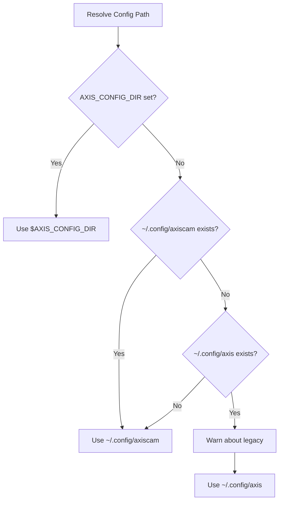
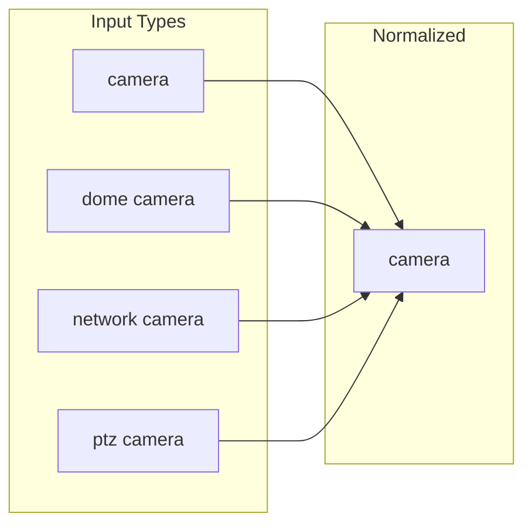
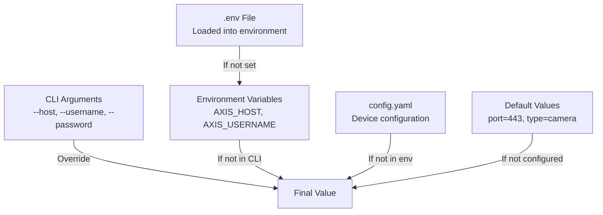
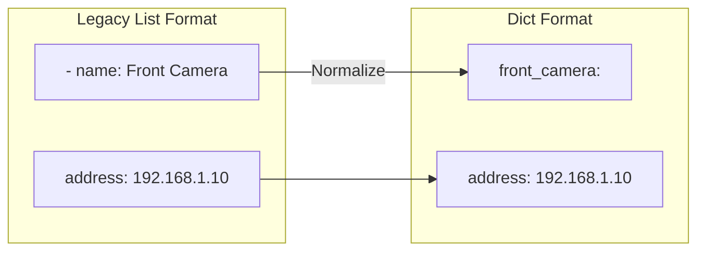
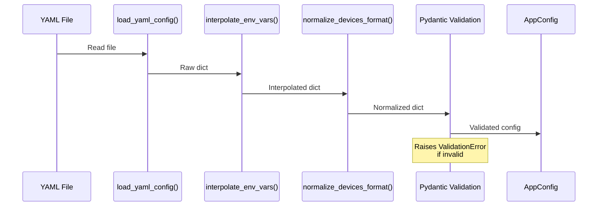

# Configuration Guide

This document provides comprehensive documentation for the `axis_cam` configuration system.

## Table of Contents

- [Overview](#overview)
- [Configuration File Location](#configuration-file-location)
- [Configuration Format](#configuration-format)
- [Device Configuration](#device-configuration)
- [Environment Variables](#environment-variables)
- [Secrets Management](#secrets-management)
- [Configuration Precedence](#configuration-precedence)
- [Legacy Configuration](#legacy-configuration)
- [Pydantic Models](#pydantic-models)
- [Troubleshooting](#troubleshooting)

---

## Overview

The configuration system supports:

- **YAML configuration files** with device definitions
- **Environment variable interpolation** (`${VAR_NAME}` syntax)
- **XDG Base Directory** specification compliance
- **Legacy path migration** from `~/.config/axis/`
- **Multiple device types** with validation
- **.env file support** for secrets

```mermaid
flowchart TD
    subgraph "Configuration Sources"
        ENV[Environment Variables]
        DOTENV[.env File]
        YAML[config.yaml]
        CLI[CLI Arguments]
    end

    subgraph "Processing"
        LOAD[Load YAML]
        INTERP[Interpolate ${VAR}]
        NORM[Normalize Format]
        VALID[Pydantic Validation]
    end

    subgraph "Output"
        APP[AppConfig]
        DEV[DeviceConfig]
    end

    DOTENV --> ENV
    ENV --> INTERP
    YAML --> LOAD
    LOAD --> INTERP
    INTERP --> NORM
    NORM --> VALID
    CLI --> VALID
    VALID --> APP
    APP --> DEV
```

---

## Configuration File Location

### Primary Location

```
~/.config/axiscam/config.yaml
```

### Legacy Location (Auto-Detected)

```
~/.config/axis/config.yaml
```

When the legacy path exists, a warning is shown recommending migration.

### Environment Override

```bash
export AXIS_CONFIG_DIR=/custom/path
```

### XDG Compliance

The configuration follows XDG Base Directory specification:

| Directory | Default | Purpose |
|-----------|---------|---------|
| Config | `~/.config/axiscam/` | Configuration files |
| Data | `~/.local/share/axiscam/` | Application data |



---

## Configuration Format

### Complete Example

```yaml
# ~/.config/axiscam/config.yaml

# Default device when --device not specified
default_device: front_door

# Global request timeout (seconds)
timeout: 30.0

# Device definitions
devices:
  front_door:
    name: "Front Door Camera"
    vendor: axis
    model: M3216-LVE
    type: camera
    address: 192.168.1.10
    port: 443
    username: ${AXIS_ROOT_USER_NAME}
    password: ${AXIS_ROOT_USER_PASSWORD}
    ssl_verify: false

  back_yard:
    name: "Back Yard Camera"
    vendor: axis
    model: P3265-LVE
    type: camera
    address: 192.168.1.11
    port: 443
    username: ${AXIS_ROOT_USER_NAME}
    password: ${AXIS_ROOT_USER_PASSWORD}
    ssl_verify: false

  main_nvr:
    name: "Main NVR"
    vendor: axis
    model: S3016
    type: recorder
    address: 192.168.1.100
    port: 443
    username: ${AXIS_ROOT_USER_NAME}
    password: ${AXIS_ROOT_USER_PASSWORD}
    ssl_verify: false

  front_intercom:
    name: "Front Door Intercom"
    vendor: axis
    model: I8016-LVE
    type: intercom
    address: 192.168.1.12
    port: 443
    username: ${AXIS_ROOT_USER_NAME}
    password: ${AXIS_ROOT_USER_PASSWORD}
    ssl_verify: false

  office_speaker:
    name: "Office Speaker"
    vendor: axis
    model: C1310-E
    type: speaker
    address: 192.168.1.45
    port: 443
    username: ${AXIS_ROOT_USER_NAME}
    password: ${AXIS_ROOT_USER_PASSWORD}
    ssl_verify: false
```

### Minimal Example

```yaml
default_device: camera1

devices:
  camera1:
    address: 192.168.1.10
    username: root
    password: mypassword
```

---

## Device Configuration

### Required Fields

| Field | Type | Description |
|-------|------|-------------|
| `address` | `str` | IP address or hostname |
| `username` | `str` | Authentication username |
| `password` | `str` | Authentication password |

### Optional Fields

| Field | Type | Default | Description |
|-------|------|---------|-------------|
| `name` | `str` | `None` | Friendly display name |
| `vendor` | `str` | `"axis"` | Device vendor |
| `model` | `str` | `None` | Device model number |
| `type` | `str` | `"camera"` | Device type |
| `port` | `int` | `443` | HTTPS port |
| `ssl_verify` | `bool` | `False` | Verify SSL certificates |

### Device Types

| Type | Class | Description |
|------|-------|-------------|
| `camera` | `AxisCamera` | Network cameras (default) |
| `recorder` | `AxisRecorder` | NVR devices (S-series) |
| `intercom` | `AxisIntercom` | Door stations (I-series) |
| `speaker` | `AxisSpeaker` | Audio devices (C-series) |

### Type Normalization

The configuration system normalizes device type names:



**Supported Type Mappings:**

| Input | Normalized |
|-------|------------|
| `camera`, `network camera`, `dome camera`, `bullet camera`, `ptz camera`, `thermal camera`, `modular camera` | `camera` |
| `recorder`, `nvr`, `network video recorder`, `s3008`, `s3016` | `recorder` |
| `intercom`, `door station`, `network video intercom` | `intercom` |
| `speaker`, `network speaker`, `horn speaker`, `network audio` | `speaker` |

---

## Environment Variables

### Direct Device Connection

Bypass configuration file and connect directly:

```bash
export AXIS_HOST=192.168.1.10
export AXIS_USERNAME=root
export AXIS_PASSWORD=mypassword
export AXIS_PORT=443
export AXIS_SSL_VERIFY=false
```

### Configuration Override

```bash
# Use custom config directory
export AXIS_CONFIG_DIR=/custom/path
```

### Credential Variables for Interpolation

Used in config.yaml with `${VAR_NAME}` syntax:

```bash
export AXIS_ROOT_USER_NAME=root
export AXIS_ROOT_USER_PASSWORD=secure_password
```

### Variable Mapping

| Environment Variable | Config Field |
|---------------------|--------------|
| `AXIS_HOST` | `host` |
| `AXIS_USERNAME` | `username` |
| `AXIS_PASSWORD` | `password` |
| `AXIS_PORT` | `port` |
| `AXIS_SSL_VERIFY` | `ssl_verify` |
| `AXIS_ADMIN_USERNAME` | `username` (alternative) |
| `AXIS_ADMIN_PASSWORD` | `password` (alternative) |

---

## Secrets Management

### .env File

Store credentials in `~/.config/axiscam/.env`:

```bash
# ~/.config/axiscam/.env
AXIS_ROOT_USER_NAME=root
AXIS_ROOT_USER_PASSWORD=your_secure_password

# Optional: Additional credentials
AXIS_ADMIN_PASSWORD=admin_password
```

### Loading .env File

The .env file is automatically loaded when the configuration is read.

**Manual loading:**
```bash
source ~/.config/axiscam/.env
axiscam info --device camera1
```

### Security Best Practices

```mermaid
flowchart TB
    subgraph "Do"
        A1[Use .env files]
        A2[Use ${VAR} interpolation]
        A3[Set file permissions 600]
        A4[Use environment variables]
    end

    subgraph "Don't"
        B1[Hardcode passwords in YAML]
        B2[Commit secrets to git]
        B3[Use world-readable permissions]
    end
```

**Recommended Permissions:**

```bash
chmod 600 ~/.config/axiscam/.env
chmod 600 ~/.config/axiscam/config.yaml
```

---

## Configuration Precedence

Configuration values are resolved in this order (highest to lowest):



### Example Resolution

```yaml
# config.yaml
devices:
  camera1:
    address: 192.168.1.10
    username: ${AXIS_USERNAME}
    password: ${AXIS_PASSWORD}
    port: 443
```

```bash
# Environment
export AXIS_USERNAME=config_user
export AXIS_PASSWORD=config_pass

# CLI override
axiscam info --device camera1 --username cli_user
```

**Result:** Username = `cli_user` (CLI overrides environment)

---

## Legacy Configuration

### Legacy List Format

The original configuration used a list format:

```yaml
# Legacy: ~/.config/axis/config.yaml
devices:
  - name: 'Front Camera'
    vendor: AXIS
    model: "M3216-LVE"
    type: "Dome Camera"
    address: 192.168.1.10
    port: 80
    username: '${AXIS_ROOT_USER_NAME}'
    password: '${AXIS_ROOT_USER_PASSWORD}'
```

### Automatic Conversion

The list format is automatically converted to dict format:



**Conversion Rules:**
- `name` field becomes the dict key
- Name is lowercased and spaces replaced with underscores
- Original name preserved in `name` field

### Migration Command

```bash
axiscam migrate
```

This copies configuration from `~/.config/axis/` to `~/.config/axiscam/`.

---

## Pydantic Models

### DeviceConfig

```python
class DeviceConfig(BaseModel):
    """Configuration for a single AXIS device."""

    model_config = {"frozen": True, "populate_by_name": True}

    host: str = Field(
        ...,
        alias="address",
        description="Device IP address or hostname",
    )
    username: str = Field(..., description="Authentication username")
    password: SecretStr = Field(..., description="Authentication password")
    port: int = Field(default=443, ge=1, le=65535)
    ssl_verify: bool = Field(default=False)
    device_type: str = Field(default="camera", alias="type")
    name: str | None = Field(default=None)
    vendor: str = Field(default="axis")
    model: str | None = Field(default=None)
```

### AppConfig

```python
class AppConfig(BaseModel):
    """Application-wide configuration."""

    model_config = {"frozen": True}

    default_device: str | None = Field(default=None)
    timeout: float = Field(default=30.0, ge=1.0, le=300.0)
    devices: dict[str, DeviceConfig] = Field(default_factory=dict)
```

### Validation Flow



---

## Troubleshooting

### Common Issues

#### Missing Configuration File

```
Error: Configuration file not found
```

**Solution:**
```bash
axiscam init
# Edit ~/.config/axiscam/config.yaml
```

#### Environment Variable Not Found

```
Warning: Environment variable AXIS_ROOT_USER_NAME not set
```

**Solution:**
```bash
# Set in environment
export AXIS_ROOT_USER_NAME=root

# Or in .env file
echo "AXIS_ROOT_USER_NAME=root" >> ~/.config/axiscam/.env
```

#### Invalid Device Type

```
Warning: Unknown device type 'webcam', defaulting to 'camera'
```

**Solution:** Use a valid device type:
- `camera`
- `recorder`
- `intercom`
- `speaker`

#### Legacy Path Warning

```
Warning: Using legacy config path: ~/.config/axis/
         Consider migrating to: ~/.config/axiscam/
```

**Solution:**
```bash
axiscam migrate
```

### Debug Configuration Loading

```python
from axis_cam.config import load_config, get_config_dir

# Check config directory
print(f"Config dir: {get_config_dir()}")

# Load and inspect config
config = load_config()
print(f"Default device: {config.default_device}")
print(f"Devices: {list(config.devices.keys())}")

# Check specific device
device = config.devices.get("camera1")
if device:
    print(f"Host: {device.host}")
    print(f"Port: {device.port}")
    print(f"Type: {device.device_type}")
```

### Verify Device Configuration

```bash
# List all configured devices
axiscam devices

# Show current configuration
axiscam config

# Test device connectivity
axiscam status --device camera1
```

### Configuration Validation

```yaml
# Test with axiscam
axiscam info --device camera1

# Common validation errors:
# - Empty host/address
# - Port out of range (1-65535)
# - Missing required fields
```

---

## See Also

- [Architecture Overview](./architecture.md) - System architecture
- [CLI Reference](./cli-reference.md) - Command-line usage
- [Device Classes](./device-classes.md) - Device implementations
