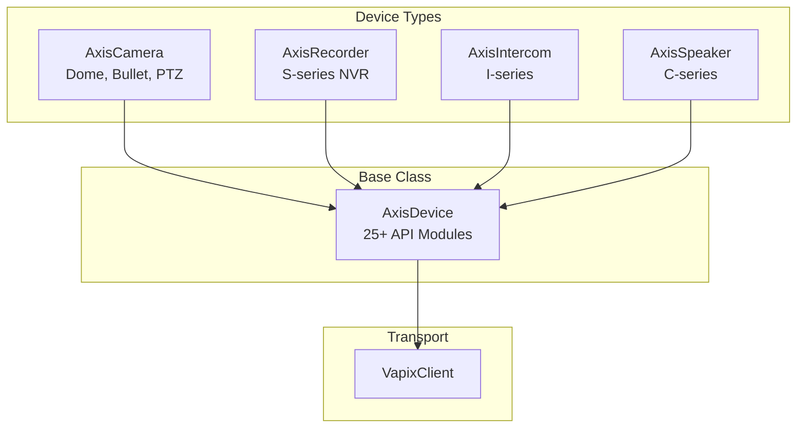
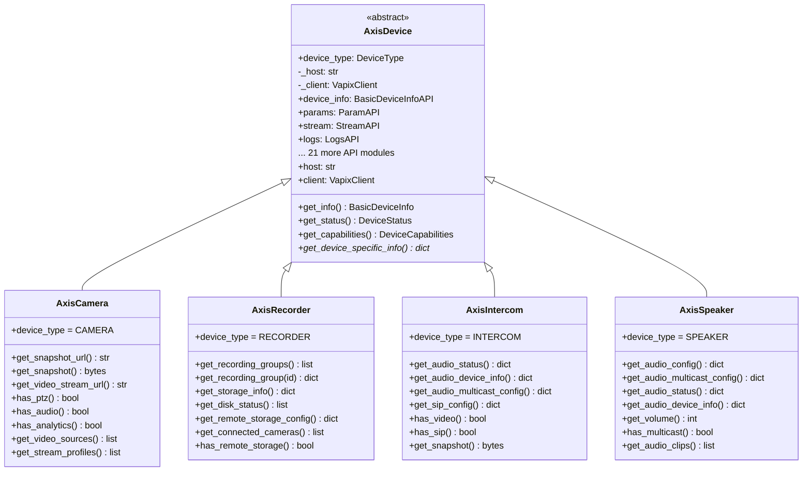
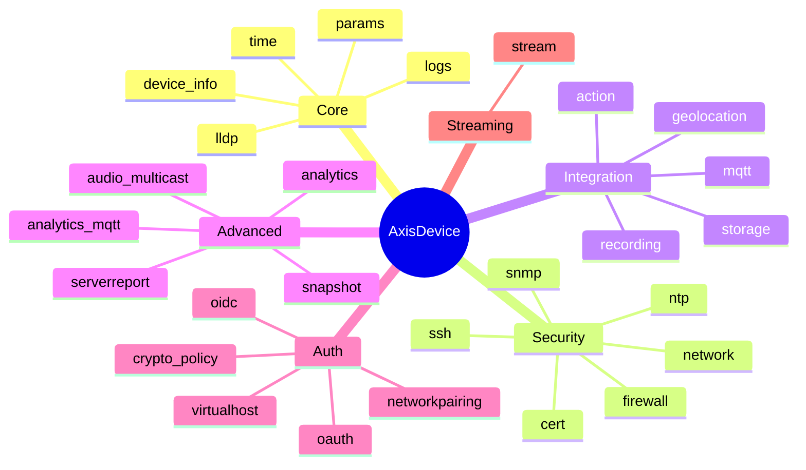
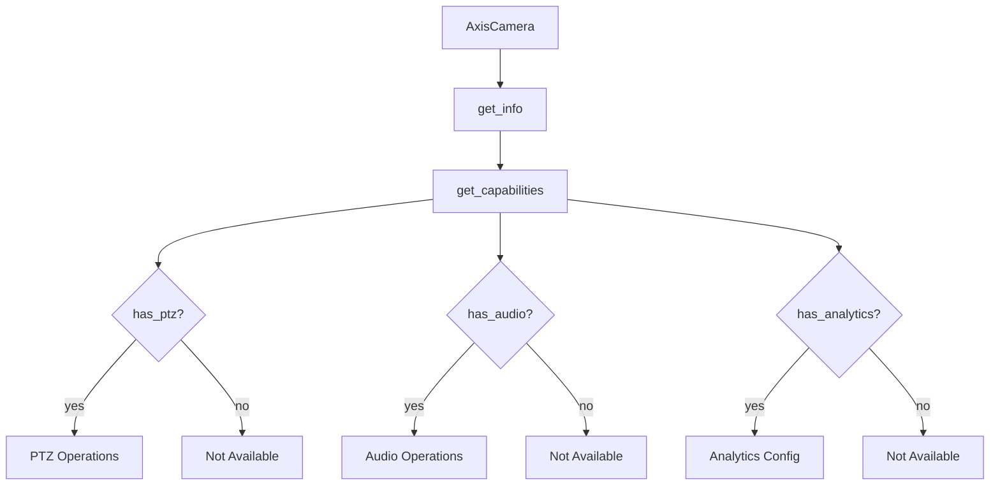
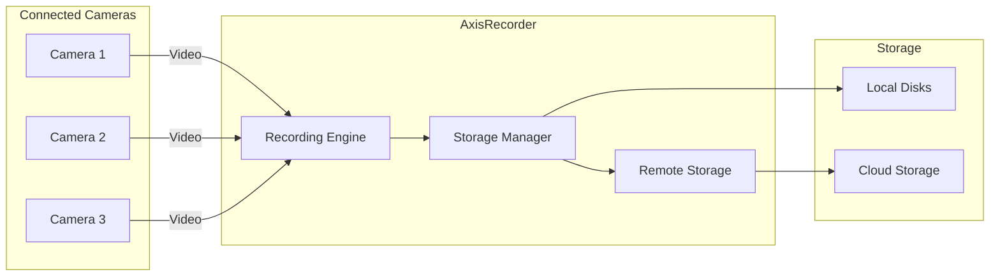
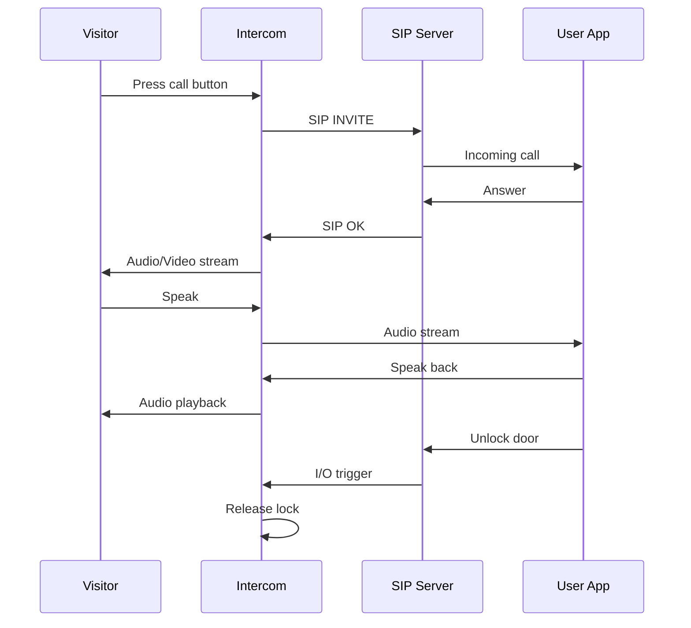
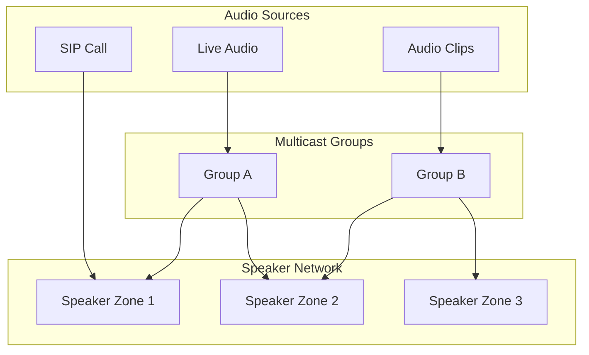
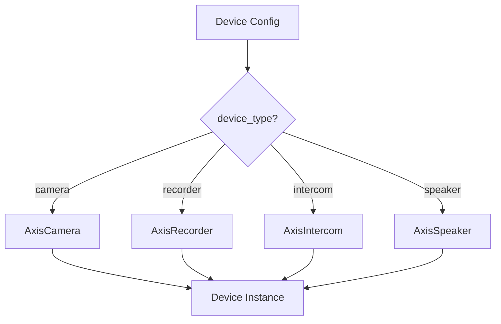
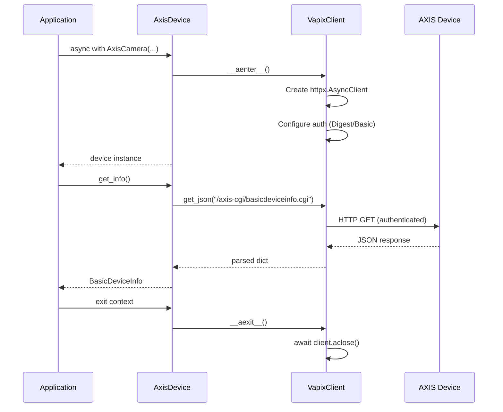

# Device Classes Reference

This document provides detailed documentation for all device classes in the `axis_cam.devices` package.

## Table of Contents

- [Overview](#overview)
- [Class Hierarchy](#class-hierarchy)
- [AxisDevice (Base Class)](#axisdevice-base-class)
- [AxisCamera](#axiscamera)
- [AxisRecorder](#axisrecorder)
- [AxisIntercom](#axisintercom)
- [AxisSpeaker](#axisspeaker)
- [Device Factory Pattern](#device-factory-pattern)
- [Common Operations](#common-operations)

---

## Overview

The device classes provide a high-level interface for interacting with different types of AXIS network devices. Each device class:

- Inherits from `AxisDevice` base class
- Composes 25+ API modules via the base class
- Provides device-specific methods and capabilities
- Implements async context manager protocol



---

## Class Hierarchy



---

## AxisDevice (Base Class)

**Module:** `devices/base.py`

The abstract base class for all AXIS device types. Provides common functionality and composes all shared API modules.

### Constructor

```python
def __init__(
    self,
    host: str,
    username: str,
    password: str,
    port: int = 443,
    ssl_verify: bool = False,
    timeout: float = 30.0,
    use_digest_auth: bool = False,
) -> None
```

| Parameter | Type | Default | Description |
|-----------|------|---------|-------------|
| `host` | `str` | Required | Device IP address or hostname |
| `username` | `str` | Required | Authentication username |
| `password` | `str` | Required | Authentication password |
| `port` | `int` | `443` | HTTPS port (443 = HTTPS, other = HTTP) |
| `ssl_verify` | `bool` | `False` | Verify SSL certificates |
| `timeout` | `float` | `30.0` | Request timeout in seconds |
| `use_digest_auth` | `bool` | `False` | Use Digest auth instead of Basic |

### Composed API Modules

The base class initializes 25+ API modules:



### Common Methods

| Method | Returns | Description |
|--------|---------|-------------|
| `get_info()` | `BasicDeviceInfo` | Device identification |
| `get_status()` | `DeviceStatus` | Connectivity and health |
| `get_capabilities()` | `DeviceCapabilities` | Available APIs |
| `check_connectivity()` | `bool` | Ping device |
| `get_time_info()` | `TimeInfo` | Time settings |
| `get_logs(type, max)` | `LogReport` | Retrieve logs |
| `get_friendly_name()` | `str` | Device display name |
| `get_location()` | `str` | Physical location |
| `get_lldp_info()` | `LldpInfo` | Switch port mapping |
| `get_network_config()` | `NetworkConfig` | Network settings |
| `get_firewall_config()` | `FirewallConfig` | Firewall rules |
| `get_ssh_config()` | `SshConfig` | SSH settings |
| `get_snmp_config()` | `SnmpConfig` | SNMP settings |
| `get_cert_config()` | `CertConfig` | Certificate info |
| `get_ntp_config()` | `NtpConfig` | NTP settings |
| `get_action_config()` | `ActionConfig` | Action rules |
| `get_mqtt_config()` | `MqttBridgeConfig` | MQTT bridge |
| `get_recording_config()` | `RecordingConfig` | Recording groups |
| `get_storage_config()` | `RemoteStorageConfig` | Storage destinations |
| `get_geolocation_config()` | `GeolocationConfig` | GPS coordinates |
| `get_analytics_config()` | `AnalyticsConfig` | Video analytics |
| `get_snapshot_config()` | `BestSnapshotConfig` | Snapshot profiles |
| `capture_snapshot()` | `bytes` | Capture JPEG image |
| `download_server_report()` | `ServerReport` | Download report |
| `download_debug_archive()` | `ServerReport` | Download debug.tgz |
| `get_oidc_config()` | `OidcConfig` | OIDC settings |
| `get_oauth_config()` | `OAuthConfig` | OAuth settings |
| `get_crypto_policy_config()` | `CryptoPolicyConfig` | TLS settings |
| `get_stream_diagnostics()` | `StreamDiagnostics` | RTSP/RTP config |

### Async Context Manager

```python
async with AxisDevice("192.168.1.10", "admin", "pass") as device:
    info = await device.get_info()
    # Connection automatically managed
```

---

## AxisCamera

**Module:** `devices/camera.py`

For AXIS network cameras (dome, bullet, PTZ, thermal, modular).

### Device Type

```python
device_type = DeviceType.CAMERA
```

### Supported Models

- **M-series**: Dome cameras (M3216-LVE, etc.)
- **P-series**: Bullet cameras (P3265-LVE, etc.)
- **Q-series**: PTZ cameras
- **F-series**: Modular cameras

### Camera-Specific Methods

| Method | Returns | Description |
|--------|---------|-------------|
| `get_device_specific_info()` | `dict` | Camera capabilities summary |
| `get_snapshot_url(resolution)` | `str` | JPEG snapshot URL |
| `get_snapshot(resolution)` | `bytes` | Capture JPEG image |
| `get_video_stream_url(profile, codec)` | `str` | RTSP stream URL |
| `has_ptz()` | `bool` | PTZ capability check |
| `has_audio()` | `bool` | Audio capability check |
| `has_analytics()` | `bool` | Analytics capability check |
| `get_video_sources()` | `list[dict]` | Video source configs |
| `get_stream_profiles()` | `list[dict]` | Stream profile configs |

### Example Usage

```python
from axis_cam import AxisCamera

async with AxisCamera(
    host="192.168.1.10",
    username="admin",
    password="your_password",  # pragma: allowlist secret
    port=443,
    use_digest_auth=True,
) as camera:
    # Get device info
    info = await camera.get_info()
    print(f"Model: {info.product_number}")
    print(f"Serial: {info.serial_number}")

    # Check capabilities
    if await camera.has_ptz():
        print("PTZ supported")

    if await camera.has_analytics():
        print("Video analytics supported")

    # Capture snapshot
    snapshot = await camera.get_snapshot(resolution="1920x1080")
    with open("snapshot.jpg", "wb") as f:
        f.write(snapshot)

    # Get RTSP URL
    rtsp_url = await camera.get_video_stream_url(codec="h264")
    print(f"RTSP: {rtsp_url}")

    # Get stream diagnostics
    diagnostics = await camera.get_stream_diagnostics("front_camera")
    print(f"RTSP Port: {diagnostics.rtsp.port}")
```

### Capability Flow



---

## AxisRecorder

**Module:** `devices/recorder.py`

For AXIS network video recorders (S-series NVR).

### Device Type

```python
device_type = DeviceType.RECORDER
```

### Supported Models

- **S3008**: 8-channel recorder
- **S30XX series**: Various channel counts

### Recorder-Specific Methods

| Method | Returns | Description |
|--------|---------|-------------|
| `get_device_specific_info()` | `dict` | Recorder capabilities and storage |
| `get_recording_groups()` | `list[dict]` | All recording groups |
| `get_recording_group(id)` | `dict \| None` | Specific recording group |
| `get_storage_info()` | `dict` | Storage capacity and status |
| `get_disk_status()` | `list[dict]` | Connected disk status |
| `get_remote_storage_config()` | `dict \| None` | Remote storage settings |
| `get_connected_cameras()` | `list[dict]` | Cameras connected to NVR |
| `has_remote_storage()` | `bool` | Remote storage capability |

### Example Usage

```python
from axis_cam import AxisRecorder

async with AxisRecorder(
    host="192.168.1.100",
    username="admin",
    password="secure_password",
    use_digest_auth=True,
) as nvr:
    # Get device info
    info = await nvr.get_info()
    print(f"NVR Model: {info.product_number}")

    # Get storage status
    storage = await nvr.get_storage_info()
    print(f"Storage: {storage}")

    # Get disk status
    disks = await nvr.get_disk_status()
    for disk in disks:
        print(f"Disk: {disk}")

    # Get recording groups
    groups = await nvr.get_recording_groups()
    for group in groups:
        print(f"Recording Group: {group}")

    # Get connected cameras
    cameras = await nvr.get_connected_cameras()
    for cam in cameras:
        print(f"Connected: {cam}")
```

### NVR Data Flow



---

## AxisIntercom

**Module:** `devices/intercom.py`

For AXIS network intercoms (I-series door stations).

### Device Type

```python
device_type = DeviceType.INTERCOM
```

### Supported Models

- **I8016-LVE**: Network Video Intercom
- **I-series**: Various intercom models

### Intercom-Specific Methods

| Method | Returns | Description |
|--------|---------|-------------|
| `get_device_specific_info()` | `dict` | Intercom capabilities |
| `get_audio_status()` | `dict` | Audio subsystem status |
| `get_audio_device_info()` | `dict` | Audio device details |
| `get_audio_multicast_config()` | `dict \| None` | Multicast settings |
| `get_sip_config()` | `dict` | VoIP/SIP settings |
| `has_video()` | `bool` | Video capability check |
| `has_sip()` | `bool` | SIP capability check |
| `get_snapshot_url(resolution)` | `str` | Snapshot URL (if video) |
| `get_snapshot(resolution)` | `bytes` | Capture image (if video) |

### Example Usage

```python
from axis_cam import AxisIntercom

async with AxisIntercom(
    host="192.168.1.12",
    username="admin",
    password="secure_password",
    use_digest_auth=True,
) as intercom:
    # Get device info
    info = await intercom.get_info()
    print(f"Intercom: {info.product_number}")

    # Check capabilities
    if await intercom.has_video():
        snapshot = await intercom.get_snapshot()
        print(f"Captured {len(snapshot)} bytes")

    if await intercom.has_sip():
        sip_config = await intercom.get_sip_config()
        print(f"SIP: {sip_config}")

    # Get audio status
    audio = await intercom.get_audio_status()
    print(f"Audio Status: {audio}")
```

### Intercom Communication Flow



---

## AxisSpeaker

**Module:** `devices/speaker.py`

For AXIS network speakers (C-series audio devices).

### Device Type

```python
device_type = DeviceType.SPEAKER
```

### Supported Models

- **C1410**: Network Mini Speaker
- **C-series**: Various speaker models

### Speaker-Specific Methods

| Method | Returns | Description |
|--------|---------|-------------|
| `get_device_specific_info()` | `dict` | Speaker capabilities |
| `get_audio_config()` | `dict` | Audio configuration |
| `get_audio_multicast_config()` | `dict \| None` | Multicast settings |
| `get_audio_status()` | `dict` | Audio subsystem status |
| `get_audio_device_info()` | `dict` | Audio device details |
| `get_volume()` | `int \| None` | Current volume (0-100) |
| `has_multicast()` | `bool` | Multicast capability |
| `get_audio_clips()` | `list[dict]` | Stored audio clips |

### Example Usage

```python
from axis_cam import AxisSpeaker

async with AxisSpeaker(
    host="192.168.1.45",
    username="admin",
    password="secure_password",
    use_digest_auth=True,
) as speaker:
    # Get device info
    info = await speaker.get_info()
    print(f"Speaker: {info.product_number}")

    # Get volume
    volume = await speaker.get_volume()
    print(f"Volume: {volume}%")

    # Check multicast support
    if await speaker.has_multicast():
        mc_config = await speaker.get_audio_multicast_config()
        print(f"Multicast: {mc_config}")

    # Get audio clips
    clips = await speaker.get_audio_clips()
    for clip in clips:
        print(f"Clip: {clip}")
```

### Audio Zone Management



---

## Device Factory Pattern

The CLI uses a factory pattern to create device instances based on configuration.

### Device Class Resolution



### Factory Implementation

```python
from axis_cam import AxisCamera, AxisRecorder, AxisIntercom, AxisSpeaker

DEVICE_CLASSES = {
    "camera": AxisCamera,
    "recorder": AxisRecorder,
    "intercom": AxisIntercom,
    "speaker": AxisSpeaker,
}

def get_device_class(device_type: str):
    """Get the device class for a device type."""
    return DEVICE_CLASSES.get(device_type, AxisCamera)

# Usage
device_class = get_device_class(config.device_type)
async with device_class(
    host=config.host,
    username=config.username,
    password=config.password.get_secret_value(),
    port=config.port,
    ssl_verify=config.ssl_verify,
    use_digest_auth=use_digest,
) as device:
    info = await device.get_info()
```

---

## Common Operations

### Connection Lifecycle



### Error Handling

```python
from axis_cam import AxisCamera
from axis_cam.exceptions import (
    AxisError,
    AxisConnectionError,
    AxisAuthenticationError,
    AxisDeviceError,
)

try:
    async with AxisCamera("192.168.1.10", "admin", "wrong_pass") as camera:
        info = await camera.get_info()
except AxisAuthenticationError as e:
    print(f"Auth failed: {e}")
except AxisConnectionError as e:
    print(f"Connection failed: {e}")
except AxisDeviceError as e:
    print(f"Device error: {e}")
except AxisError as e:
    print(f"AXIS error: {e}")
```

### Parallel Operations

```python
import asyncio
from axis_cam import AxisCamera

async def get_device_info(host: str, username: str, password: str):
    async with AxisCamera(host, username, password) as camera:
        return await camera.get_info()

# Query multiple devices in parallel
devices = [
    ("192.168.1.10", "admin", "pass1"),
    ("192.168.1.11", "admin", "pass2"),
    ("192.168.1.12", "admin", "pass3"),
]

results = await asyncio.gather(*[
    get_device_info(host, user, pw)
    for host, user, pw in devices
])
```

---

## See Also

- [Architecture Overview](./architecture.md) - System architecture
- [API Modules Reference](./api-modules.md) - API module details
- [CLI Reference](./cli-reference.md) - Command-line usage
- [Configuration Guide](./configuration.md) - Configuration system
