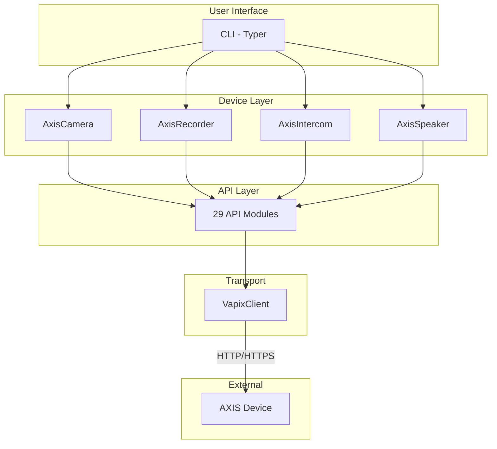

# AXIS Camera Manager Documentation

Welcome to the documentation for `axis_cam`, a comprehensive CLI tool and Python library for managing AXIS network devices via the VAPIX REST API.

## Quick Navigation

| Document | Description |
|----------|-------------|
| [Architecture](./architecture.md) | System architecture, design patterns, data flows |
| [API Modules](./api-modules.md) | VAPIX API module reference (29 modules) |
| [Device Classes](./device-classes.md) | Device type implementations |
| [CLI Reference](./cli-reference.md) | Command-line interface documentation |
| [Configuration](./configuration.md) | Configuration system guide |

---

## Architecture Overview



---

## Quick Start

### Installation

```bash
# Using uv (recommended)
uv tool install .

# Or with pip
pip install .
```

### Configuration

```bash
# Initialize configuration
axiscam init

# Edit configuration
nano ~/.config/axiscam/config.yaml
```

### Basic Usage

```bash
# Get device info
axiscam info --device front_camera

# Check connectivity
axiscam status --device front_camera

# Generate report
axiscam report --device front_camera --full --output report.json
```

---

## Module Summary

### Core Modules

| Module | Description | Lines |
|--------|-------------|-------|
| `cli.py` | Typer CLI implementation | ~2600 |
| `client.py` | VapixClient HTTP client | ~375 |
| `config.py` | Configuration management | ~575 |
| `models.py` | Pydantic data models | ~2000 |
| `exceptions.py` | Exception hierarchy | ~110 |

### API Modules (29 total)

| Category | Modules |
|----------|---------|
| **Core** | device_info, param, time |
| **Security** | firewall, ssh, snmp, cert, crypto_policy |
| **Network** | network, lldp, ntp, networkpairing |
| **Streaming** | stream, audio_multicast |
| **Recording** | recording, storage, snapshot |
| **Analytics** | analytics, analytics_mqtt |
| **Integration** | action, mqtt, virtualhost, geolocation |
| **Diagnostics** | logs, serverreport |
| **Auth** | oidc, oauth |

### Device Classes

| Class | Device Type | Purpose |
|-------|-------------|---------|
| `AxisDevice` | Base | Abstract base class |
| `AxisCamera` | camera | Network cameras |
| `AxisRecorder` | recorder | NVR devices |
| `AxisIntercom` | intercom | Door stations |
| `AxisSpeaker` | speaker | Audio devices |

---

## Key Features

### Multi-Device Support

- **Cameras**: Dome, bullet, PTZ, thermal, modular
- **Recorders**: S-series NVR devices
- **Intercoms**: I-series door stations
- **Speakers**: C-series audio devices

### Comprehensive APIs

- Device identification and parameters
- Stream diagnostics (RTSP, RTP, profiles)
- Network configuration and LLDP
- Security (firewall, SSH, certificates)
- MQTT and action rules
- Recording and storage
- Video analytics
- Authentication (OIDC, OAuth)

### Diagnostic Tools

- System, access, and audit logs
- Server reports (ZIP with snapshot)
- Debug archives for support
- LLDP neighbor discovery

### Configuration System

- YAML configuration files
- Environment variable interpolation
- XDG Base Directory compliance
- Legacy path migration
- .env file support for secrets

---

## Design Patterns

| Pattern | Usage |
|---------|-------|
| **Composition** | API modules composed into device classes |
| **Async Context Manager** | Connection lifecycle management |
| **Factory** | Device class selection by type |
| **Strategy** | Authentication method selection |
| **Template Method** | Common API operations |

---

## VAPIX API Coverage

| API | Status | Description |
|-----|--------|-------------|
| basic-device-info | Full | Device identification |
| param | Full | Device parameters |
| time | Full | Time/timezone/NTP |
| network-settings | Full | Network configuration |
| lldp | Full | Neighbor discovery |
| log | Full | System/access/audit logs |
| firewall | Full | Firewall rules |
| ssh | Full | SSH configuration |
| snmp | Full | SNMP configuration |
| cert | Full | Certificate management |
| ntp | Full | NTP synchronization |
| action | Full | Action rules |
| mqtt | Full | Event bridge |
| recording | Full | Recording profiles |
| storage | Full | Remote storage |
| geolocation | Full | GPS/location |
| analytics | Full | Video analytics |
| snapshot | Full | Best snapshot |
| stream | Full | RTSP/RTP/profiles |
| serverreport | Full | Diagnostic reports |
| oidc | Full | OpenID Connect |
| oauth | Full | OAuth 2.0 |
| virtualhost | Full | Virtual hosts |
| crypto-policy | Full | TLS/cipher settings |
| network-pairing | Full | Device pairing |

---

## Getting Help

- **CLI Help**: `axiscam --help`
- **Command Help**: `axiscam <command> --help`
- **Documentation**: This docs folder
- **README**: Project root README.md

---

## Contributing

See the main [README.md](../README.md) for contribution guidelines.

## License

MIT License - See LICENSE file for details.
