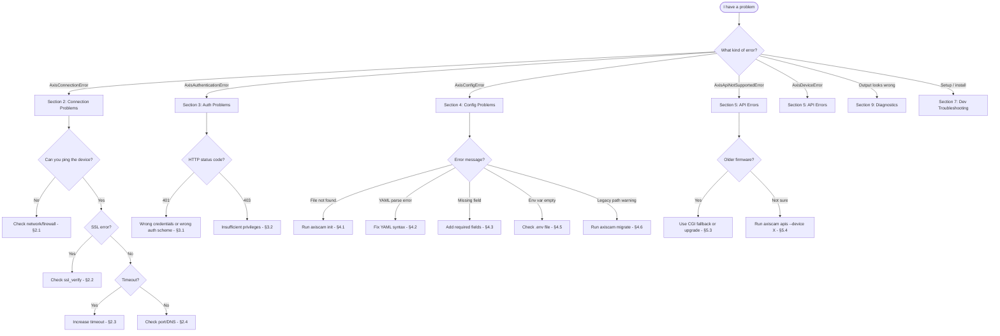
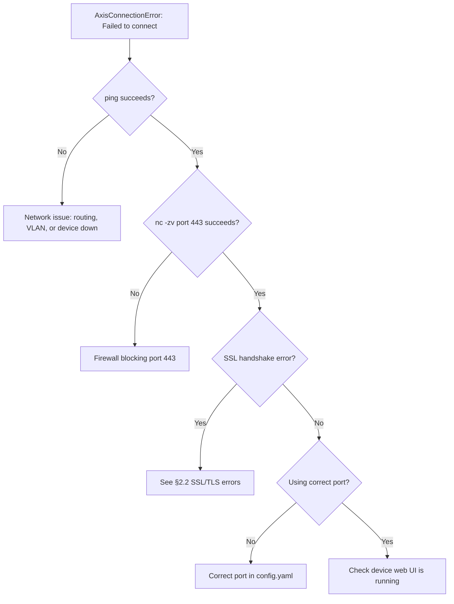
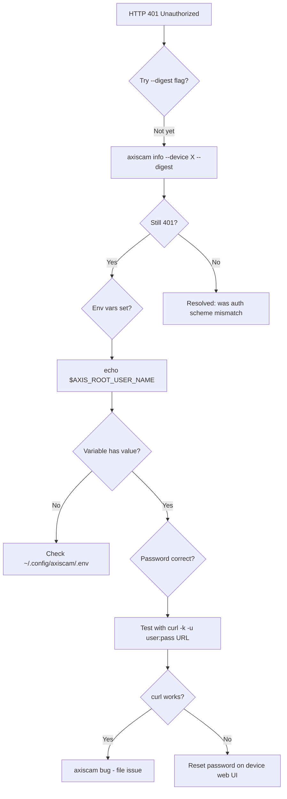
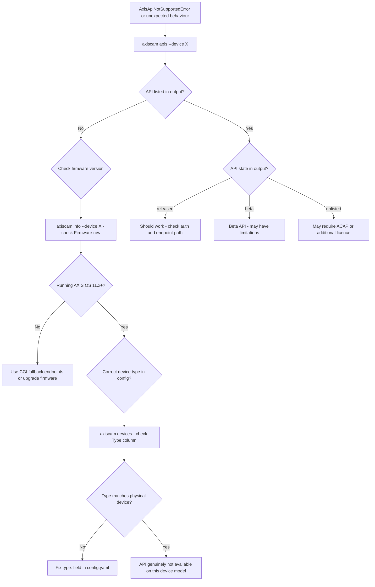
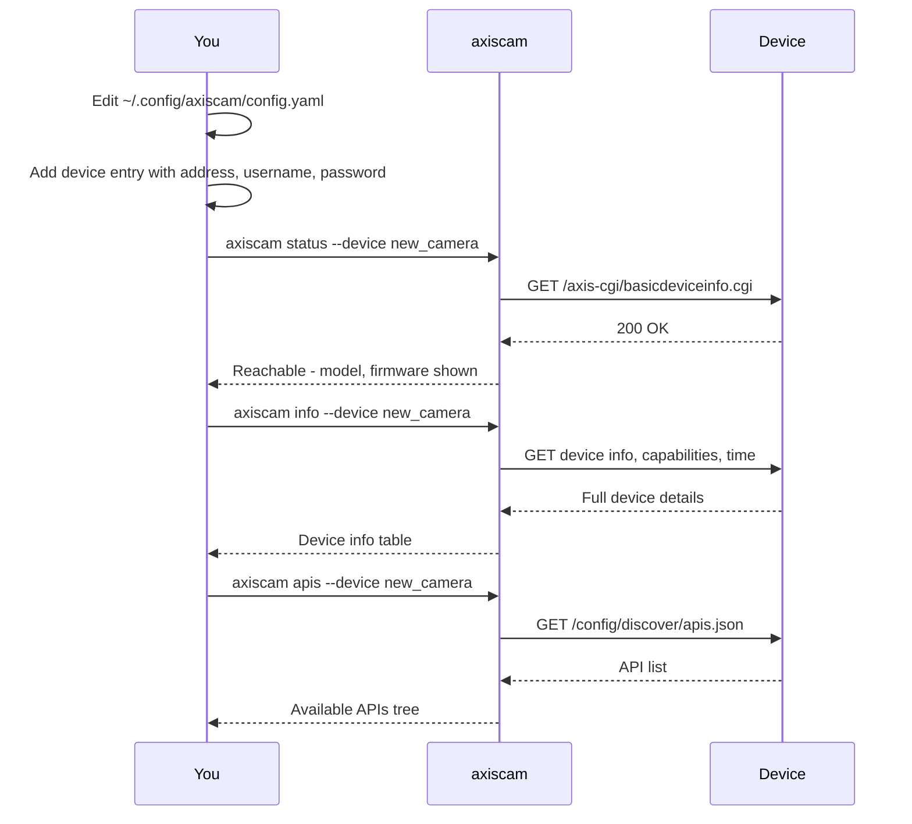
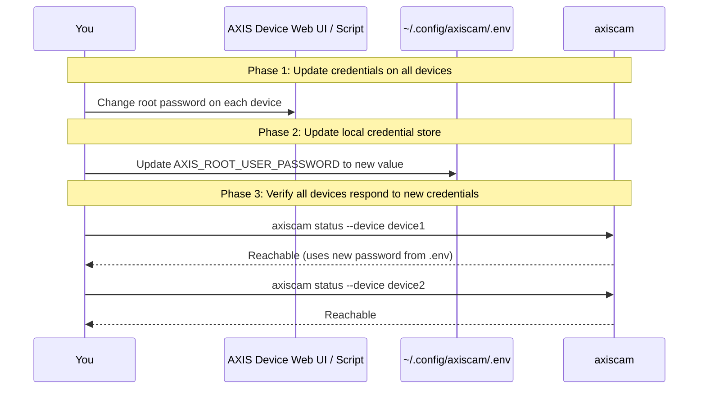
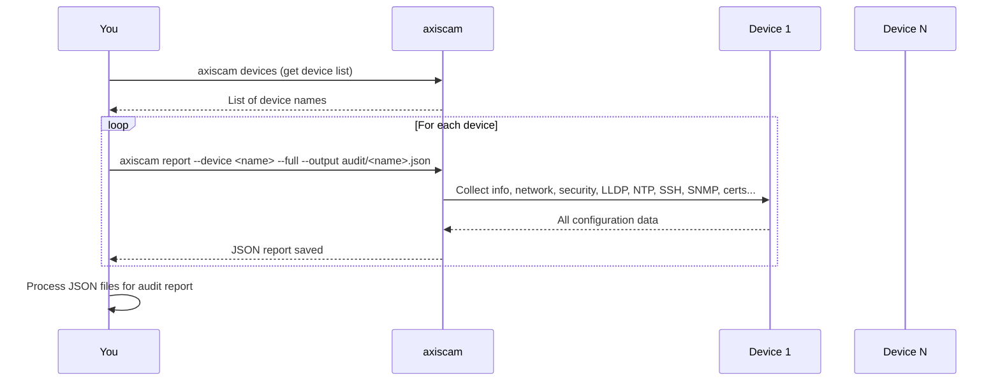
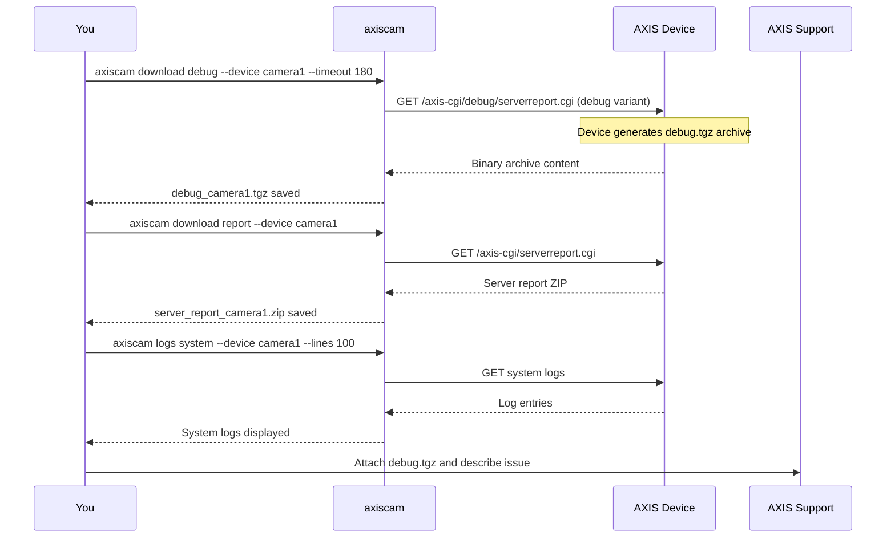
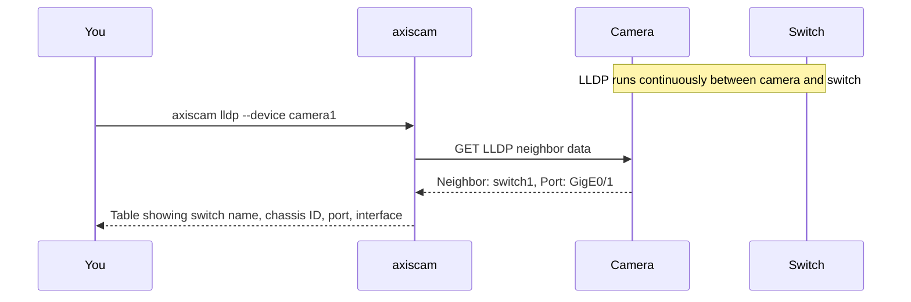

# axiscam Troubleshooting and Runbook

**Version**: 0.1.0  
**CLI**: `axiscam`  
**Package**: `axis-cam`

---

## Table of Contents

1. [Quick Reference - Decision Tree](#1-quick-reference---decision-tree)
2. [Connection Problems](#2-connection-problems)
3. [Authentication Problems](#3-authentication-problems)
4. [Configuration Problems](#4-configuration-problems)
5. [API Errors](#5-api-errors)
6. [Common Operations Runbook](#6-common-operations-runbook)
7. [Development Troubleshooting](#7-development-troubleshooting)
8. [Error Reference Table](#8-error-reference-table)
9. [Diagnostic Commands Quick Reference](#9-diagnostic-commands-quick-reference)

---

## 1. Quick Reference - Decision Tree

Use this flowchart to route any problem to the right section.



---

## 2. Connection Problems

### 2.1 Device Unreachable

**Symptoms**: `AxisConnectionError: Failed to connect to <host>: ...`

The `VapixClient` raises `AxisConnectionError` wrapping `httpx.ConnectError` when the TCP connection cannot be established.

**Diagnostic steps**:

```bash
# 1. Basic reachability
ping -c 4 <device-ip>

# 2. Port connectivity (axiscam uses 443 by default)
nc -zv <device-ip> 443
# or
curl -k --connect-timeout 5 https://<device-ip>/axis-cgi/basicdeviceinfo.cgi

# 3. Check what axiscam sees
axiscam status --device <name>

# 4. Try with explicit host override to bypass config
axiscam status --host <device-ip> --username admin --password <pass>
```

**Common causes and fixes**:

| Cause | Fix |
|-------|-----|
| Wrong IP address in config | Run `axiscam config` to verify `host` field, correct in `~/.config/axiscam/config.yaml` |
| Firewall blocking port 443 | Allow outbound TCP/443 from your workstation to device subnet |
| Device on different VLAN | Ensure routing exists; AXIS devices default to HTTPS on port 443 |
| Device powered off or crashed | Physical check; AXIS devices have a status LED |
| Wrong port specified | Default is 443 (HTTPS). Check `port` field in device config |



### 2.2 SSL/TLS Errors

**Symptoms**: `SSL: CERTIFICATE_VERIFY_FAILED` or similar SSL errors wrapped in `AxisConnectionError`.

AXIS devices use self-signed certificates by default. The `VapixClient` defaults to `verify_ssl=False`, but this is a per-device config field.

**Fix - disable SSL verification in config**:

```yaml
# ~/.config/axiscam/config.yaml
devices:
  front_door:
    address: 192.168.1.10
    ssl_verify: false    # Required for self-signed certs (AXIS default)
```

**Fix - use HTTP instead of HTTPS** (non-default ports only):

The client uses HTTPS when `use_https=True` or when the port is 443. If you configure a non-443 port, the client uses HTTP automatically. AXIS devices that have HTTPS disabled can be reached on port 80.

**Important**: `ssl_verify: false` is the correct and expected setting for most AXIS deployments. AXIS devices ship with self-signed certificates. Only set `ssl_verify: true` if your organisation deploys a CA-signed certificate to devices.

**Verify the current setting**:

```bash
axiscam config
# Look for ssl_verify under each device entry
```

### 2.3 Timeout Errors

**Symptoms**: `AxisConnectionError: Connection timeout to <host>: ...`

The default timeout is **30 seconds**. This is set globally in `AppConfig` and passed to `VapixClient`. The `download report` command uses 60s and `download debug` uses 120s by default because diagnostic archives can be large.

**Causes**:
- Slow device (under load, generating a report)
- Large log files or server reports
- Congested network path

**Fixes**:

```bash
# Increase timeout for downloads
axiscam download report --device camera1 --timeout 120

axiscam download debug --device camera1 --timeout 300

# Increase global timeout in config
# ~/.config/axiscam/config.yaml
timeout: 60.0    # seconds, default is 30.0, max is 300.0
```

**Note**: The `timeout` field in `AppConfig` has a `ge=1.0, le=300.0` validator. Values above 300 are rejected with a Pydantic validation error.

### 2.4 DNS Resolution Failures

**Symptoms**: `AxisConnectionError: Failed to connect to <hostname>: ...` when using hostnames instead of IPs.

AXIS devices may be configured with hostnames. Resolution depends on your local DNS infrastructure.

**Diagnostic steps**:

```bash
# Test DNS resolution
dig <device-hostname>
nslookup <device-hostname>

# If DNS fails, use IP address directly in config
# or add to /etc/hosts:
echo "192.168.1.10  axis-front-door.local" | sudo tee -a /etc/hosts
```

**Config workaround** - use IP addresses where DNS is unreliable:

```yaml
devices:
  front_door:
    address: 192.168.1.10    # IP preferred over hostname for reliability
```

---

## 3. Authentication Problems

### 3.1 401 Unauthorized

**Symptoms**: `AxisAuthenticationError: Authentication failed for <host>. Check username/password.`

This is raised by `_check_response()` in `VapixClient` when the device returns HTTP 401.

**Diagnostic steps**:

```bash
# Test credentials directly with curl (Basic auth)
curl -k -u admin:<password> https://<device-ip>/axis-cgi/basicdeviceinfo.cgi

# Test with Digest auth
curl -k --digest -u admin:<password> https://<device-ip>/axis-cgi/basicdeviceinfo.cgi

# Check what axiscam is using (Basic is default, Digest with --digest flag)
axiscam info --device camera1 --digest    # Force Digest auth
axiscam info --device camera1 --no-digest # Force Basic auth
```

**Common causes**:

| Cause | Fix |
|-------|-----|
| Wrong password in config | Check env var interpolation: `axiscam config` shows host but not password; verify env var is set |
| Env var not loaded | Confirm `.env` file exists at `~/.config/axiscam/.env` and contains the right value |
| Basic vs Digest mismatch | Try `--digest` flag; older AXIS OS defaults to Digest, newer OS 11.x defaults to Basic |
| Account locked out | Log into device web UI and check Users page |
| Password has special characters | Ensure password is quoted in `.env` file: `AXIS_ROOT_USER_PASSWORD="p@ss!word"` |

**Auth method selection** (from `client.py`):

The `--digest/--no-digest` flag controls which `httpx` auth scheme is used:
- `--digest` → `httpx.DigestAuth` (challenge-response, more secure)
- `--no-digest` (default) → `httpx.BasicAuth` (base64 encoded)

Note: The CLI's `DigestOption` default is `True` (Digest auth is the default), matching older AXIS OS behaviour.



### 3.2 403 Forbidden

**Symptoms**: `AxisAuthenticationError: Access denied to <host>. Insufficient permissions.`

This is raised by `_check_response()` when the device returns HTTP 403. Authentication succeeded but the account lacks the required privilege.

**Common causes**:

- Using a non-root/non-admin account for operations that require `root` privileges
- AXIS VAPIX APIs for configuration changes require the `root` or `operator` role
- The `root` user is required for accessing logs and generating server reports

**Fixes**:

```bash
# Check which user is being used
axiscam config
# Verify the username field for the device

# AXIS privilege levels:
# - root/administrator: full access (required for most VAPIX operations)
# - operator: can view and change most settings, not user management
# - viewer: read-only access to streams only
```

Use the `root` user for all `axiscam` operations. The VAPIX API is designed for administrative access.

### 3.3 Credential Storage Best Practices

**Never** store passwords as plaintext in `config.yaml`. The config is stored at `~/.config/axiscam/config.yaml` with no enforced encryption.

**Recommended approach - environment variable interpolation with `.env` file**:

```bash
# Create ~/.config/axiscam/.env (mode 600)
cat > ~/.config/axiscam/.env << 'EOF'
AXIS_ROOT_USER_NAME=root
AXIS_ROOT_USER_PASSWORD=your-secure-password-here
EOF
chmod 600 ~/.config/axiscam/.env
```

```yaml
# ~/.config/axiscam/config.yaml - references env vars, never literals
devices:
  front_door:
    username: ${AXIS_ROOT_USER_NAME}
    password: ${AXIS_ROOT_USER_PASSWORD}
```

**How interpolation works**: `config.py` calls `interpolate_env_vars()` which replaces `${VAR_NAME}` patterns with `os.environ.get(var_name, "")`. Empty string is returned if the variable is not set - this produces an authentication failure, not a config error.

**Optional - 1Password CLI integration**:

```bash
# In ~/.config/axiscam/.env
AXIS_ROOT_USER_NAME=$(op item get "AXIS Cameras" --field username)
AXIS_ROOT_USER_PASSWORD=$(op item get "AXIS Cameras" --field password)
```

**Security checklist**:

- [ ] `config.yaml` has no plaintext passwords
- [ ] `.env` file permissions are `600` (owner read/write only)
- [ ] `.env` is in `.gitignore` if the config dir is under version control
- [ ] `config.yaml` permissions are `600`

```bash
# Verify permissions
ls -la ~/.config/axiscam/
# Should show: -rw-------  config.yaml
# Should show: -rw-------  .env
```

---

## 4. Configuration Problems

### 4.1 Config File Not Found

**Symptoms**: `No devices configured` message, or `axiscam config` shows empty device list.

The config system searches for the config file in this order (from `config.py`):

1. `$AXIS_CONFIG_DIR/config.yaml` (if env var set)
2. `$XDG_CONFIG_HOME/axiscam/config.yaml` (default: `~/.config/axiscam/config.yaml`)
3. `$XDG_CONFIG_HOME/axis/config.yaml` (legacy path, shows warning)

**Fix - initialise a new config**:

```bash
# Create default config file at ~/.config/axiscam/config.yaml
axiscam init

# View what was created
axiscam config

# If config already exists and you want to overwrite
axiscam init --force
```

**Fix - check where axiscam is looking**:

```bash
# Shows current config file path
axiscam config
# Output includes: Config File: /Users/you/.config/axiscam/config.yaml
```

**Fix - use a custom config location**:

```bash
# Point to a specific config file via env var
export AXIS_CONFIG_DIR=/path/to/your/config/dir
axiscam config
```

### 4.2 Invalid YAML Syntax

**Symptoms**: `AxisConfigError: ...` or Pydantic `ValidationError` on startup, or Python `yaml.YAMLError` traceback.

YAML is whitespace-sensitive. Common mistakes:

```yaml
# WRONG - tab indentation (YAML requires spaces)
devices:
	front_door:      # tab character here - INVALID

# WRONG - missing colon after key
devices
  front_door:

# WRONG - incorrect list/dict mixing
devices:
  - front_door:    # mixing list and dict syntax
    address: 192.168.1.10

# CORRECT
devices:
  front_door:
    address: 192.168.1.10
    username: ${AXIS_ROOT_USER_NAME}
    password: ${AXIS_ROOT_USER_PASSWORD}
```

**Validate YAML before saving**:

```bash
# Python one-liner to validate
python3 -c "import yaml; yaml.safe_load(open('~/.config/axiscam/config.yaml').read()); print('Valid')"

# Or use yamllint if installed
yamllint ~/.config/axiscam/config.yaml
```

### 4.3 Missing Required Fields

**Symptoms**: Pydantic `ValidationError` citing missing fields.

Required fields for each device in `DeviceConfig` (from `config.py`):

| Field | YAML key | Required | Default | Notes |
|-------|----------|----------|---------|-------|
| `host` | `address` | Yes | - | IP or hostname |
| `username` | `username` | Yes | - | Auth username |
| `password` | `password` | Yes | - | Auth password (use `${VAR}`) |
| `port` | `port` | No | `443` | 1-65535 |
| `ssl_verify` | `ssl_verify` | No | `false` | SSL cert verification |
| `device_type` | `type` | No | `"camera"` | camera/recorder/intercom/speaker |
| `name` | `name` | No | `null` | Friendly label |
| `vendor` | `vendor` | No | `"axis"` | Normalized to lowercase |
| `model` | `model` | No | `null` | Device model number |

Note: `host` uses the YAML alias `address` - you must use `address:` in the YAML file, not `host:`.

**Minimal valid device config**:

```yaml
devices:
  camera1:
    address: 192.168.1.10
    username: root
    password: ${AXIS_ROOT_USER_PASSWORD}
```

### 4.4 Invalid Device Type

**Symptoms**: Device type silently defaults to `"camera"` - not an error, but may cause wrong API calls.

The `validate_device_type` validator in `DeviceConfig` accepts many descriptive strings and normalises them. The full mapping (from `config.py`):

| Input value(s) | Normalised to |
|----------------|---------------|
| `camera`, `network camera`, `dome camera`, `bullet camera`, `ptz camera`, `thermal camera`, `modular camera` | `camera` |
| `recorder`, `network video recorder`, `nvr`, `s3008`, `s3016` | `recorder` |
| `intercom`, `network video intercom`, `door station` | `intercom` |
| `speaker`, `network speaker`, `network mini speaker`, `horn speaker`, `network audio` | `speaker` |

Any unrecognised value defaults silently to `"camera"`. If you see unexpected behaviour querying a recorder or intercom, verify the `type:` field in your config.

```bash
# Check resolved device types
axiscam config
# Look at Type column in device list

# Or list all devices
axiscam devices
```

### 4.5 Environment Variable Interpolation Failures

**Symptoms**: Device connects but authentication fails - password is empty string.

The `interpolate_env_vars()` function replaces `${VAR_NAME}` with `os.environ.get(var_name, "")`. If the variable is not set, it becomes an empty string silently.

**Diagnostic steps**:

```bash
# 1. Check if the variable is set in the current shell
echo $AXIS_ROOT_USER_NAME
echo $AXIS_ROOT_USER_PASSWORD

# 2. Check the .env file exists and is readable
ls -la ~/.config/axiscam/.env
cat ~/.config/axiscam/.env

# 3. Verify .env file format (KEY=VALUE, no spaces around =)
# CORRECT:
AXIS_ROOT_USER_PASSWORD=mypassword
# ALSO CORRECT (quotes are stripped):
AXIS_ROOT_USER_PASSWORD="mypassword"
AXIS_ROOT_USER_PASSWORD='mypassword'
# WRONG (spaces around = are not trimmed):
AXIS_ROOT_USER_PASSWORD = mypassword
```

**Load order**: The `load_config()` function calls `load_env_file()` first, which sets env vars that aren't already in the environment. If you export `AXIS_ROOT_USER_PASSWORD` in your shell before running `axiscam`, the shell value takes precedence over `.env`.

```mermaid
flowchart TD
    A[Config loaded] --> B[load_env_file called]
    B --> C{~/.config/axiscam/.env exists?}
    C -->|No| D[Skip - use existing env]
    C -->|Yes| E[Read each KEY=VALUE line]
    E --> F{KEY already in os.environ?}
    F -->|Yes| G[Skip - shell env wins]
    F -->|No| H[Set os.environ KEY=VALUE]
    H --> I[interpolate_env_vars replaces ${VAR}]
    I --> J{VAR found in env?}
    J -->|Yes| K[Replaced with value]
    J -->|No| L[Replaced with empty string - silent failure!]
```

### 4.6 Legacy Config Migration

**Symptoms**: Warning message on stderr: `Warning: Using legacy config path: ~/.config/axis/`

This warning appears when `~/.config/axis/` exists but `~/.config/axiscam/` does not. The legacy path (`axis`) is still used but the new path (`axiscam`) is preferred.

**Fix - migrate to new path**:

```bash
# Automatic migration (copies config.yaml and .env)
axiscam migrate

# Verify migration succeeded
axiscam config
# Should show: Config File: /Users/you/.config/axiscam/config.yaml

# Once verified, remove legacy directory
rm -rf ~/.config/axis/
```

The `migrate` command:
1. Copies `~/.config/axis/config.yaml` to `~/.config/axiscam/config.yaml`
2. Copies `~/.config/axis/.env` to `~/.config/axiscam/.env` (if it exists)
3. Sets file permissions to `0o600` on both files
4. Preserves the original files (does not delete them)

---

## 5. API Errors

### 5.1 AxisApiNotSupportedError

**Symptoms**: `AxisApiNotSupportedError: <message>` - the requested functionality is not available on this device.

Raised by API modules when a specific endpoint or capability doesn't exist on the target device. Common cases:

- PTZ commands on a fixed camera
- Time API on a speaker (`get_time_info()` is wrapped in a try/except in the `info` command precisely for this reason)
- Analytics APIs on devices without the ACAP analytics package
- Recording APIs on standalone cameras (not NVRs)

**Diagnostic steps**:

```bash
# List all APIs the device actually supports
axiscam apis --device <name>

# Check device capabilities via info command
axiscam info --device <name>
# Look at the Capabilities table - PTZ, Audio, Analytics columns
```

### 5.2 AxisDeviceError - Unexpected Response Format

**Symptoms**: `AxisDeviceError: Invalid JSON response from <path>: ...`

Raised by `get_json()` and `post_json()` in `VapixClient` when the response body cannot be parsed as JSON.

**Causes**:

- Device returned an HTML error page (captive portal, maintenance mode)
- CGI endpoint returned plain text instead of JSON
- Firmware bug or API version mismatch
- Response truncated by network device (MTU/proxy issues)

**Diagnostic steps**:

```bash
# Check what the raw response looks like with curl
curl -k -u root:<pass> https://<device-ip>/config/discover/apis.json

# Try the CGI fallback endpoint
curl -k -u root:<pass> "https://<device-ip>/axis-cgi/basicdeviceinfo.cgi?json=yes"

# Enable verbose output (not directly available in axiscam, use curl)
curl -k -v -u root:<pass> https://<device-ip>/axis-cgi/basicdeviceinfo.cgi
```

### 5.3 REST vs CGI Compatibility

AXIS OS 11.x introduced REST APIs at `/config/rest/*/v*`. Older firmware only supports CGI endpoints at `/axis-cgi/*.cgi`. The codebase uses REST-first with CGI fallback in some modules.

**API discovery endpoint**: `/config/discover/apis.json`  
The `discover_apis()` method in `VapixClient` queries this endpoint. On older firmware, it returns `{}` (empty dict) rather than raising an error:

```python
# From client.py - older devices return empty dict, no exception raised
async def discover_apis(self) -> dict[str, Any]:
    try:
        return await self.get_json("/config/discover/apis.json")
    except AxisDeviceError:
        return {}
```

**Check firmware version**:

```bash
# Get firmware version
axiscam info --device <name>
# Look at "Firmware" row in the table

# Full firmware info via curl
curl -k -u root:<pass> https://<device-ip>/axis-cgi/basicdeviceinfo.cgi
```

**Firmware compatibility guide**:

| Feature | Minimum AXIS OS |
|---------|----------------|
| REST API (`/config/rest/`) | 11.x |
| API discovery (`/config/discover/apis.json`) | 11.x |
| CGI endpoints (`/axis-cgi/`) | All versions |
| LLDP API | 10.x+ |
| Analytics REST API | 11.x |

### 5.4 API Availability Check Workflow



### 5.5 4xx/5xx HTTP Errors from Device

**Symptoms**: `AxisDeviceError: Device error <status> from <host>: <body>`

Raised by `_check_response()` for any status >= 400 that isn't 401 or 403.

| Status | Meaning | Action |
|--------|---------|--------|
| 400 | Bad request - malformed API call | Bug in axiscam - file an issue |
| 404 | Endpoint not found | API not supported - check `axiscam apis` |
| 405 | Method not allowed | API module using wrong HTTP method |
| 500 | Device-side error | Check device system logs: `axiscam logs system --device X` |
| 503 | Device busy/overloaded | Wait and retry; device may be rebooting |

---

## 6. Common Operations Runbook

### 6.1 Adding a New Device to Configuration

**Use case**: You have a new AXIS camera at 192.168.1.50 and want to add it to your fleet.

**Prerequisites**:
- Physical access or knowledge of the device's IP, username, and password
- `~/.config/axiscam/config.yaml` already initialised (`axiscam init`)



**Step-by-step**:

```bash
# Step 1: Verify credentials work before adding to config
curl -k -u root:<password> https://192.168.1.50/axis-cgi/basicdeviceinfo.cgi

# Step 2: Add to config file
# Edit ~/.config/axiscam/config.yaml and add under devices:
# new_camera:
#   name: "New Camera"
#   address: 192.168.1.50
#   type: camera
#   port: 443
#   username: ${AXIS_ROOT_USER_NAME}
#   password: ${AXIS_ROOT_USER_PASSWORD}
#   ssl_verify: false

# Step 3: Verify axiscam picks it up
axiscam devices
# Should show new_camera in the list

# Step 4: Test connectivity
axiscam status --device new_camera

# Step 5: Get full device info
axiscam info --device new_camera

# Step 6: Check available APIs
axiscam apis --device new_camera

# Step 7: Optionally generate a full report
axiscam report --device new_camera --output ~/reports/new_camera_baseline.json
```

### 6.2 Rotating Credentials Across a Fleet

**Use case**: Password rotation policy requires updating the root password on all cameras.

**Important**: axiscam reads credentials from env vars at runtime. Updating the password on the devices AND updating `.env` must happen in a coordinated sequence.



**Step-by-step**:

```bash
# Step 1: Update password on all devices
# (do this via AXIS web UI or AXIS Device Manager, or via the VAPIX user management API)

# Step 2: Update .env file
# Edit ~/.config/axiscam/.env
# Change: AXIS_ROOT_USER_PASSWORD=newpassword

# Step 3: Clear the config cache (load_config uses @lru_cache)
# The cache is process-scoped. Simply starting a new axiscam command picks up .env changes.

# Step 4: Verify each device
for device in $(axiscam devices --json 2>/dev/null | python3 -c "import sys,json; [print(d) for d in json.load(sys.stdin)['devices']]"); do
    echo "Testing $device..."
    axiscam status --device "$device"
done

# Step 5: If a device fails, you may need to use explicit credentials
# (the old password may still work if rotation wasn't applied to all)
axiscam status --host 192.168.1.10 --username root --password <old-or-new-password>
```

### 6.3 Generating a Full Fleet Audit Report

**Use case**: Quarterly audit - collect firmware versions, network config, and security posture for all cameras.



**Step-by-step**:

```bash
# Create output directory
mkdir -p ~/axis-audit-$(date +%Y%m%d)
cd ~/axis-audit-$(date +%Y%m%d)

# Get list of configured devices
axiscam devices

# Generate full report for each device (substitute your device names)
for device in camera1 camera2 nvr1 intercom1; do
    echo "Collecting report for $device..."
    axiscam report \
        --device "$device" \
        --full \
        --output "${device}-audit.json"
done

# Quick firmware version check across all devices
for device in camera1 camera2 nvr1 intercom1; do
    echo -n "$device: "
    axiscam info --device "$device" --json 2>/dev/null | \
        python3 -c "import sys,json; d=json.load(sys.stdin); print(d.get('firmware_version','unknown'))"
done

# Check LLDP to verify physical switch connectivity
for device in camera1 camera2; do
    echo "=== $device LLDP ==="
    axiscam lldp --device "$device" --json
done
```

### 6.4 Collecting Diagnostic Data for AXIS Support

**Use case**: A camera is behaving unexpectedly and AXIS technical support has requested diagnostic data.

The `download debug` command downloads `debug.tgz` - the standard diagnostic archive that AXIS support requests.



**Step-by-step**:

```bash
# Create a support bundle directory
mkdir -p ~/axis-support-$(date +%Y%m%d)
cd ~/axis-support-$(date +%Y%m%d)

# 1. Download debug archive (main file AXIS support needs)
axiscam download debug \
    --device camera1 \
    --output debug_camera1.tgz \
    --timeout 180

# 2. Download server report (lighter weight, faster)
axiscam download report \
    --device camera1 \
    --output server_report_camera1.zip \
    --timeout 60

# 3. Capture current system logs
axiscam logs system --device camera1 --lines 200 > system_logs.txt

# 4. Capture access logs
axiscam logs access --device camera1 --lines 100 > access_logs.txt

# 5. Capture device info
axiscam info --device camera1 > device_info.txt

# 6. Capture full report
axiscam report --device camera1 --full --output full_report.json

echo "Support bundle ready in: $(pwd)"
ls -lh
```

### 6.5 Checking Firmware Versions Across Fleet

**Use case**: Pre-upgrade audit, vulnerability assessment, or compliance check.

```bash
# Quick firmware check - all devices
echo "Device | Firmware Version"
echo "-------|----------------"
for device in $(axiscam devices 2>/dev/null | tail -n +3 | awk '{print $1}' | tr -d '*'); do
    fw=$(axiscam info --device "$device" 2>/dev/null | grep "Firmware" | awk '{print $NF}')
    echo "$device | ${fw:-UNREACHABLE}"
done

# Full info per device (includes model, serial, architecture)
axiscam info --device camera1
```

**What to look for in `axiscam info` output**:

| Field | Significance |
|-------|-------------|
| Firmware | Check against AXIS latest release notes |
| Architecture | ARTPEC-7/8 = modern; ARTPEC-5/6 = older, may have EOL concerns |
| SoC | Hardware generation |
| Serial Number | For AXIS support cases and asset tracking |

### 6.6 Verifying Network Topology via LLDP

**Use case**: Verify that cameras are connected to the expected switch ports (useful after physical moves or for initial audit).

LLDP (Link Layer Discovery Protocol) broadcasts the camera's neighbour switch name, chassis ID, and port. This requires LLDP to be enabled on both the camera and the connected switch.



**Step-by-step**:

```bash
# Check LLDP for a single camera
axiscam lldp --device camera1

# Check all cameras and get switch port info (JSON for scripting)
for device in camera1 camera2 camera3; do
    echo "=== $device ==="
    axiscam lldp --device "$device" --json | \
        python3 -c "
import sys, json
data = json.load(sys.stdin)
if data['neighbors']:
    n = data['neighbors'][0]
    print(f\"  Switch: {n['sys_name']}, Port: {n['port_id']}, Desc: {n['port_descr']}\")
else:
    print('  No LLDP neighbors (LLDP disabled or not supported)')
"
done
```

**If LLDP shows no neighbors**:

1. Verify LLDP is enabled on the camera (check via web UI: System > Plain config > Network > LLDP)
2. Verify LLDP is enabled on the switch (varies by switch vendor)
3. LLDP requires Layer 2 adjacency - it does not traverse routers

---

## 7. Development Troubleshooting

### 7.1 Setting Up the Dev Environment

**Prerequisites**: Python 3.12+, `uv` package manager

```bash
# Clone or navigate to project
cd /Users/ataylor/code/personal/network/axiscam

# Create virtual environment and install with dev dependencies
uv venv
uv sync --extra dev

# Verify installation
uv run axiscam --help
uv run python -c "import axis_cam; print(axis_cam.__version__)"
```

**If `uv` is not installed**:

```bash
# Install uv (macOS)
brew install uv
# or
curl -LsSf https://astral.sh/uv/install.sh | sh
```

### 7.2 Running Tests

```bash
# Run all tests
uv run pytest

# Run with coverage
uv run pytest --cov=axis_cam --cov-report=term-missing

# Run specific test file
uv run pytest tests/test_client.py -v

# Run only unit tests (exclude integration tests requiring live devices)
uv run pytest -m "not integration"

# Run a single test by name
uv run pytest -k "test_connection_error" -v
```

**Test configuration** (from `pyproject.toml`):
- `asyncio_mode = "auto"` - async tests run automatically
- `--strict-markers` - unknown markers cause errors
- `integration` marker - skipped unless live device available
- Coverage threshold: 80% (fails below this)

### 7.3 Type Checking

```bash
# mypy (strict mode)
uv run mypy src/axis_cam

# pyright (standard mode)
uv run pyright src/axis_cam

# Common mypy issues:
# - Missing type stubs: add types-* package to dev dependencies
# - Any types: use explicit type annotations
# - Optional handling: check for None before use
```

**mypy configuration** (from `pyproject.toml`):
- `strict = true` - enables all strict checks
- `warn_return_any = true` - flags `Any` return types
- `disallow_untyped_defs = true` - all functions need type annotations

### 7.4 Linting and Formatting

```bash
# Check for linting issues
uv run ruff check src/

# Fix auto-fixable issues
uv run ruff check --fix src/

# Format code
uv run ruff format src/

# Check formatting without changing (CI mode)
uv run ruff format --check src/

# Run all quality checks together
uv run ruff check src/ && uv run ruff format --check src/ && uv run mypy src/axis_cam
```

**Ruff rule sets enabled** (from `pyproject.toml`):
`E/W` (pycodestyle), `F` (pyflakes), `I` (isort), `B` (bugbear), `C4` (comprehensions), `UP` (pyupgrade), `ARG` (unused args), `SIM` (simplify), `TCH` (type-checking), `PTH` (pathlib), `RUF` (ruff-specific), `D` (docstrings/Google convention)

Tests are exempt from `D` (docstring) and `ARG` (unused args) rules.

### 7.5 Pre-commit Hooks

If pre-commit is configured:

```bash
# Install hooks
uv run pre-commit install

# Run manually on all files
uv run pre-commit run --all-files

# Run on staged files only
uv run pre-commit run
```

### 7.6 Common Dev Issues

**Import errors after adding a new module**:

```bash
# Reinstall in editable mode
uv sync --extra dev
# The package is installed as editable via hatchling, so src/ changes are live
```

**`asyncio_mode = "auto"` warnings**:

All test functions that are `async def` are treated as async tests automatically. Do not manually call `asyncio.run()` in tests.

**`respx` for HTTP mocking**:

The test suite uses `respx` for mocking `httpx` calls. If a test makes an unexpected real HTTP call, it will raise `respx.MockNotFound`.

```python
# Correct pattern for testing VapixClient
import respx
import httpx

@pytest.mark.asyncio
async def test_get_info():
    with respx.mock:
        respx.get("https://192.168.1.10:443/axis-cgi/basicdeviceinfo.cgi").mock(
            return_value=httpx.Response(200, json={"root": {"Brand": "AXIS"}})
        )
        async with VapixClient("192.168.1.10", "root", "pass", 443) as client:
            response = await client.get("/axis-cgi/basicdeviceinfo.cgi")
            assert response.status_code == 200
```

---

## 8. Error Reference Table

| Exception Class | HTTP Status / Trigger | Common Message | Common Causes | Resolution |
|----------------|----------------------|----------------|---------------|------------|
| `AxisConnectionError` | `httpx.ConnectError` | `Failed to connect to <host>: ...` | Wrong IP, firewall, device off | Check ping, firewall, device power |
| `AxisConnectionError` | `httpx.TimeoutException` | `Connection timeout to <host>: ...` | Slow device, large download, network congestion | Increase `--timeout`, check network |
| `AxisAuthenticationError` | HTTP 401 | `Authentication failed for <host>. Check username/password.` | Wrong credentials, Basic vs Digest mismatch | Verify env vars, try `--digest` flag |
| `AxisAuthenticationError` | HTTP 403 | `Access denied to <host>. Insufficient permissions.` | Non-admin account, insufficient AXIS role | Use `root` or `operator` account |
| `AxisDeviceError` | HTTP 4xx/5xx (not 401/403) | `Device error <status> from <host>: <body>` | API not found (404), device busy (503) | Check `axiscam apis`, wait and retry |
| `AxisDeviceError` | JSON parse failure | `Invalid JSON response from <path>: ...` | Device returned HTML/text, API version mismatch | Check firmware, use curl to inspect raw response |
| `AxisConfigError` | Config loading | Various Pydantic validation messages | Missing required field, invalid YAML | Fix `config.yaml`, run `axiscam init` |
| `AxisApiNotSupportedError` | API module | `<feature> not supported: ...` | Feature not available on device type or firmware | Check `axiscam apis --device X`, check firmware |
| `RuntimeError` | VapixClient | `Client not connected. Use 'async with VapixClient(...) as client:'` | VapixClient used outside context manager | Use `async with VapixClient(...) as client:` |
| `typer.Exit(1)` | CLI validation | `Error: Username and password required with --host` | Missing `--username`/`--password` with `--host` | Add `--username` and `--password` flags |
| `typer.Exit(1)` | CLI validation | `Error: No device specified. Use --device or --host` | No `--device` or `--host` given | Add `--device <name>` or `--host <ip>` |

---

## 9. Diagnostic Commands Quick Reference

### 9.1 Symptom-to-Command Table

| Symptom | Command to Run | What to Look For |
|---------|---------------|-----------------|
| "Is the device reachable?" | `axiscam status --device <name>` | `Reachable` panel (green = OK) |
| "What firmware is running?" | `axiscam info --device <name>` | `Firmware` row in Device Info table |
| "What APIs are available?" | `axiscam apis --device <name>` | Tree of API names and versions |
| "What switch port is this on?" | `axiscam lldp --device <name>` | System Name, Port columns |
| "What are the current system logs?" | `axiscam logs system --device <name> --lines 50` | Severity column, ERROR/WARNING entries |
| "Are there auth failures?" | `axiscam logs access --device <name>` | Failed login entries |
| "What config is loaded?" | `axiscam config` | Device list with hosts, types, ports |
| "What devices are configured?" | `axiscam devices` | Table of all devices, default marked with * |
| "Collect data for AXIS support" | `axiscam download debug --device <name>` | `debug_<name>.tgz` file saved |
| "Is my config YAML valid?" | `axiscam config` (no error = valid) | No traceback = YAML is valid |
| "Did my env vars load?" | `axiscam status --device <name>` and watch for 401 | 401 = env var likely empty |
| "Are credentials correct?" | `axiscam status --device <name>` | Auth error vs connection error tells you which layer failed |
| "Is there a legacy config?" | `axiscam config` | Warning on stderr about legacy path |
| "Network interface details?" | `axiscam network show --device <name>` | IP, MAC, DHCP, gateway columns |
| "Is HTTPS cert expired?" | `axiscam security certs --device <name>` | Valid To column, red Invalid/Expired |
| "What's the NTP sync status?" | `axiscam services ntp --device <name>` | Synchronization Status table |
| "Is SNMP configured?" | `axiscam services snmp --device <name>` | Enabled/Disabled status |
| "What are the firewall rules?" | `axiscam security firewall --device <name>` | Rules table, default policy |

### 9.2 Essential Debug Sequence

Run these commands in order when investigating an unknown issue:

```bash
# 1. Verify config is loaded and device is known
axiscam config
axiscam devices

# 2. Connectivity check
axiscam status --device <name>

# 3. If reachable, get full device picture
axiscam info --device <name>

# 4. Check available APIs (tells you what firmware generation you're working with)
axiscam apis --device <name>

# 5. Check recent system logs
axiscam logs system --device <name> --lines 50

# 6. If deeper investigation needed, download full debug archive
axiscam download debug --device <name> --output ~/debug_<name>.tgz --timeout 180
```

### 9.3 JSON Output for Scripting

All commands that support `--json` output structured data suitable for `jq` or Python processing:

```bash
# Get firmware version as plain text
axiscam info --device camera1 --json | python3 -c "
import sys, json
d = json.load(sys.stdin)
print(d.get('firmware_version', 'unknown'))
"

# Get all device IPs from config
axiscam config --json 2>/dev/null | python3 -c "
import sys, json
cfg = json.load(sys.stdin)
for name, dev in cfg.get('devices', {}).items():
    print(f\"{name}: {dev['host']}:{dev['port']}\")
"

# Get LLDP switch port as JSON
axiscam lldp --device camera1 --json

# Export all parameters to file for offline analysis
axiscam params --device camera1 --export --output params_camera1.json
```

### 9.4 Direct API Testing (Bypassing axiscam)

When you need to rule out an axiscam-specific issue, test the raw API:

```bash
# Basic device info (works on all AXIS firmware)
curl -k -u root:<pass> https://<ip>/axis-cgi/basicdeviceinfo.cgi

# API discovery (AXIS OS 11.x+)
curl -k -u root:<pass> https://<ip>/config/discover/apis.json | python3 -m json.tool

# System logs
curl -k -u root:<pass> "https://<ip>/axis-cgi/admin/systemlog.cgi"

# Server report (triggers archive generation)
curl -k -u root:<pass> -o server_report.zip \
    "https://<ip>/axis-cgi/serverreport.cgi?createimage=1" \
    --max-time 60

# Test Digest auth
curl -k --digest -u root:<pass> https://<ip>/axis-cgi/basicdeviceinfo.cgi

# Verbose output to diagnose SSL/TLS issues
curl -k -v -u root:<pass> https://<ip>/axis-cgi/basicdeviceinfo.cgi 2>&1 | head -50
```

---

*Document covers axiscam v0.1.0. Source: `/Users/ataylor/code/personal/network/axiscam/`*
